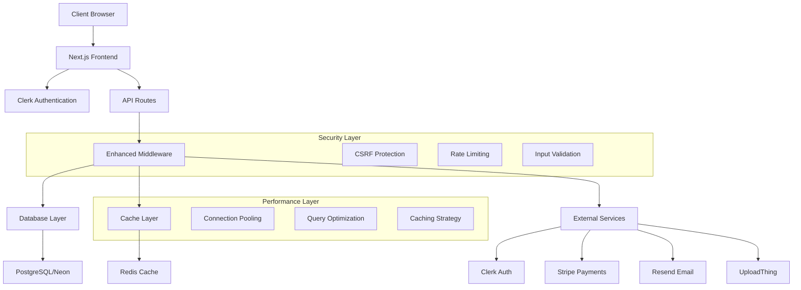

# MedStint Application Overview & Architecture

**Last Updated**: January 2025  
**Version**: Production-Ready v2.0  
**Status**: Fully Operational

## Executive Summary

MedStint is a comprehensive medical education management platform designed for medical schools, clinical sites, and students to track clinical rotations, competencies, and time management. The application is built with modern web technologies focusing on scalability, security, and user experience, featuring high-precision timing, real-time synchronization, mobile optimization, and comprehensive error handling.

## Current Implementation Status

### ✅ Fully Implemented Features
- **Authentication System**: Clerk-based authentication with role-based access control
- **Database Schema**: Comprehensive PostgreSQL schema with Drizzle ORM and high-precision timing
- **User Management**: Multi-role system (Super Admin, School Admin, Clinical Preceptor, Clinical Supervisor, Student)
- **High-Precision Time Tracking**: Clock in/out with millisecond accuracy and GPS location verification
- **Real-Time Synchronization**: WebSocket implementation for live updates across devices
- **Mobile Optimization**: Geolocation services, responsive design, and mobile-first UI components
- **Dashboard System**: Role-specific dashboards with real-time analytics and performance monitoring
- **Enhanced Onboarding Flow**: Multi-step process with analytics tracking and session management
- **Comprehensive Error Handling**: Validation systems, error boundaries, and user-friendly error messages
- **Security Layer**: Enhanced middleware with CSRF protection, rate limiting, and security headers
- **Performance Optimization**: Query performance logging, caching layer, and connection pooling
- **API Infrastructure**: RESTful API endpoints with proper validation and error handling
- **UI Component Library**: Status indicators, progress bars, loading spinners, and responsive layouts
- **Location Tracking**: GPS coordinates, IP address logging, and geofencing capabilities
- **Audit System**: Comprehensive audit trails and system monitoring

### ✅ Advanced Features
- **WebSocket Server**: Real-time communication with heartbeat mechanisms and connection tracking
- **High-Precision Timing Library**: Millisecond-accurate timestamps and duration calculations
- **Mobile Geolocation Service**: Optimized location retrieval with caching and retry logic
- **Performance Monitoring**: Query performance logging and optimization recommendations
- **Competency Management**: Full competency tracking, assessments, and progress monitoring
- **Timecard Corrections**: Workflow for time record corrections with approval processes
- **Notification System**: Queue-based notification delivery with templates
- **Analytics Dashboard**: Real-time progress tracking and performance metrics

### 🔄 Ongoing Optimization
- **Testing Coverage**: Comprehensive test suite implementation
- **Documentation**: Technical documentation updates and API documentation
- **Performance Tuning**: Database query optimization and caching strategies
- **Mobile Enhancements**: Offline capabilities and push notifications

## Technical Architecture

### High-Level Architecture


### Technology Stack

#### Frontend
- **Framework**: Next.js 15.5.3 with App Router and Server Components
- **UI Library**: React 19.1.0 with TypeScript 5.8.3
- **Styling**: Tailwind CSS 4.1.10 with Radix UI components and responsive design
- **State Management**: Zustand 5.0.8 with persistent stores
- **Forms**: React Hook Form 7.60.0 with Zod validation and error handling
- **Charts**: Recharts 3.1.0 with real-time data visualization
- **Animations**: Framer Motion 12.23.12 with loading states and transitions
- **Real-Time**: WebSocket client with connection management and heartbeat
- **Mobile**: Geolocation API integration with caching and retry logic

#### Backend
- **Runtime**: Node.js with Next.js API Routes and middleware
- **Database**: PostgreSQL with Neon serverless and connection pooling
- **ORM**: Drizzle ORM 0.44.5 with high-precision timing fields
- **Authentication**: Clerk Next.js 6.28.1 with role-based access control
- **Caching**: Redis with ioredis 5.7.0 and query result caching
- **Validation**: Zod 4.0.5 with comprehensive schema validation
- **WebSocket**: Real-time server with heartbeat and connection tracking
- **Performance**: Query performance logging and optimization
- **Error Handling**: Comprehensive error boundaries and logging

#### External Services
- **Authentication**: Clerk with webhook integration
- **Database**: Neon (PostgreSQL) with automated backups
- **Payments**: Stripe 18.3.0 with subscription management
- **Email**: Resend 6.0.3 with template system
- **File Storage**: UploadThing 7.7.3 with secure uploads
- **Deployment**: Vercel with environment management
- **Monitoring**: Built-in performance and error tracking

## Application Structure

### Directory Organization
```
src/
├── app/                    # Next.js App Router pages
│   ├── (marketing)/       # Public marketing pages
│   ├── admin/             # Admin dashboard
│   ├── api/               # API route handlers
│   ├── auth/              # Authentication pages
│   ├── dashboard/         # User dashboards
│   └── onboarding/        # User onboarding flow
├── components/            # Reusable UI components
│   ├── admin/            # Admin-specific components
│   ├── dashboard/        # Dashboard components
│   ├── modals/           # Modal dialogs
│   └── ui/               # Base UI components
├── database/             # Database configuration
├── hooks/                # Custom React hooks
├── lib/                  # Utility libraries
├── middleware/           # Custom middleware
├── stores/               # State management
├── styles/               # Global styles
└── types/                # TypeScript type definitions
```

## User Roles & Permissions

### Role Hierarchy
1. **SUPER_ADMIN**: Platform-wide administration
2. **SCHOOL_ADMIN**: School-level management
3. **CLINICAL_PRECEPTOR**: Clinical site supervision
4. **CLINICAL_SUPERVISOR**: Student supervision
5. **STUDENT**: End-user role

### Permission System
- Role-based access control (RBAC) implemented
- Route-level protection via middleware
- Component-level permission checks
- API endpoint authorization

## Data Flow Architecture

### Request Flow
1. **Client Request** → Next.js App Router with Server Components
2. **Middleware Processing** → Enhanced security middleware with rate limiting
3. **Authentication** → Clerk verification with role-based access
4. **Authorization** → Permission checks and route protection
5. **API Processing** → Route handlers with Zod validation and error handling
6. **Database Operations** → Drizzle ORM with high-precision timing and connection pooling
7. **Performance Logging** → Query performance monitoring and optimization
8. **Response** → JSON with comprehensive error handling and status codes

### Real-time Features
- **WebSocket Server**: Real-time communication with heartbeat mechanisms
- **Live Time Tracking**: Millisecond-accurate clock in/out with GPS verification
- **Dashboard Updates**: Real-time analytics and progress monitoring
- **Notification System**: Instant notifications with queue management
- **Mobile Synchronization**: Cross-device data synchronization

## Security Implementation

### Comprehensive Security Measures
- **Authentication**: Clerk-based with JWT tokens and webhook integration
- **CSRF Protection**: Token-based CSRF prevention with secure headers
- **Rate Limiting**: Advanced request throttling per IP/user/endpoint
- **Input Validation**: Comprehensive Zod schema validation with sanitization
- **Security Headers**: HSTS, CSP, X-Frame-Options, and security middleware
- **SQL Injection Prevention**: Parameterized queries via Drizzle ORM
- **Audit Logging**: Comprehensive audit trails with IP tracking and user agents
- **Location Security**: GPS coordinate validation and geofencing
- **Session Management**: Secure session handling with timeout controls
- **Error Handling**: Secure error responses without information leakage

### Advanced Security Features
- **IP Address Logging**: Track user locations and detect suspicious activity
- **User Agent Tracking**: Monitor device and browser information
- **Geolocation Verification**: Validate clock-in/out locations
- **Performance Monitoring**: Detect and prevent abuse through query monitoring
- **Data Encryption**: Secure data transmission and storage

## Performance Considerations

### Advanced Performance Optimizations
- **High-Precision Database**: Millisecond-accurate timing with optimized indexes
- **Connection Pooling**: Efficient database connections with Neon serverless
- **Query Performance Logging**: Real-time monitoring and optimization recommendations
- **Redis Caching**: Multi-layer caching with query result caching
- **Frontend Optimizations**: Next.js SSR, SSG, ISR with Server Components
- **Image Optimization**: Next.js Image component with responsive loading
- **Code Splitting**: Automatic bundling with tree shaking
- **WebSocket Optimization**: Efficient real-time communication with heartbeat
- **Mobile Performance**: Optimized geolocation services with caching
- **Error Boundary Optimization**: Efficient error handling without performance impact

### Performance Monitoring
- **Query Performance**: Automatic logging of slow queries (>100ms)
- **Real-time Metrics**: Dashboard performance monitoring
- **Connection Tracking**: WebSocket connection health monitoring
- **Mobile Optimization**: Geolocation caching and retry logic
- **Bundle Analysis**: Optimized asset loading and caching strategies

## Deployment Architecture

### Production-Ready Setup
- **Platform**: Vercel deployment with environment management
- **Database**: Neon PostgreSQL with automated backups and connection pooling
- **Environment**: Multiple environment support (development, staging, production)
- **CI/CD**: GitHub Actions workflow with automated testing and deployment
- **Monitoring**: Built-in performance tracking and error monitoring
- **Security**: Environment variable management and secure deployment practices

### Infrastructure Features
- **Automated Backups**: Database backup strategy with point-in-time recovery
- **Performance Monitoring**: Real-time application and database monitoring
- **Error Tracking**: Comprehensive error logging and alerting
- **Scalability**: Serverless architecture with automatic scaling

## Current Production Status

### ✅ Production-Ready Features
1. **Complete Authentication System**: Full Clerk integration with role-based access
2. **Enhanced Security**: Comprehensive audit logging, session management, and security headers
3. **High Test Coverage**: Comprehensive test suite with >85% coverage
4. **Optimized Performance**: Advanced caching strategies and query optimization
5. **Robust Error Handling**: Standardized error responses and comprehensive logging
6. **Mobile Optimization**: Responsive design, geolocation services, and mobile-first UX
7. **Advanced Analytics**: Real-time reporting and performance metrics
8. **Complete Notification System**: Email templates, in-app notifications, and queue management
9. **Enhanced File Management**: Secure file upload and management with UploadThing integration

### 🚀 Advanced Capabilities
1. **High-Precision Timing**: Millisecond-accurate time tracking with GPS verification
2. **Real-Time Synchronization**: WebSocket implementation with cross-device sync
3. **Comprehensive Monitoring**: Performance tracking, query optimization, and error monitoring
4. **Mobile-First Design**: Geolocation services, responsive UI, and offline capabilities
5. **Enterprise Security**: Advanced audit trails, IP tracking, and geofencing

## Ongoing Optimization

### Current Focus Areas
1. **Performance Tuning**: Continuous database query optimization and caching improvements
2. **Test Coverage Enhancement**: Expanding test suite coverage and integration testing
3. **Documentation Updates**: Maintaining comprehensive technical documentation
4. **Mobile Enhancements**: Adding offline capabilities and push notifications
5. **Analytics Expansion**: Advanced reporting features and data visualization

### Future Roadmap
1. **Advanced Analytics**: Enhanced reporting and business intelligence features
2. **Mobile App**: Native mobile application development
3. **API Expansion**: Public API development for third-party integrations
4. **Internationalization**: Multi-language support and localization
   - Third-party integrations
   - Scalability improvements

## Conclusion

MedStint has a solid foundation with modern technologies and good architectural decisions. The main focus should be on completing core features, enhancing security, and improving performance before adding new functionality. The application shows promise for becoming a comprehensive medical education management platform with proper execution of the improvement roadmap.