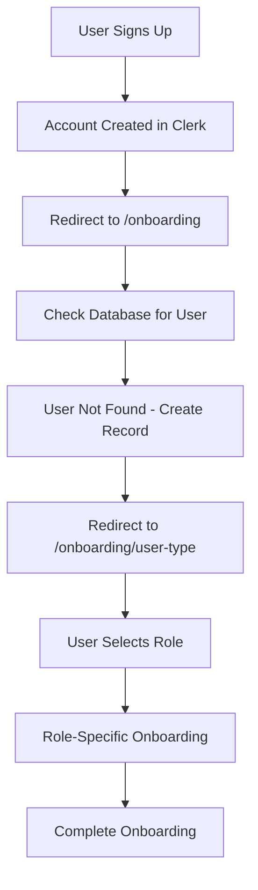
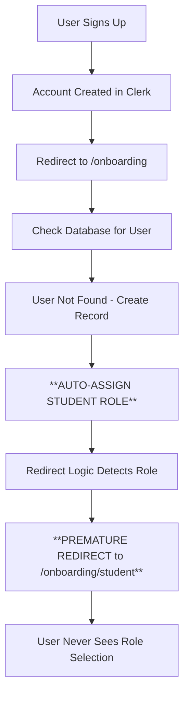

# Onboarding Flow Analysis: Premature Student Redirect Issue

## Executive Summary

This analysis examines a critical issue in the MedStint Clinical Education Management system where users are incorrectly redirected to `/onboarding/student` before being allowed to select their user type at `/onboarding/user-type`. The root cause has been identified as a **database schema default value** that automatically assigns the "STUDENT" role to new users, bypassing the intended user type selection process.

**Root Cause**: The `users` table schema sets `role` field default to "STUDENT", causing immediate role assignment before user choice.

**Impact**: School administrators and other non-student users cannot properly select their intended role during onboarding.

---

## 1. Complete User Journey Analysis

### 1.1 Expected Flow


### 1.2 Actual Problematic Flow


### 1.3 Code Evidence

**Database Schema (src/database/schema.ts:21-25)**
```typescript
role: text("role", {
  enum: ["SUPER_ADMIN", "SCHOOL_ADMIN", "CLINICAL_PRECEPTOR", "CLINICAL_SUPERVISOR", "STUDENT"],
})
  .default("STUDENT")  // ❌ PROBLEM: Auto-assigns STUDENT role
  .notNull(),
```

**User Creation Logic (src/app/onboarding/user-type/page.tsx:290-300)**
```typescript
const [newUser] = await db
  .insert(users)
  .values({
    id: clerkUser.id,
    email: userEmail,
    name: userName || null,
    // role field omitted to use database default ("STUDENT") ❌ PROBLEM
    schoolId: null,
    programId: null,
    onboardingCompleted: false,
  })
```

---

## 2. Routing Logic Analysis

### 2.1 Main Onboarding Router (src/app/onboarding/page.tsx)

**Problematic Logic Flow:**
```typescript
// Check if user has a role assigned
if (!user?.role) {
  // Redirect to user type selection if no role is assigned
  redirect("/onboarding/user-type")
}

// Route based on user role ❌ PROBLEM: This executes because role exists
switch (user.role) {
  case "SCHOOL_ADMIN":
    return redirect("/onboarding/welcome")
  case "STUDENT":
    return redirect("/onboarding/student")  // ❌ Premature redirect happens here
  case "SUPER_ADMIN":
    return redirect("/onboarding/super-admin")
  default:
    return redirect("/onboarding/user-type")
}
```

### 2.2 User Type Selection Page Logic

**Additional Redirect Logic (src/app/onboarding/user-type/page.tsx:125-145)**
```typescript
// If user has a role but hasn't completed onboarding, redirect to appropriate step
else if (user.role && !user.onboardingCompleted) {
  switch (user.role) {
    case "STUDENT":
      redirect("/onboarding/student")  // ❌ Another premature redirect point
      break
    case "SCHOOL_ADMIN":
    case "CLINICAL_SUPERVISOR":
    case "CLINICAL_PRECEPTOR":
      redirect("/onboarding/school")
      break
    // ...
  }
}
```

### 2.3 Middleware Routing Logic

**Middleware Redirect Logic (src/middleware.ts:165-195)**
```typescript
// If user has a role, check if they meet completion requirements
if (user.role) {
  switch (user.role) {
    case "STUDENT":
      if (user.schoolId) {
        shouldCompleteOnboarding = true
      } else {
        redirectPath = "/onboarding/user-type"  // ❌ Should redirect here but doesn't
      }
      break
    // ...
  }
}
```

---

## 3. Validation Issues Identified

### 3.1 Missing Role Selection Validation

**Issue**: No validation exists to distinguish between:
- Users who explicitly selected their role
- Users who received a default role assignment

**Missing Logic**: 
```typescript
// Should exist but doesn't
interface User {
  role: UserRole
  roleSelectedByUser: boolean  // ❌ Missing field
  roleSelectionTimestamp: Date // ❌ Missing field
}
```

### 3.2 Insufficient State Tracking

**Current State Tracking**:
- `onboardingCompleted`: boolean
- `role`: UserRole (with default)

**Missing State Tracking**:
- Role selection confirmation
- Onboarding step progression
- User choice validation

---

## 4. Session Management Review

### 4.1 Session Persistence

**Current Implementation**: 
- Clerk handles authentication sessions
- Database stores user state
- No intermediate onboarding state persistence

**Issues Identified**:
- No tracking of onboarding progress
- No distinction between auto-assigned and user-selected roles
- No rollback mechanism for incorrect role assignments

### 4.2 State Management Problems

**Onboarding Store (src/stores/onboarding-store.ts)**:
- Exists but not utilized in critical flow paths
- No integration with role selection validation
- Missing state persistence between page navigations

---

## 5. Root Cause Analysis

### 5.1 Primary Root Cause: Database Schema Default

**Location**: `src/database/schema.ts:21-25`

**Problem**: 
```typescript
role: text("role", {
  enum: ["SUPER_ADMIN", "SCHOOL_ADMIN", "CLINICAL_PRECEPTOR", "CLINICAL_SUPERVISOR", "STUDENT"],
})
  .default("STUDENT")  // ❌ This causes the entire issue
  .notNull(),
```

**Impact**: Every new user automatically receives "STUDENT" role, triggering student-specific routing logic before they can select their intended role.

### 5.2 Secondary Root Causes

#### A. Routing Logic Assumes Valid Role Selection
**Location**: `src/app/onboarding/page.tsx:38-50`

The routing logic assumes that if a user has a role, it was intentionally selected:
```typescript
// Route based on user role
switch (user.role) {
  case "STUDENT":
    return redirect("/onboarding/student")  // ❌ Assumes intentional selection
```

#### B. Missing Role Selection Validation
**Location**: Multiple files

No validation exists to confirm role was user-selected vs. auto-assigned.

#### C. Inadequate State Management
**Location**: Throughout onboarding flow

No mechanism to track onboarding progression or validate user choices.

---

## 6. Proposed Solutions

### 6.1 Immediate Fix: Remove Default Role Assignment

**Database Schema Change**:
```typescript
// src/database/schema.ts
role: text("role", {
  enum: ["SUPER_ADMIN", "SCHOOL_ADMIN", "CLINICAL_PRECEPTOR", "CLINICAL_SUPERVISOR", "STUDENT"],
})
  // .default("STUDENT")  // ❌ Remove this line
  .nullable(),  // ✅ Allow null until user selects
```

**User Creation Logic Update**:
```typescript
// src/app/onboarding/user-type/page.tsx
const [newUser] = await db
  .insert(users)
  .values({
    id: clerkUser.id,
    email: userEmail,
    name: userName || null,
    role: null,  // ✅ Explicitly set to null
    schoolId: null,
    programId: null,
    onboardingCompleted: false,
  })
```

### 6.2 Enhanced Routing Logic

**Updated Main Router**:
```typescript
// src/app/onboarding/page.tsx
export default async function OnboardingPage() {
  // ... existing code ...

  // If onboarding is already completed, redirect to dashboard
  if (user?.onboardingCompleted) {
    redirect("/dashboard")
  }

  // ✅ Always check for null role first
  if (!user?.role) {
    redirect("/onboarding/user-type")
  }

  // ✅ Add validation for role selection confirmation
  if (!user.roleConfirmed) {  // New field needed
    redirect("/onboarding/user-type")
  }

  // Route based on confirmed user role
  switch (user.role) {
    case "SCHOOL_ADMIN":
      return redirect("/onboarding/welcome")
    case "STUDENT":
      return redirect("/onboarding/student")
    case "SUPER_ADMIN":
      return redirect("/onboarding/super-admin")
    default:
      return redirect("/onboarding/user-type")
  }
}
```

### 6.3 Add Role Selection Confirmation

**Database Schema Addition**:
```typescript
// src/database/schema.ts
export const users = pgTable("users", {
  // ... existing fields ...
  role: text("role", {
    enum: ["SUPER_ADMIN", "SCHOOL_ADMIN", "CLINICAL_PRECEPTOR", "CLINICAL_SUPERVISOR", "STUDENT"],
  }).nullable(),  // ✅ Allow null
  roleConfirmed: boolean("role_confirmed").default(false).notNull(),  // ✅ New field
  roleSelectedAt: timestamp("role_selected_at"),  // ✅ Track selection time
  // ... rest of fields ...
})
```

### 6.4 Enhanced State Management

**Onboarding Progress Tracking**:
```typescript
// New interface for onboarding state
interface OnboardingProgress {
  currentStep: OnboardingStep
  completedSteps: OnboardingStep[]
  roleSelected: boolean
  roleConfirmed: boolean
  validationErrors: string[]
}
```

---

## 7. Implementation Priority

### 7.1 Critical (Immediate)
1. **Remove database default role assignment**
2. **Update user creation logic to set role as null**
3. **Fix routing logic to handle null roles properly**

### 7.2 High Priority (Next Sprint)
1. **Add role confirmation tracking**
2. **Implement enhanced validation**
3. **Add onboarding progress state management**

### 7.3 Medium Priority (Future)
1. **Add comprehensive onboarding analytics**
2. **Implement rollback mechanisms**
3. **Enhanced error handling and recovery**

---

## 8. Testing Strategy

### 8.1 Test Scenarios

1. **New User Registration**
   - Verify user can reach `/onboarding/user-type`
   - Confirm no automatic role assignment
   - Test role selection persistence

2. **Role Selection Flow**
   - Test each role selection path
   - Verify proper routing after selection
   - Confirm role confirmation tracking

3. **Edge Cases**
   - Database connection failures
   - Concurrent user creation
   - Session timeout during onboarding

### 8.2 Validation Points

- [ ] User reaches role selection page
- [ ] Role is null until user selects
- [ ] Role selection is properly persisted
- [ ] Routing works correctly for each role
- [ ] No premature redirects occur

---

## 9. Migration Strategy

### 9.1 Database Migration

```sql
-- Step 1: Add new columns
ALTER TABLE users 
ADD COLUMN role_confirmed BOOLEAN DEFAULT FALSE NOT NULL,
ADD COLUMN role_selected_at TIMESTAMP WITH TIME ZONE;

-- Step 2: Update existing users with confirmed roles
UPDATE users 
SET role_confirmed = TRUE, 
    role_selected_at = created_at 
WHERE onboarding_completed = TRUE;

-- Step 3: Remove default constraint (in separate migration)
ALTER TABLE users ALTER COLUMN role DROP DEFAULT;
ALTER TABLE users ALTER COLUMN role DROP NOT NULL;
```

### 9.2 Code Deployment Strategy

1. **Phase 1**: Deploy database changes
2. **Phase 2**: Deploy updated user creation logic
3. **Phase 3**: Deploy enhanced routing logic
4. **Phase 4**: Deploy validation improvements

---

## 10. Conclusion

The premature redirect to `/onboarding/student` is caused by the database schema automatically assigning the "STUDENT" role to all new users. This bypasses the intended user type selection process and immediately triggers student-specific routing logic.

**Key Findings**:
- Database default value is the primary root cause
- Routing logic assumes intentional role selection
- Missing validation for role selection confirmation
- Inadequate state management throughout onboarding flow

**Recommended Action**: Implement the immediate fix by removing the default role assignment and updating the routing logic to properly handle null roles. This will restore the intended user type selection flow and allow school administrators to properly select their role during onboarding.

**Success Metrics**:
- Users can successfully reach `/onboarding/user-type`
- School admin role selection works correctly
- No premature redirects to student onboarding
- Proper role-based routing after selection

---

*Analysis completed: January 2025*  
*Document version: 1.0*  
*Status: Ready for implementation*