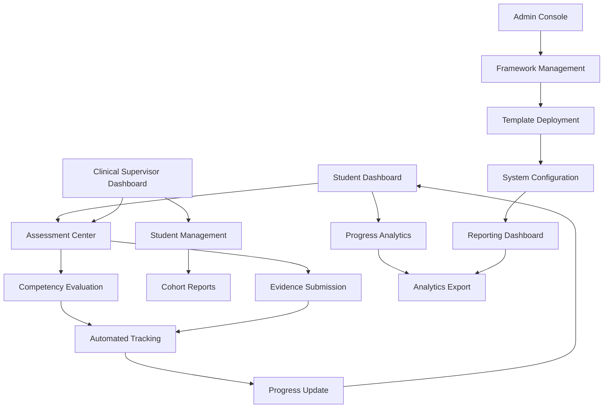

# Student Competency Tracking System - Product Requirements Document

## 1. Product Overview

A comprehensive competency tracking system that monitors and records student skill development across various medical domains, providing real-time progress visualization, automated tracking, and detailed reporting capabilities for educational institutions.

The system addresses the critical need for systematic competency assessment in medical education, enabling students to track their progress while providing administrators and clinical supervisors with detailed insights into skill acquisition patterns and learning outcomes.

## 2. Core Features

### 2.1 User Roles

| Role                | Registration Method      | Core Permissions                                                              |
| ------------------- | ------------------------ | ----------------------------------------------------------------------------- |
| Student             | School enrollment system | View own competencies, progress tracking, submit evidence                     |
| Clinical Preceptor  | Institution invitation   | Submit competencies for students, conduct evaluations, view assigned students |
| Clinical Supervisor | Institution invitation   | Full competency management, advanced reporting, student oversight             |
| School Admin        | System administration    | Complete system access, framework customization, institutional reporting      |
| Super Admin         | System level access      | Global system management, multi-institution oversight                         |

### 2.2 Feature Module

Our comprehensive competency tracking system consists of the following main components:

1. **Student Dashboard**: Personal competency overview, progress visualization, skill development timeline, upcoming assessments
2. **Competency Assessment Center**: Structured evaluation forms, rubric-based scoring, evidence submission, peer assessments
3. **Progress Analytics Hub**: Interactive charts and graphs, trend analysis, comparative reporting, predictive insights
4. **Framework Management**: Customizable competency templates, deployment tools, version control, import/export capabilities
5. **Automated Tracking Engine**: Real-time progress updates, milestone notifications, deadline management, integration workflows
6. **Reporting Dashboard**: Multi-level reports, data export tools, compliance documentation, performance analytics
7. **Administrative Console**: User management, system configuration, audit trails, security controls

### 2.3 Page Details

| Page Name              | Module Name                | Feature Description                                                                                         |
| ---------------------- | -------------------------- | ----------------------------------------------------------------------------------------------------------- |
| Student Dashboard      | Progress Overview          | Display overall competency completion percentage, recent activities, upcoming deadlines, achievement badges |
| Student Dashboard      | Skill Development Timeline | Interactive timeline showing competency acquisition over time with milestones and achievements              |
| Student Dashboard      | Personal Analytics         | Individual performance metrics, strengths/weaknesses analysis, learning recommendations                     |
| Assessment Center      | Evaluation Forms           | Dynamic forms based on competency frameworks with rubric scoring, evidence upload, multimedia support       |
| Assessment Center      | Peer Assessment            | Student-to-student evaluation tools with structured feedback mechanisms                                     |
| Assessment Center      | Self-Assessment            | Reflective assessment tools allowing students to evaluate their own progress                                |
| Progress Analytics     | Interactive Charts         | Real-time charts showing progress across categories, comparison with cohort averages, trend analysis        |
| Progress Analytics     | Predictive Insights        | AI-powered predictions for completion timelines, risk identification, intervention recommendations          |
| Progress Analytics     | Comparative Analysis       | Benchmarking against program standards, peer comparisons, historical data analysis                          |
| Framework Management   | Template Builder           | Drag-and-drop interface for creating custom competency frameworks with criteria definition                  |
| Framework Management   | Deployment Tools           | Batch deployment of competencies to student cohorts with scheduling and notification features               |
| Framework Management   | Version Control            | Track changes to competency frameworks, rollback capabilities, approval workflows                           |
| Automated Tracking     | Progress Engine            | Real-time calculation of completion percentages, automatic status updates, milestone detection              |
| Automated Tracking     | Notification System        | Automated reminders for upcoming assessments, deadline alerts, achievement notifications                    |
| Automated Tracking     | Integration Hub            | API connections with LMS, clinical systems, external assessment tools                                       |
| Reporting Dashboard    | Student Reports            | Individual progress reports, competency transcripts, achievement certificates                               |
| Reporting Dashboard    | Administrative Reports     | Cohort performance analysis, program effectiveness metrics, compliance documentation                        |
| Reporting Dashboard    | Export Tools               | PDF generation, Excel exports, API data access, scheduled report delivery                                   |
| Administrative Console | User Management            | Role-based access control, user provisioning, permission management                                         |
| Administrative Console | System Configuration       | Framework settings, notification preferences, integration configurations                                    |
| Administrative Console | Audit & Security           | Activity logs, security monitoring, compliance tracking, data privacy controls                              |

## 3. Core Process

### Student Flow

Students begin by accessing their personalized dashboard to view assigned competencies and current progress. They participate in assessments conducted by clinical supervisors or complete self-evaluations as required. Students can upload evidence of skill demonstration and track their progress through interactive visualizations. The system automatically updates their competency status and provides recommendations for skill development.

### Clinical Supervisor Flow

Clinical supervisors access the assessment center to evaluate student performance using structured rubrics. They submit competency assessments on behalf of students, provide detailed feedback, and monitor progress across their assigned cohorts. Supervisors can generate reports for individual students or groups and receive automated notifications about assessment deadlines and student achievements.

### Administrator Flow

Administrators manage the competency frameworks through the template builder, deploying new competencies to student cohorts and monitoring system-wide performance. They access comprehensive reporting tools to analyze program effectiveness, ensure compliance with accreditation standards, and make data-driven decisions about curriculum improvements.

## 4. User Interface Design

### 4.1 Design Style

* **Primary Colors**: Medical blue (#2563eb), Success green (#10b981), Warning amber (#f59e0b)

* **Secondary Colors**: Neutral gray (#6b7280), Light blue (#dbeafe), Soft green (#d1fae5)

* **Button Style**: Rounded corners (8px radius), subtle shadows, hover animations

* **Typography**: Inter font family, 16px base size, clear hierarchy with 14px-24px range

* **Layout Style**: Card-based design with clean spacing, top navigation with sidebar, responsive grid system

* **Icons**: Lucide React icons with medical and educational themes, consistent 20px sizing

* **Animations**: Smooth transitions (300ms), progress bar animations, subtle hover effects

### 4.2 Page Design Overview

| Page Name              | Module Name        | UI Elements                                                                                             |
| ---------------------- | ------------------ | ------------------------------------------------------------------------------------------------------- |
| Student Dashboard      | Progress Overview  | Large progress rings with percentage displays, color-coded status indicators, achievement badge gallery |
| Student Dashboard      | Skill Timeline     | Horizontal timeline with milestone markers, interactive hover states, progress indicators               |
| Assessment Center      | Evaluation Forms   | Multi-step form wizard, rubric scoring sliders, file upload dropzones, rich text editors                |
| Progress Analytics     | Interactive Charts | Recharts library integration, responsive chart containers, filter controls, export buttons              |
| Framework Management   | Template Builder   | Drag-and-drop interface, collapsible sections, real-time preview, validation indicators                 |
| Reporting Dashboard    | Report Generator   | Tabbed interface, date range pickers, chart type selectors, download progress indicators                |
| Administrative Console | User Management    | Data tables with sorting/filtering, modal dialogs, bulk action controls, status badges                  |

### 4.3 Responsiveness

The system is designed mobile-first with responsive breakpoints at 640px, 768px, 1024px, and 1280px. Touch-optimized interactions for mobile devices include larger tap targets (44px minimum), swipe gestures for navigation, and optimized form inputs. Desktop versions feature enhanced data density, keyboard shortcuts, and multi-panel layouts for efficient workflow management.

## 5. Technical Architecture

### 5.1 Database Enhancement

The existing database schema provides a solid foundation with tables for competencies, assessments, evaluations, and submissions. Additional enhancements include:

* **Progress Snapshots Table**: Store historical progress data for trend analysis

* **Learning Analytics Table**: Capture detailed interaction data for insights

* **Notification Queue Table**: Manage automated notifications and reminders

* **Report Cache Table**: Store generated reports for improved performance

### 5.2 API Enhancements

Building upon the existing competency-submissions API, new endpoints include:

* `/api/competency-analytics`: Real-time progress calculations and trend analysis

* `/api/competency-reports`: Report generation and export functionality

* `/api/competency-notifications`: Automated notification management

* `/api/competency-frameworks`: Template management and deployment tools

### 5.3 Real-time Features

* WebSocket connections for live progress updates

* Server-sent events for notification delivery

* Background job processing for report generation

* Caching strategies for improved performance

## 6. Data Privacy & Security

### 6.1 Privacy Compliance

* **FERPA Compliance**: Educational record protection with proper consent mechanisms

* **GDPR Compliance**: Data minimization, right to erasure, consent management

* **HIPAA Considerations**: Protected health information handling for clinical data

* **Data Retention**: Configurable retention policies with automated cleanup

### 6.2 Security Measures

* **Role-Based Access Control**: Granular permissions based on user roles and institutional hierarchy

* **Data Encryption**: AES-256 encryption at rest, TLS 1.3 for data in transit

* **Audit Logging**: Comprehensive activity tracking with tamper-proof logs

* **Input Validation**: Strict validation and sanitization of all user inputs

* **Rate Limiting**: API rate limiting to prevent abuse and ensure system stability

### 6.3 Access Control Matrix

| Feature                  | Student | Clinical Preceptor | Clinical Supervisor | School Admin | Super Admin |
| ------------------------ | ------- | ------------------ | ------------------- | ------------ | ----------- |
| View Own Progress        | ✓       | -                  | -                   | -            | -           |
| Submit Evidence          | ✓       | -                  | -                   | -            | -           |
| Evaluate Students        | -       | ✓                  | ✓                   | ✓            | ✓           |
| Manage Frameworks        | -       | -                  | Limited             | ✓            | ✓           |
| Generate Reports         | Limited | Limited            | ✓                   | ✓            | ✓           |
| System Administration    | -       | -                  | -                   | ✓            | ✓           |
| Multi-Institution Access | -       | -                  | -                   | -            | ✓           |

## 7. Implementation Phases

### Phase 1: Core Tracking (Weeks 1-4)

* Enhanced student dashboard with progress visualization

* Improved assessment center with rubric-based evaluations

* Basic reporting functionality

### Phase 2: Analytics & Automation (Weeks 5-8)

* Advanced progress analytics with charts and trends

* Automated tracking engine with notifications

* Predictive insights and recommendations

### Phase 3: Framework Management (Weeks 9-12)

* Customizable competency framework builder

* Template deployment and version control

* Import/export capabilities

### Phase 4: Advanced Features (Weeks 13-16)

* Comprehensive reporting dashboard

* Administrative console enhancements

* Performance optimization and security hardening

## 8. Success Metrics

### 8.1 User Engagement

* Daily active users (target: 80% of enrolled students)

* Assessment completion rates (target: 95% within deadlines)

* Evidence submission frequency (target: 2x per week average)

### 8.2 System Performance

* Page load times (target: <2 seconds)

* Report generation speed (target: <30 seconds for complex reports)

* System uptime (target: 99.9%)

### 8.3 Educational Outcomes

* Competency completion rates (target: 90% within program timeline)

* Student satisfaction scores (target: 4.5/5.0)

* Administrative efficiency gains (target: 50% reduction in manual tracking)

## 9. Risk Mitigation

### 9.1 Technical Risks

* **Data Loss**: Automated backups, redundant storage, disaster recovery procedures

* **Performance Issues**: Load testing, scalable architecture, monitoring and alerting

* **Security Breaches**: Regular security audits, penetration testing, incident response plans

### 9.2 Operational Risks

* **User Adoption**: Comprehensive training programs, change management support

* **Data Quality**: Validation rules, data cleansing procedures, quality monitoring

* **Compliance**: Regular compliance audits, legal review processes, documentation maintenance

## 10. Future Enhancements

### 10.1 Advanced Analytics

* Machine learning models for personalized learning recommendations

* Predictive analytics for at-risk student identification

* Natural language processing for feedback analysis

### 10.2 Integration Expansion

* LMS integration for seamless workflow

* Clinical system connections for real-world data

* Third-party assessment tool integrations

### 10.3 Mobile Applications

* Native mobile apps for iOS and Android

* Offline capability

