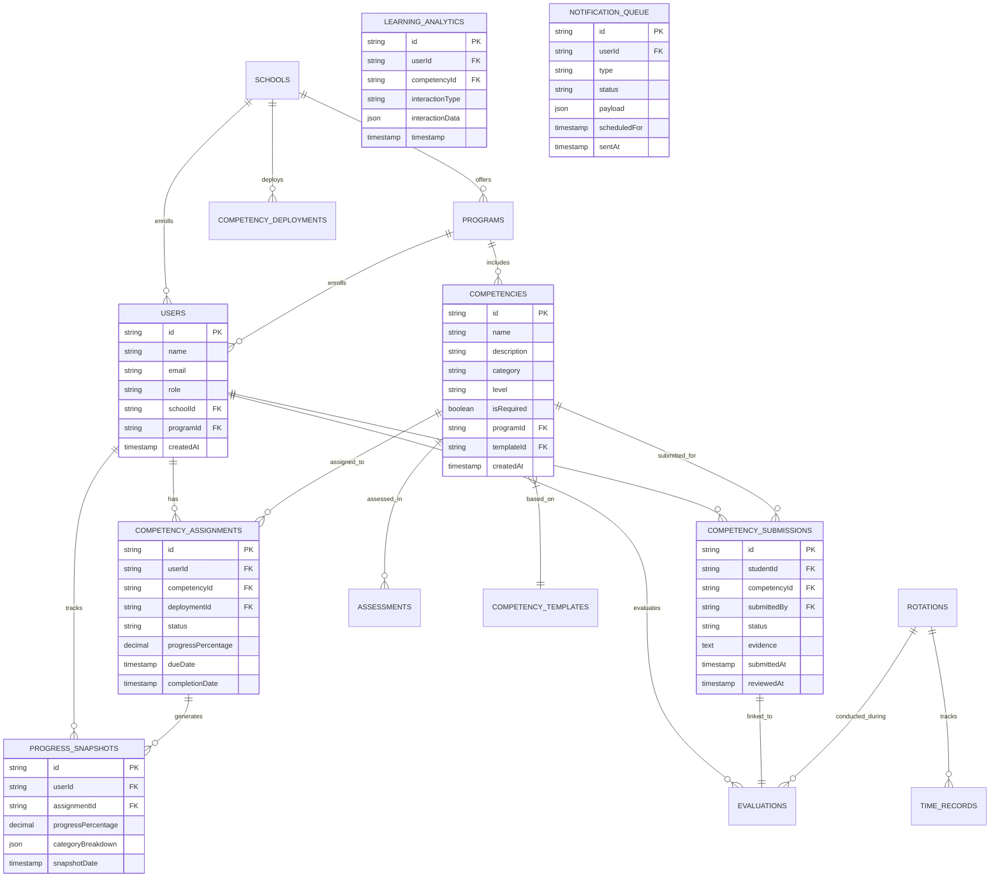

# Student Competency Tracking System - Technical Architecture Document

## 1. Architecture Design


## 2. Technology Description

* **Frontend**: React\@18 + Next.js\@14 + TypeScript + Tailwind CSS + Recharts + Framer Motion

* **Backend**: Next.js API Routes + Drizzle ORM + Zod validation

* **Database**: Supabase (PostgreSQL) with real-time subscriptions

* **Caching**: Redis for session management and report caching

* **File Storage**: Supabase Storage for evidence files and documents

* **Authentication**: Supabase Auth with role-based access control

* **Background Jobs**: Bull Queue with Redis for report generation and notifications

* **Real-time**: Supabase real-time subscriptions for live updates

## 3. Route Definitions

| Route                                        | Purpose                                             |
| -------------------------------------------- | --------------------------------------------------- |
| `/dashboard/student`                         | Student competency dashboard with progress overview |
| `/dashboard/student/competencies`            | Detailed competency list and assessment history     |
| `/dashboard/student/progress`                | Interactive progress analytics and charts           |
| `/dashboard/student/reports`                 | Personal competency reports and certificates        |
| `/dashboard/clinical-supervisor`             | Supervisor dashboard for student oversight          |
| `/dashboard/clinical-supervisor/assessments` | Assessment center for evaluating students           |
| `/dashboard/clinical-supervisor/analytics`   | Cohort analytics and performance insights           |
| `/dashboard/clinical-supervisor/reports`     | Supervisor reporting tools                          |
| `/dashboard/school-admin`                    | Administrative dashboard for system management      |
| `/dashboard/school-admin/frameworks`         | Competency framework management                     |
| `/dashboard/school-admin/users`              | User management and role assignment                 |
| `/dashboard/school-admin/reports`            | Institutional reporting and analytics               |
| `/assessment/[id]`                           | Individual competency assessment interface          |
| `/assessment/batch`                          | Batch assessment tools for multiple students        |
| `/reports/generator`                         | Interactive report builder                          |
| `/settings/profile`                          | User profile and preferences                        |
| `/settings/notifications`                    | Notification preferences and settings               |

## 4. API Definitions

### 4.1 Core Competency APIs

**Student Progress Tracking**

```
GET /api/competency-progress
```

Request:

| Param Name | Param Type | isRequired | Description                             |
| ---------- | ---------- | ---------- | --------------------------------------- |
| studentId  | string     | false      | Filter by specific student (admin only) |
| programId  | string     | false      | Filter by program                       |
| dateRange  | string     | false      | Date range filter (ISO format)          |
| category   | string     | false      | Competency category filter              |

Response:

| Param Name            | Param Type | Description                           |
| --------------------- | ---------- | ------------------------------------- |
| totalCompetencies     | number     | Total number of assigned competencies |
| completedCompetencies | number     | Number of completed competencies      |
| progressPercentage    | number     | Overall completion percentage         |
| categoryBreakdown     | array      | Progress by competency category       |
| recentActivities      | array      | Recent assessment activities          |
| upcomingDeadlines     | array      | Upcoming assessment deadlines         |

Example Response:

```json
{
  "totalCompetencies": 45,
  "completedCompetencies": 32,
  "progressPercentage": 71.1,
  "categoryBreakdown": [
    {
      "category": "Patient Care",
      "completed": 12,
      "total": 15,
      "percentage": 80
    }
  ],
  "recentActivities": [
    {
      "id": "eval_123",
      "competencyName": "Blood Pressure Measurement",
      "rating": 4.5,
      "date": "2024-01-15T10:30:00Z",
      "evaluator": "Dr. Smith"
    }
  ]
}
```

**Competency Assessment Submission**

```
POST /api/competency-assessments
```

Request:

| Param Name     | Param Type | isRequired | Description                                    |
| -------------- | ---------- | ---------- | ---------------------------------------------- |
| studentId      | string     | true       | ID of student being assessed                   |
| competencyId   | string     | true       | ID of competency being assessed                |
| evaluationData | object     | true       | Assessment data including ratings and feedback |
| evidenceFiles  | array      | false      | Uploaded evidence files                        |
| metadata       | object     | false      | Additional assessment metadata                 |

Response:

| Param Name     | Param Type | Description                                     |
| -------------- | ---------- | ----------------------------------------------- |
| assessmentId   | string     | Unique assessment identifier                    |
| status         | string     | Assessment status (submitted/approved/rejected) |
| progressUpdate | object     | Updated progress information                    |

**Analytics and Reporting**

```
GET /api/competency-analytics
```

Request:

| Param Name | Param Type | isRequired | Description                              |
| ---------- | ---------- | ---------- | ---------------------------------------- |
| scope      | string     | true       | Analytics scope (student/cohort/program) |
| timeframe  | string     | false      | Time period for analysis                 |
| metrics    | array      | false      | Specific metrics to include              |
| format     | string     | false      | Response format (json/csv/pdf)           |

Response:

| Param Name      | Param Type | Description                  |
| --------------- | ---------- | ---------------------------- |
| summary         | object     | High-level analytics summary |
| trends          | array      | Progress trends over time    |
| comparisons     | object     | Comparative analysis data    |
| recommendations | array      | AI-generated recommendations |

### 4.2 Framework Management APIs

**Competency Framework CRUD**

```
POST /api/competency-frameworks
GET /api/competency-frameworks
PUT /api/competency-frameworks/[id]
DELETE /api/competency-frameworks/[id]
```

**Template Deployment**

```
POST /api/competency-deployments
```

Request:

| Param Name    | Param Type | isRequired | Description                             |
| ------------- | ---------- | ---------- | --------------------------------------- |
| templateId    | string     | true       | Framework template to deploy            |
| targetGroups  | array      | true       | Student groups or programs to deploy to |
| effectiveDate | string     | false      | When deployment becomes active          |
| notifications | boolean    | false      | Send deployment notifications           |

### 4.3 Real-time APIs

**WebSocket Events**

```
WS /api/realtime/competency-updates
```

Events:

* `progress_updated`: Real-time progress changes

* `assessment_submitted`: New assessment submissions

* `deadline_approaching`: Upcoming deadline alerts

* `achievement_unlocked`: Competency completion notifications

## 5. Server Architecture Diagram


## 6. Data Model

### 6.1 Enhanced Data Model Definition



### 6.2 Data Definition Language

**Progress Snapshots Table**

```sql
CREATE TABLE progress_snapshots (
    id TEXT PRIMARY KEY DEFAULT gen_random_uuid(),
    user_id TEXT NOT NULL REFERENCES users(id) ON DELETE CASCADE,
    assignment_id TEXT REFERENCES competency_assignments(id) ON DELETE CASCADE,
    progress_percentage DECIMAL(5,2) DEFAULT 0.0,
    category_breakdown JSONB,
    competencies_completed INTEGER DEFAULT 0,
    competencies_total INTEGER DEFAULT 0,
    snapshot_date TIMESTAMP WITH TIME ZONE DEFAULT NOW(),
    metadata JSONB,
    created_at TIMESTAMP WITH TIME ZONE DEFAULT NOW()
);

CREATE INDEX idx_progress_snapshots_user_date ON progress_snapshots(user_id, snapshot_date DESC);
CREATE INDEX idx_progress_snapshots_assignment ON progress_snapshots(assignment_id);
```

**Learning Analytics Table**

```sql
CREATE TABLE learning_analytics (
    id TEXT PRIMARY KEY DEFAULT gen_random_uuid(),
    user_id TEXT NOT NULL REFERENCES users(id) ON DELETE CASCADE,
    competency_id TEXT REFERENCES competencies(id) ON DELETE CASCADE,
    interaction_type TEXT NOT NULL CHECK (interaction_type IN (
        'VIEW', 'ASSESSMENT_START', 'ASSESSMENT_COMPLETE', 'EVIDENCE_UPLOAD', 
        'FEEDBACK_VIEW', 'PROGRESS_CHECK', 'REPORT_GENERATE'
    )),
    interaction_data JSONB,
    session_id TEXT,
    ip_address INET,
    user_agent TEXT,
    timestamp TIMESTAMP WITH TIME ZONE DEFAULT NOW(),
    created_at TIMESTAMP WITH TIME ZONE DEFAULT NOW()
);

CREATE INDEX idx_learning_analytics_user_time ON learning_analytics(user_id, timestamp DESC);
CREATE INDEX idx_learning_analytics_competency ON learning_analytics(competency_id);
CREATE INDEX idx_learning_analytics_type ON learning_analytics(interaction_type);
```

**Notification Queue Table**

```sql
CREATE TABLE notification_queue (
    id TEXT PRIMARY KEY DEFAULT gen_random_uuid(),
    user_id TEXT NOT NULL REFERENCES users(id) ON DELETE CASCADE,
    type TEXT NOT NULL CHECK (type IN (
        'DEADLINE_REMINDER', 'ASSESSMENT_DUE', 'PROGRESS_UPDATE', 
        'ACHIEVEMENT_UNLOCKED', 'FEEDBACK_AVAILABLE', 'SYSTEM_ANNOUNCEMENT'
    )),
    status TEXT DEFAULT 'PENDING' CHECK (status IN ('PENDING', 'SENT', 'FAILED', 'CANCELLED')),
    priority TEXT DEFAULT 'NORMAL' CHECK (priority IN ('LOW', 'NORMAL', 'HIGH', 'URGENT')),
    channel TEXT DEFAULT 'IN_APP' CHECK (channel IN ('IN_APP', 'EMAIL', 'SMS', 'PUSH')),
    subject TEXT,
    content TEXT NOT NULL,
    payload JSONB,
    scheduled_for TIMESTAMP WITH TIME ZONE DEFAULT NOW(),
    sent_at TIMESTAMP WITH TIME ZONE,
    retry_count INTEGER DEFAULT 0,
    max_retries INTEGER DEFAULT 3,
    error_message TEXT,
    created_at TIMESTAMP WITH TIME ZONE DEFAULT NOW(),
    updated_at TIMESTAMP WITH TIME ZONE DEFAULT NOW()
);

CREATE INDEX idx_notification_queue_user ON notification_queue(user_id);
CREATE INDEX idx_notification_queue_status_scheduled ON notification_queue(status, scheduled_for);
CREATE INDEX idx_notification_queue_type ON notification_queue(type);
```

**Report Cache Table**

```sql
CREATE TABLE report_cache (
    id TEXT PRIMARY KEY DEFAULT gen_random_uuid(),
    cache_key TEXT UNIQUE NOT NULL,
    report_type TEXT NOT NULL,
    user_id TEXT REFERENCES users(id) ON DELETE CASCADE,
    school_id TEXT REFERENCES schools(id) ON DELETE CASCADE,
    parameters JSONB,
    report_data JSONB,
    file_path TEXT,
    file_size INTEGER,
    mime_type TEXT,
    expires_at TIMESTAMP WITH TIME ZONE,
    access_count INTEGER DEFAULT 0,
    last_accessed TIMESTAMP WITH TIME ZONE,
    created_at TIMESTAMP WITH TIME ZONE DEFAULT NOW()
);

CREATE INDEX idx_report_cache_key ON report_cache(cache_key);
CREATE INDEX idx_report_cache_user ON report_cache(user_id);
CREATE INDEX idx_report_cache_expires ON report_cache(expires_at);
```

**Enhanced Competency Rubrics Table**

```sql
CREATE TABLE competency_rubrics (
    id TEXT PRIMARY KEY DEFAULT gen_random_uuid(),
    competency_id TEXT NOT NULL REFERENCES competencies(id) ON DELETE CASCADE,
    criterion_name TEXT NOT NULL,
    description TEXT NOT NULL,
    weight DECIMAL(5,2) DEFAULT 1.0,
    max_score DECIMAL(5,2) DEFAULT 5.0,
    performance_levels JSONB NOT NULL,
    order_index INTEGER DEFAULT 0,
    is_active BOOLEAN DEFAULT true,
    created_by TEXT REFERENCES users(id),
    created_at TIMESTAMP WITH TIME ZONE DEFAULT NOW(),
    updated_at TIMESTAMP WITH TIME ZONE DEFAULT NOW()
);

CREATE INDEX idx_competency_rubrics_competency ON competency_rubrics(competency_id);
CREATE INDEX idx_competency_rubrics_order ON competency_rubrics(competency_id, order_index);
```

**Initial Data Setup**

```sql
-- Insert default notification templates
INSERT INTO notification_templates (school_id, name, type, subject, content, trigger_event, recipient_type, created_by)
VALUES 
    ('default', 'Assessment Due Reminder', 'EMAIL', 'Competency Assessment Due Soon', 
     'Your competency assessment for {{competency_name}} is due on {{due_date}}.', 
     'ASSIGNMENT_DUE', 'STUDENT', 'system'),
    ('default', 'Progress Update', 'IN_APP', 'Progress Updated', 
     'Your progress in {{competency_name}} has been updated to {{progress_percentage}}%.', 
     'ASSESSMENT_COMPLETED', 'STUDENT', 'system');

-- Insert default competency categories
INSERT INTO competencies (id, name, description, category, level, is_required, created_by)
VALUES 
    ('comp_patient_care_001', 'Patient Assessment', 'Comprehensive patient assessment skills', 'Patient Care', 'FUNDAMENTAL', true, 'system'),
    ('comp_communication_001', 'Patient Communication', 'Effective communication with patients and families', 'Communication', 'FUNDAMENTAL', true, 'system'),
    ('comp_clinical_001', 'Clinical Reasoning', 'Critical thinking and clinical decision making', 'Clinical Skills', 'INTERMEDIATE', true, 'system');

-- Grant permissions
GRANT SELECT, INSERT, UPDATE ON progress_snapshots TO authenticated;
GRANT SELECT, INSERT ON learning_analytics TO authenticated;
GRANT SELECT, INSERT, UPDATE ON notification_queue TO authenticated;
GRANT SELECT ON report_cache TO authenticated;
GRANT ALL PRIVILEGES ON competency_rubrics TO authenticated;

-- Row Level Security policies
ALTER TABLE progress_snapshots ENABLE ROW LEVEL SECURITY;
CREATE POLICY "Users can view own progress snapshots" ON progress_snapshots
    FOR SELECT USING (user_id = auth.uid() OR 
                     EXISTS (SELECT 1 FROM users WHERE id = auth.uid() AND role IN ('SCHOOL_ADMIN', 'SUPER_ADMIN')));

ALTER TABLE learning_analytics ENABLE ROW LEVEL SECURITY;
CREATE POLICY "Users can view own analytics" ON learning_analytics
    FOR SELECT USING (user_id = auth.uid() OR 
                     EXISTS (SELECT 1 FROM users WHERE id = auth.uid() AND role IN ('SCHOOL_ADMIN', 'SUPER_ADMIN')));
```

## 7. Performance Optimization

### 7.1 Database Optimization

* **Indexing Strategy**: Composite indexes on frequently queried columns (user\_id + timestamp)

* **Query Optimization**: Use of materialized views for complex analytics queries

* **Connection Pooling**: Supabase connection pooling for efficient database connections

* **Read Replicas**: Separate read replicas for reporting and analytics queries

### 7.2 Caching Strategy

* **Redis Caching**: Cache frequently accessed competency data and user progress

* **Report Caching**: Pre-generate and cache common reports

* **CDN Integration**: Static asset caching through Vercel Edge Network

* **Browser Caching**: Aggressive caching of competency frameworks and templates

### 7.3 Real-time Performance

* **WebSocket Optimization**: Efficient event filtering and batching

* **Background Processing**: Async processing for heavy operations

* **Progressive Loading**: Lazy loading of competency details and historical data

* **Pagination**: Cursor-based pagination for large datasets

## 8. Security Implementation

### 8.1 Authentication & Authorization

* **Supabase Auth**: JWT-based authentication with refresh tokens

* **Role-Based Access**: Granular permissions based on user roles

* **Session Management**: Secure session handling with automatic expiration

* **Multi-Factor Authentication**: Optional 2FA for administrative users

### 8.2 Data Protection

* **Encryption**: AES-256 encryption for sensitive data at rest

* **TLS 1.3**: Encrypted data transmission

* **Input Sanitization**: Comprehensive input validation and sanitization

* **SQL Injection Prevention**: Parameterized queries and ORM protection

### 8.3 Privacy Controls

* **Data Minimization**: Collect only necessary competency data

* **Consent Management**: Explicit consent for data processing

* **Right to Erasure**: Automated data deletion capabilities

* **Audit Trails**: Comprehensive logging of all data access and modifications

## 9. Monitoring & Analytics

### 9.1 Application Monitoring

* **Performance Metrics**: Response times, error rates, throughput

* **User Analytics**: Feature usage, engagement patterns, completion rates

* **System Health**: Database performance, cache hit rates, queue lengths

* **Error Tracking**: Comprehensive error logging and alerting

### 9.2 Business Intelligence

* **Competency Analytics**: Progress trends, completion patterns, performance insights

* **User Behavior**: Learning patterns, engagement metrics, success factors

* **Institutional Metrics**: Program effectiveness, accreditation compliance, outcomes

* **Predictive Analytics**: At-risk student identification, completion predictions

## 10. Deployment & DevOps

### 10.1 Deployment Strategy

* **Vercel Deployment**: Automated deployments with preview environments

* **Database Migrations**: Automated schema migrations with rollback capabilities

* **Environment Management**: Separate staging and production environments

* **Feature Flags**: Gradual feature rollouts and A/B testing

### 10.2 Backup & Recovery

* **Automated Backups**: Daily database backups with point-in-time recovery

* **File Backup**: Regular backup of uploaded evidence and documents

* **Disaster Recovery**: Multi-region backup strategy with RTO < 4 hours

* **Data Integrity**: Regular data validation and consistency checks

### 10.3 Scaling Considerations

* **Horizontal Scaling**: Auto-scaling based on traffic patterns

* **Database Scaling**: Read replicas and connection pooling

* **CDN Scaling**: Global content delivery for static assets

* **Background Job Scaling**: Auto-scaling job workers based on queue length

