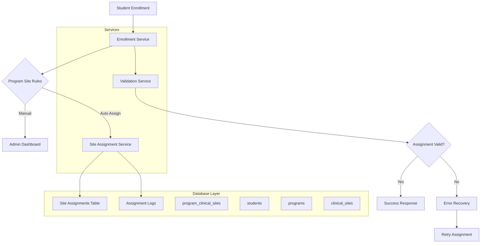
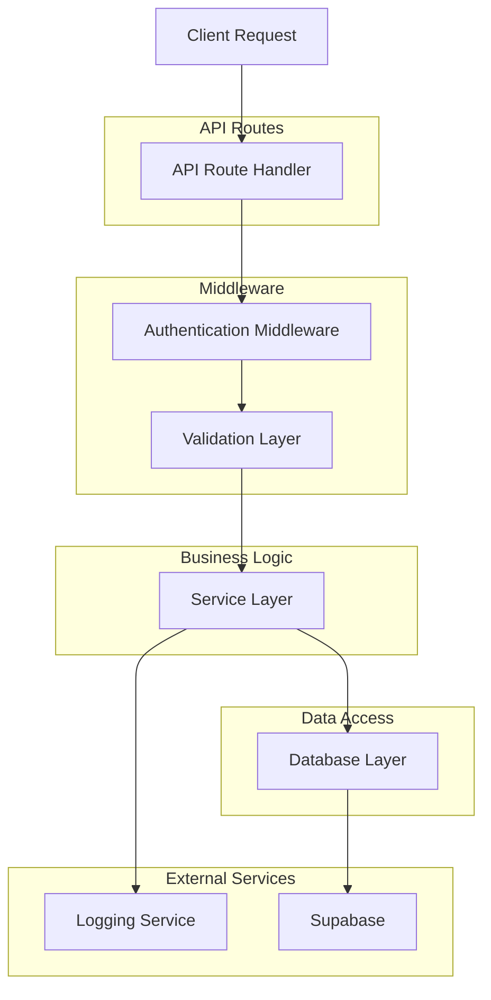
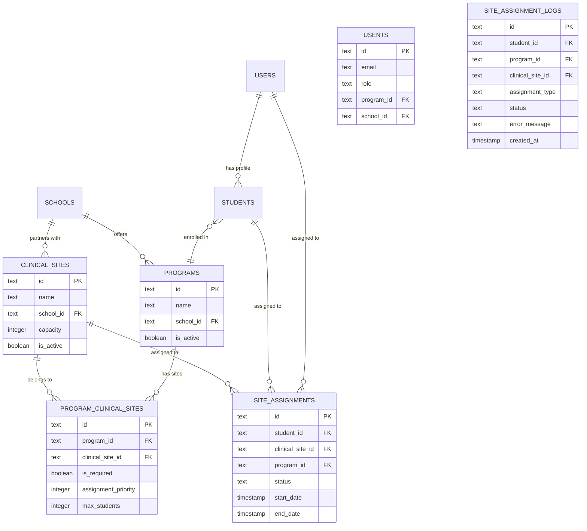

# Clinical Site Assignment Technical Architecture

## 1. Architecture Design



## 2. Technology Description

- **Frontend**: React@18 + Next.js@14 + TypeScript
- **Backend**: Next.js API Routes + Supabase
- **Database**: PostgreSQL (Neon) with Drizzle ORM
- **Authentication**: Supabase Auth
- **State Management**: React Context + SWR
- **Validation**: Zod schemas
- **Logging**: Winston + custom audit logs

## 3. Route Definitions

| Route | Purpose |
|-------|---------|
| `/api/enrollment` | Student enrollment with automatic site assignment |
| `/api/site-assignments/auto` | Automatic site assignment endpoint |
| `/api/site-assignments/validate` | Validate student site assignments |
| `/api/program-sites` | Manage program-clinical site relationships |
| `/api/admin/assignments/recover` | Recover missing assignments |
| `/api/student/dashboard` | Enhanced with assignment validation |

## 4. API Definitions

### 4.1 Enrollment API

```
POST /api/enrollment
```

Request:
| Param Name | Param Type | isRequired | Description |
|------------|-------------|-------------|-------------|
| studentId | string | true | Student user ID |
| programId | string | true | Program ID to enroll in |
| enrollmentDate | date | true | Enrollment start date |

Response:
| Param Name | Param Type | Description |
|------------|-------------|-------------|
| success | boolean | Enrollment status |
| studentId | string | Student ID |
| assignedSites | array | Assigned clinical sites |
| validationResult | object | Assignment validation |

Example:
```json
{
  "studentId": "user_123",
  "programId": "prog_med_2024",
  "enrollmentDate": "2024-01-15"
}
```

### 4.2 Program Sites API

```
GET /api/program-sites/:programId
```

Response:
| Param Name | Param Type | Description |
|------------|-------------|-------------|
| programId | string | Program ID |
| sites | array | Associated clinical sites |
| assignmentRules | object | Auto-assignment configuration |

### 4.3 Validation API

```
POST /api/site-assignments/validate
```

Request:
| Param Name | Param Type | isRequired | Description |
|------------|-------------|-------------|-------------|
| studentId | string | true | Student user ID |

Response:
| Param Name | Param Type | Description |
|------------|-------------|-------------|
| isValid | boolean | Validation status |
| missingSites | array | Required sites not assigned |
| assignedSites | array | Currently assigned sites |
| totalRequired | number | Total required sites |
| totalAssigned | number | Total assigned sites |

## 5. Server Architecture Diagram



## 6. Data Model

### 6.1 Enhanced Database Schema



### 6.2 Data Definition Language

#### New Tables

**Program Clinical Sites Table**
```sql
CREATE TABLE program_clinical_sites (
    id UUID PRIMARY KEY DEFAULT gen_random_uuid(),
    program_id TEXT NOT NULL REFERENCES programs(id) ON DELETE CASCADE,
    clinical_site_id TEXT NOT NULL REFERENCES clinical_sites(id) ON DELETE CASCADE,
    is_required BOOLEAN DEFAULT true,
    assignment_priority INTEGER DEFAULT 1,
    max_students INTEGER,
    notes TEXT,
    created_at TIMESTAMP WITH TIME ZONE DEFAULT NOW(),
    updated_at TIMESTAMP WITH TIME ZONE DEFAULT NOW(),
    UNIQUE(program_id, clinical_site_id)
);

-- Indexes
CREATE INDEX idx_program_clinical_sites_program_id ON program_clinical_sites(program_id);
CREATE INDEX idx_program_clinical_sites_site_id ON program_clinical_sites(clinical_site_id);
CREATE INDEX idx_program_clinical_sites_active ON program_clinical_sites(is_required);
```

**Site Assignment Logs Table**
```sql
CREATE TABLE site_assignment_logs (
    id UUID PRIMARY KEY DEFAULT gen_random_uuid(),
    student_id TEXT REFERENCES users(id) ON DELETE SET NULL,
    program_id TEXT REFERENCES programs(id) ON DELETE SET NULL,
    clinical_site_id TEXT REFERENCES clinical_sites(id) ON DELETE SET NULL,
    assignment_type TEXT CHECK (assignment_type IN ('auto', 'manual', 'bulk')),
    status TEXT CHECK (status IN ('success', 'failed', 'pending')),
    error_message TEXT,
    triggered_by TEXT CHECK (triggered_by IN ('enrollment', 'rotation', 'admin_action')),
    metadata JSONB DEFAULT '{}',
    created_at TIMESTAMP WITH TIME ZONE DEFAULT NOW()
);

-- Indexes
CREATE INDEX idx_assignment_logs_student_id ON site_assignment_logs(student_id);
CREATE INDEX idx_assignment_logs_status ON site_assignment_logs(status);
CREATE INDEX idx_assignment_logs_created_at ON site_assignment_logs(created_at);
```

**Assignment Rules Table**
```sql
CREATE TABLE program_assignment_rules (
    id UUID PRIMARY KEY DEFAULT gen_random_uuid(),
    program_id TEXT NOT NULL REFERENCES programs(id) ON DELETE CASCADE,
    assignment_trigger TEXT CHECK (assignment_trigger IN ('enrollment', 'rotation_start', 'manual')),
    assignment_type TEXT CHECK (assignment_type IN ('auto', 'suggested', 'required')),
    auto_assign BOOLEAN DEFAULT false,
    validation_enabled BOOLEAN DEFAULT true,
    created_at TIMESTAMP WITH TIME ZONE DEFAULT NOW(),
    updated_at TIMESTAMP WITH TIME ZONE DEFAULT NOW(),
    UNIQUE(program_id)
);
```

#### Enhanced Existing Tables

**Add to site_assignments table**:
```sql
ALTER TABLE site_assignments 
ADD COLUMN IF NOT EXISTS program_id TEXT REFERENCES programs(id),
ADD COLUMN IF NOT EXISTS assignment_type TEXT CHECK (assignment_type IN ('auto', 'manual', 'bulk')) DEFAULT 'manual',
ADD COLUMN IF NOT EXISTS auto_assignment_id TEXT;
```

## 7. Service Implementation

### 7.1 Enrollment Service

```typescript
// src/lib/services/enrollment-service.ts
import { db } from '@/lib/db'
import { users, programs, siteAssignments, programClinicalSites } from '@/lib/schema'
import { eq, and } from 'drizzle-orm'

export class EnrollmentService {
  async enrollStudent(data: {
    studentId: string
    programId: string
    enrollmentDate: Date
  }) {
    const { studentId, programId, enrollmentDate } = data
    
    // Start transaction
    return await db.transaction(async (tx) => {
      // Update student program
      await tx.update(users)
        .set({ 
          programId,
          enrollmentDate,
          updatedAt: new Date()
        })
        .where(eq(users.id, studentId))
      
      // Get program clinical sites
      const programSites = await tx
        .select()
        .from(programClinicalSites)
        .where(eq(programClinicalSites.programId, programId))
      
      // Auto-assign sites if configured
      const assignments = await this.autoAssignSites(tx, {
        studentId,
        programId,
        sites: programSites,
        enrollmentDate
      })
      
      // Validate assignments
      const validation = await this.validateAssignments(tx, studentId)
      
      return {
        success: true,
        studentId,
        assignedSites: assignments,
        validationResult: validation
      }
    })
  }
  
  private async autoAssignSites(tx: any, data: any) {
    const assignments = []
    
    for (const site of data.sites) {
      if (site.isRequired) {
        const assignment = await tx
          .insert(siteAssignments)
          .values({
            studentId: data.studentId,
            clinicalSiteId: site.clinicalSiteId,
            programId: data.programId,
            status: 'ACTIVE',
            startDate: data.enrollmentDate,
            assignedBy: 'system',
            assignmentType: 'auto'
          })
          .returning()
        
        assignments.push(assignment[0])
      }
    }
    
    return assignments
  }
  
  private async validateAssignments(tx: any, studentId: string) {
    const assignedSites = await tx
      .select()
      .from(siteAssignments)
      .where(and(
        eq(siteAssignments.studentId, studentId),
        eq(siteAssignments.status, 'ACTIVE')
      ))
    
    const student = await tx
      .select()
      .from(users)
      .where(eq(users.id, studentId))
      .limit(1)
    
    const programSites = await tx
      .select()
      .from(programClinicalSites)
      .where(eq(programClinicalSites.programId, student[0].programId))
    
    const requiredSites = programSites.filter(site => site.isRequired)
    const assignedSiteIds = assignedSites.map(site => site.clinicalSiteId)
    
    const missingSites = requiredSites.filter(site => 
      !assignedSiteIds.includes(site.clinicalSiteId)
    )
    
    return {
      isValid: missingSites.length === 0,
      missingSites,
      totalRequired: requiredSites.length,
      totalAssigned: assignedSites.length
    }
  }
}
```

### 7.2 Validation Service

```typescript
// src/lib/services/validation-service.ts
export class ValidationService {
  async validateStudentAssignments(studentId: string) {
    const student = await db
      .select({
        id: users.id,
        programId: users.programId,
        name: users.name
      })
      .from(users)
      .where(eq(users.id, studentId))
      .limit(1)
    
    if (!student[0]?.programId) {
      throw new Error('Student not enrolled in any program')
    }
    
    // Get required program sites
    const requiredSites = await db
      .select()
      .from(programClinicalSites)
      .where(and(
        eq(programClinicalSites.programId, student[0].programId),
        eq(programClinicalSites.isRequired, true)
      ))
    
    // Get current assignments
    const assignedSites = await db
      .select()
      .from(siteAssignments)
      .where(and(
        eq(siteAssignments.studentId, studentId),
        eq(siteAssignments.status, 'ACTIVE')
      ))
    
    const assignedSiteIds = assignedSites.map(site => site.clinicalSiteId)
    const missingSites = requiredSites.filter(site => 
      !assignedSiteIds.includes(site.clinicalSiteId)
    )
    
    return {
      studentId,
      isValid: missingSites.length === 0,
      missingSites,
      totalRequired: requiredSites.length,
      totalAssigned: assignedSites.length,
      details: {
        studentName: student[0].name,
        programId: student[0].programId
      }
    }
  }
  
  async validateAllStudentsInProgram(programId: string) {
    const students = await db
      .select({ id: users.id, name: users.name })
      .from(users)
      .where(and(
        eq(users.programId, programId),
        eq(users.role, 'STUDENT')
      ))
    
    const results = []
    
    for (const student of students) {
      const validation = await this.validateStudentAssignments(student.id)
      results.push(validation)
    }
    
    return {
      programId,
      totalStudents: students.length,
      validAssignments: results.filter(r => r.isValid).length,
      invalidAssignments: results.filter(r => !r.isValid).length,
      students: results
    }
  }
}
```

### 7.3 Error Recovery Service

```typescript
// src/lib/services/error-recovery-service.ts
export class ErrorRecoveryService {
  async recoverMissingAssignments(options?: {
    programId?: string
    studentId?: string
    batchSize?: number
  }) {
    const batchSize = options?.batchSize || 50
    
    // Find students with missing assignments
    const query = db
      .select({
        studentId: users.id,
        studentName: users.name,
        programId: users.programId
      })
      .from(users)
      .where(eq(users.role, 'STUDENT'))
    
    if (options?.programId) {
      query.where(eq(users.programId, options.programId))
    }
    
    if (options?.studentId) {
      query.where(eq(users.id, options.studentId))
    }
    
    const students = await query.limit(batchSize)
    
    const results = []
    
    for (const student of students) {
      if (!student.programId) continue
      
      try {
        const recovery = await this.recoverStudentAssignments(student.studentId)
        results.push({
          studentId: student.studentId,
          success: true,
          ...recovery
        })
      } catch (error) {
        results.push({
          studentId: student.studentId,
          success: false,
          error: error.message
        })
        
        // Log error
        await this.logAssignmentError({
          studentId: student.studentId,
          programId: student.programId,
          error: error.message,
          triggeredBy: 'recovery_service'
        })
      }
    }
    
    return {
      totalProcessed: students.length,
      successfulRecoveries: results.filter(r => r.success).length,
      failedRecoveries: results.filter(r => !r.success).length,
      results
    }
  }
  
  private async recoverStudentAssignments(studentId: string) {
    const validation = await new ValidationService().validateStudentAssignments(studentId)
    
    if (validation.isValid) {
      return { message: 'Student already has valid assignments' }
    }
    
    if (validation.missingSites.length === 0) {
      return { message: 'No missing sites to recover' }
    }
    
    // Assign missing sites
    const assignments = []
    
    for (const missingSite of validation.missingSites) {
      const assignment = await db
        .insert(siteAssignments)
        .values({
          studentId,
          clinicalSiteId: missingSite.clinicalSiteId,
          programId: validation.details.programId,
          status: 'ACTIVE',
          startDate: new Date(),
          assignedBy: 'recovery_service',
          assignmentType: 'auto'
        })
        .returning()
      
      assignments.push(assignment[0])
    }
    
    return {
      message: `Recovered ${assignments.length} missing assignments`,
      assignments
    }
  }
  
  private async logAssignmentError(data: {
    studentId: string
    programId?: string
    error: string
    triggeredBy: string
  }) {
    await db.insert(siteAssignmentLogs).values({
      studentId: data.studentId,
      programId: data.programId,
      status: 'failed',
      errorMessage: data.error,
      triggeredBy: data.triggeredBy,
      assignmentType: 'auto'
    })
  }
}
```

## 8. Implementation Steps

### Phase 1: Database Schema (Week 1)
1. Create migration for new tables
2. Add indexes for performance
3. Update existing table relationships
4. Test data integrity

### Phase 2: Core Services (Week 2)
1. Implement EnrollmentService
2. Implement ValidationService
3. Implement ErrorRecoveryService
4. Add comprehensive error handling

### Phase 3: API Endpoints (Week 3)
1. Create enrollment API endpoint
2. Create validation API endpoint
3. Create recovery API endpoint
4. Add authentication and authorization

### Phase 4: Integration & Testing (Week 4)
1. Integrate with existing student dashboard
2. Add logging and monitoring
3. Comprehensive testing
4. Performance optimization

### Phase 5: Migration & Deployment (Week 5)
1. Data migration for existing students
2. Backfill missing assignments
3. Production deployment
4. Monitoring and support

## 9. Testing Strategy

### Unit Tests
- Service layer functionality
- Database operations
- Validation logic
- Error handling

### Integration Tests
- API endpoint testing
- Database transactions
- Service integration
- Authentication/authorization

### End-to-End Tests
- Complete enrollment flow
- Assignment validation
- Error recovery process
- Admin dashboard integration

### Performance Tests
- Bulk assignment operations
- Database query performance
- Concurrent user handling
- Memory usage optimization

This technical architecture provides a comprehensive solution to the student clinical site assignment discrepancy by implementing proper data relationships, automatic assignment logic, validation services, and robust error handling with