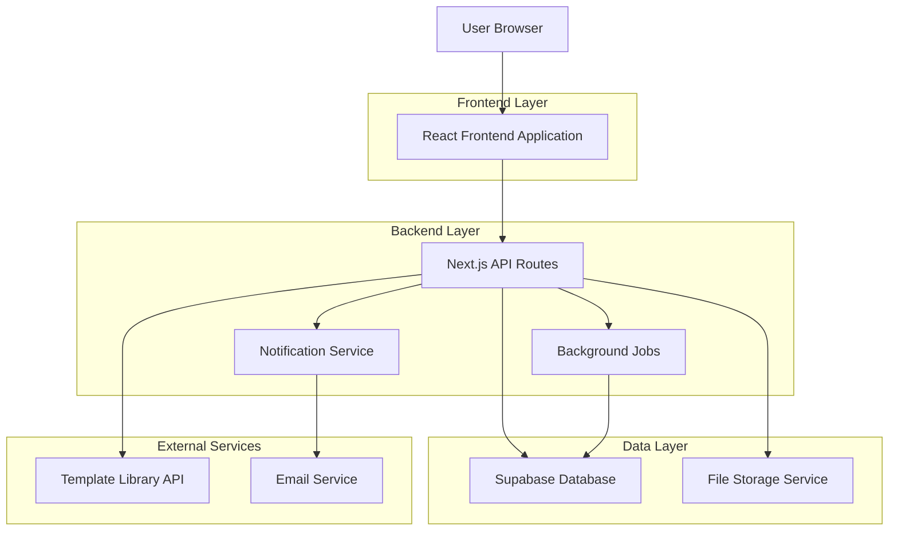
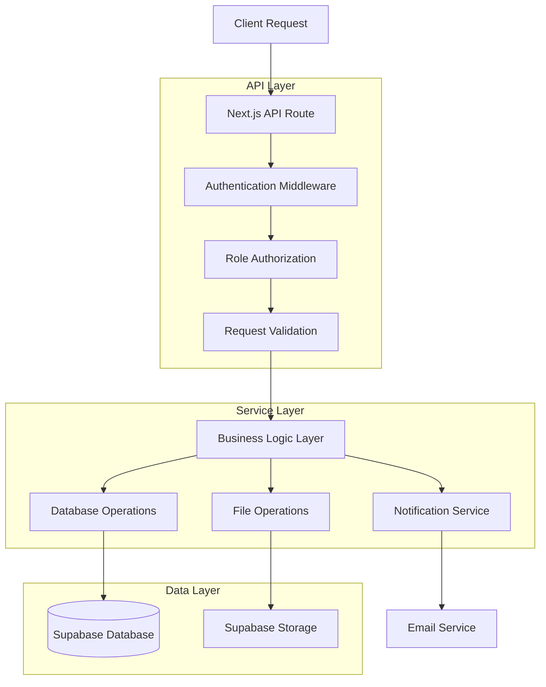
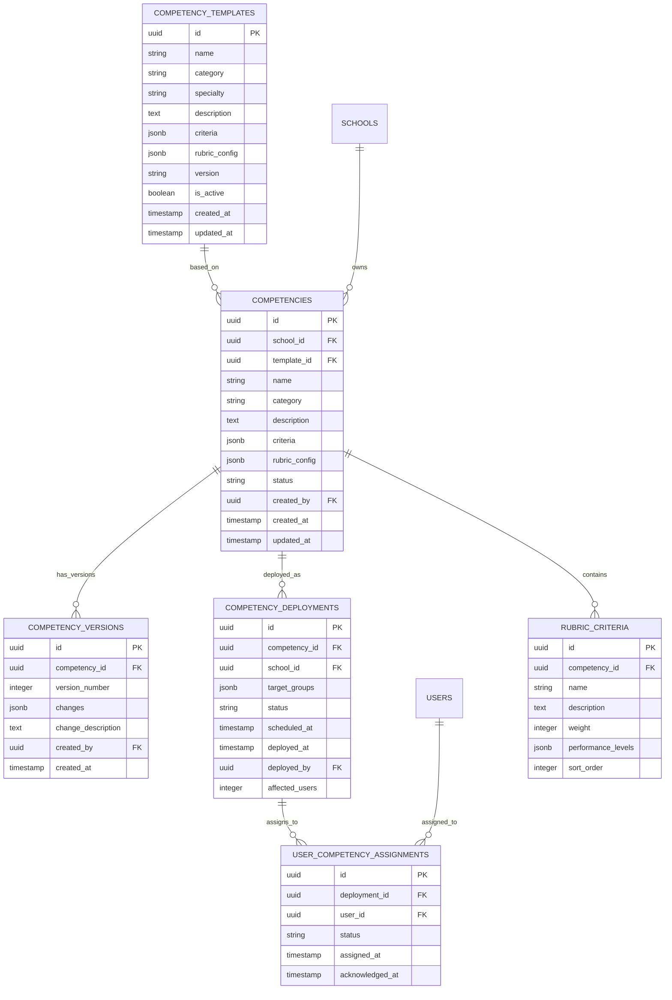

# Competency and Rubric Management System - Technical Architecture Document

## 1. Architecture Design



## 2. Technology Description

* Frontend: React\@18 + Next.js\@14 + TypeScript + Tailwind CSS + Shadcn/ui

* Backend: Next.js API Routes + Supabase

* Database: Supabase (PostgreSQL)

* File Storage: Supabase Storage

* Authentication: Clerk (existing integration)

* Validation: Zod schemas

* State Management: React Query + Zustand

## 3. Route Definitions

| Route                                               | Purpose                              |
| --------------------------------------------------- | ------------------------------------ |
| /dashboard/school-admin/competencies                | Main competency management dashboard |
| /dashboard/school-admin/competencies/templates      | Template library browser             |
| /dashboard/school-admin/competencies/builder        | Custom competency/rubric builder     |
| /dashboard/school-admin/competencies/import         | Bulk import/export center            |
| /dashboard/school-admin/competencies/deploy         | Deployment console                   |
| /dashboard/school-admin/competencies/\[id]          | Individual competency/rubric editor  |
| /dashboard/school-admin/competencies/\[id]/versions | Version history viewer               |

## 4. API Definitions

### 4.1 Core API

**Template Management**

```
GET /api/competency-templates
```

Request:

| Param Name | Param Type | isRequired | Description                               |
| ---------- | ---------- | ---------- | ----------------------------------------- |
| category   | string     | false      | Filter by template category               |
| specialty  | string     | false      | Filter by medical specialty               |
| search     | string     | false      | Search term for template name/description |
| limit      | number     | false      | Number of results per page (default: 20)  |
| offset     | number     | false      | Pagination offset (default: 0)            |

Response:

| Param Name | Param Type | Description               |
| ---------- | ---------- | ------------------------- |
| success    | boolean    | Request success status    |
| data       | array      | Array of template objects |
| pagination | object     | Pagination metadata       |

Example Response:

```json
{
  "success": true,
  "data": [
    {
      "id": "template_123",
      "name": "Clinical Skills Assessment",
      "category": "clinical",
      "specialty": "internal_medicine",
      "description": "Standardized clinical skills evaluation",
      "criteria": [...],
      "version": "1.2",
      "createdAt": "2024-01-15T10:00:00Z"
    }
  ],
  "pagination": {
    "total": 45,
    "limit": 20,
    "offset": 0
  }
}
```

**Custom Competency Creation**

```
POST /api/competencies
```

Request:

| Param Name  | Param Type | isRequired | Description                  |
| ----------- | ---------- | ---------- | ---------------------------- |
| name        | string     | true       | Competency name              |
| description | string     | true       | Detailed description         |
| category    | string     | true       | Competency category          |
| criteria    | array      | true       | Assessment criteria array    |
| rubric      | object     | true       | Scoring rubric configuration |
| schoolId    | string     | true       | School identifier            |

Response:

| Param Name | Param Type | Description               |
| ---------- | ---------- | ------------------------- |
| success    | boolean    | Creation success status   |
| data       | object     | Created competency object |
| message    | string     | Success message           |

**Bulk Import**

```
POST /api/competencies/import
```

Request:

| Param Name   | Param Type | isRequired | Description                         |
| ------------ | ---------- | ---------- | ----------------------------------- |
| file         | File       | true       | CSV/Excel file with competency data |
| schoolId     | string     | true       | Target school identifier            |
| validateOnly | boolean    | false      | Only validate without importing     |

Response:

| Param Name | Param Type | Description                           |
| ---------- | ---------- | ------------------------------------- |
| success    | boolean    | Import success status                 |
| imported   | number     | Number of successfully imported items |
| errors     | array      | Validation errors if any              |
| warnings   | array      | Non-critical warnings                 |

**School-wide Deployment**

```
POST /api/competencies/deploy
```

Request:

| Param Name    | Param Type | isRequired | Description                            |
| ------------- | ---------- | ---------- | -------------------------------------- |
| competencyIds | array      | true       | Array of competency IDs to deploy      |
| targetGroups  | array      | true       | User groups to deploy to               |
| scheduleDate  | string     | false      | Scheduled deployment date (ISO string) |
| notifyUsers   | boolean    | false      | Send notification to users             |

Response:

| Param Name    | Param Type | Description                  |
| ------------- | ---------- | ---------------------------- |
| success       | boolean    | Deployment success status    |
| deploymentId  | string     | Unique deployment identifier |
| affectedUsers | number     | Number of users affected     |
| message       | string     | Deployment status message    |

## 5. Server Architecture Diagram



## 6. Data Model

### 6.1 Data Model Definition



### 6.2 Data Definition Language

**Competency Templates Table**

```sql
-- Create competency templates table
CREATE TABLE competency_templates (
    id UUID PRIMARY KEY DEFAULT gen_random_uuid(),
    name VARCHAR(255) NOT NULL,
    category VARCHAR(100) NOT NULL,
    specialty VARCHAR(100),
    description TEXT NOT NULL,
    criteria JSONB NOT NULL DEFAULT '[]',
    rubric_config JSONB NOT NULL DEFAULT '{}',
    version VARCHAR(20) DEFAULT '1.0',
    is_active BOOLEAN DEFAULT true,
    created_at TIMESTAMP WITH TIME ZONE DEFAULT NOW(),
    updated_at TIMESTAMP WITH TIME ZONE DEFAULT NOW()
);

-- Create indexes
CREATE INDEX idx_competency_templates_category ON competency_templates(category);
CREATE INDEX idx_competency_templates_specialty ON competency_templates(specialty);
CREATE INDEX idx_competency_templates_active ON competency_templates(is_active);

-- Insert sample templates
INSERT INTO competency_templates (name, category, specialty, description, criteria, rubric_config) VALUES
('Clinical Skills Assessment', 'clinical', 'internal_medicine', 'Comprehensive clinical skills evaluation', 
 '[{"name": "Patient History", "weight": 25}, {"name": "Physical Examination", "weight": 35}, {"name": "Clinical Reasoning", "weight": 40}]',
 '{"scale": "1-5", "passing_score": 3, "levels": [{"value": 1, "label": "Novice"}, {"value": 5, "label": "Expert"}]}'),
('Professional Behavior Assessment', 'professional', 'general', 'Evaluation of professional behaviors and ethics',
 '[{"name": "Communication", "weight": 30}, {"name": "Professionalism", "weight": 40}, {"name": "Teamwork", "weight": 30}]',
 '{"scale": "pass_fail", "passing_score": 1, "levels": [{"value": 0, "label": "Fail"}, {"value": 1, "label": "Pass"}]}');
```

**Competencies Table**

```sql
-- Create competencies table
CREATE TABLE competencies (
    id UUID PRIMARY KEY DEFAULT gen_random_uuid(),
    school_id UUID NOT NULL REFERENCES schools(id) ON DELETE CASCADE,
    template_id UUID REFERENCES competency_templates(id),
    name VARCHAR(255) NOT NULL,
    category VARCHAR(100) NOT NULL,
    description TEXT NOT NULL,
    criteria JSONB NOT NULL DEFAULT '[]',
    rubric_config JSONB NOT NULL DEFAULT '{}',
    status VARCHAR(20) DEFAULT 'draft' CHECK (status IN ('draft', 'active', 'archived')),
    created_by UUID NOT NULL REFERENCES users(id),
    created_at TIMESTAMP WITH TIME ZONE DEFAULT NOW(),
    updated_at TIMESTAMP WITH TIME ZONE DEFAULT NOW()
);

-- Create indexes
CREATE INDEX idx_competencies_school_id ON competencies(school_id);
CREATE INDEX idx_competencies_category ON competencies(category);
CREATE INDEX idx_competencies_status ON competencies(status);
CREATE INDEX idx_competencies_created_by ON competencies(created_by);
```

**Competency Versions Table**

```sql
-- Create competency versions table
CREATE TABLE competency_versions (
    id UUID PRIMARY KEY DEFAULT gen_random_uuid(),
    competency_id UUID NOT NULL REFERENCES competencies(id) ON DELETE CASCADE,
    version_number INTEGER NOT NULL,
    changes JSONB NOT NULL DEFAULT '{}',
    change_description TEXT,
    created_by UUID NOT NULL REFERENCES users(id),
    created_at TIMESTAMP WITH TIME ZONE DEFAULT NOW(),
    UNIQUE(competency_id, version_number)
);

-- Create indexes
CREATE INDEX idx_competency_versions_competency_id ON competency_versions(competency_id);
CREATE INDEX idx_competency_versions_created_at ON competency_versions(created_at DESC);
```

**Competency Deployments Table**

```sql
-- Create competency deployments table
CREATE TABLE competency_deployments (
    id UUID PRIMARY KEY DEFAULT gen_random_uuid(),
    competency_id UUID NOT NULL REFERENCES competencies(id) ON DELETE CASCADE,
    school_id UUID NOT NULL REFERENCES schools(id) ON DELETE CASCADE,
    target_groups JSONB NOT NULL DEFAULT '[]',
    status VARCHAR(20) DEFAULT 'pending' CHECK (status IN ('pending', 'scheduled', 'deployed', 'failed')),
    scheduled_at TIMESTAMP WITH TIME ZONE,
    deployed_at TIMESTAMP WITH TIME ZONE,
    deployed_by UUID NOT NULL REFERENCES users(id),
    affected_users INTEGER DEFAULT 0,
    created_at TIMESTAMP WITH TIME ZONE DEFAULT NOW()
);

-- Create indexes
CREATE INDEX idx_competency_deployments_school_id ON competency_deployments(school_id);
CREATE INDEX idx_competency_deployments_status ON competency_deployments(status);
CREATE INDEX idx_competency_deployments_scheduled_at ON competency_deployments(scheduled_at);
```

**User Competency Assignments Table**

```sql
-- Create user competency assignments table
CREATE TABLE user_competency_assignments (
    id UUID PRIMARY KEY DEFAULT gen_random_uuid(),
    deployment_id UUID NOT NULL REFERENCES competency_deployments(id) ON DELETE CASCADE,
    user_id UUID NOT NULL REFERENCES users(id) ON DELETE CASCADE,
    status VARCHAR(20) DEFAULT 'assigned' CHECK (status IN ('assigned', 'acknowledged', 'completed')),
    assigned_at TIMESTAMP WITH TIME ZONE DEFAULT NOW(),
    acknowledged_at TIMESTAMP WITH TIME ZONE,
    UNIQUE(deployment_id, user_id)
);

-- Create indexes
CREATE INDEX idx_user_competency_assignments_user_id ON user_competency_assignments(user_id);
CREATE INDEX idx_user_competency_assignments_status ON user_competency_assignments(status);
CREATE INDEX idx_user_competency_assignments_assigned_at ON user_competency_assignments(assigned_at DESC);
```

**Rubric Criteria Table**

```sql
-- Create rubric criteria table
CREATE TABLE rubric_criteria (
    id UUID PRIMARY KEY DEFAULT gen_random_uuid(),
    competency_id UUID NOT NULL REFERENCES competencies(id) ON DELETE CASCADE,
    name VARCHAR(255) NOT NULL,
    description TEXT,
    weight INTEGER DEFAULT 1 CHECK (weight > 0),
    performance_levels JSONB NOT NULL DEFAULT '[]',
    sort_order INTEGER DEFAULT 0,
    created_at TIMESTAMP WITH TIME ZONE DEFAULT NOW()
);

-- Create indexes
CREATE INDEX idx_rubric_criteria_competency_id ON rubric_criteria(competency_id);
CREATE INDEX idx_rubric_criteria_sort_order ON rubric_criteria(sort_order);
```

