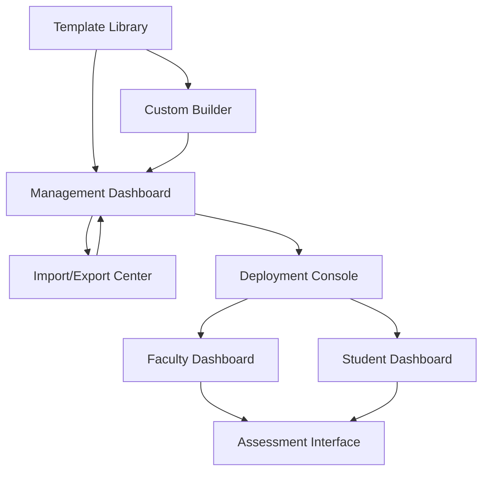

# Competency and Rubric Management System - Product Requirements Document

## 1. Product Overview

A comprehensive management system that enables schools to import standardized competency and rubric templates while providing flexibility to create custom configurations tailored to their institution's specific guidelines. The system serves as a centralized hub for managing all competency and rubric configurations across the entire school network.

* **Primary Purpose**: Streamline competency and rubric management by combining standardized templates with custom creation capabilities, ensuring consistency across all users within a school network.

* **Target Users**: School administrators who need to configure and deploy competency frameworks and evaluation rubrics for their entire institution.

* **Market Value**: Reduces administrative overhead while maintaining educational standards compliance and institutional flexibility.

## 2. Core Features

### 2.1 User Roles

| Role          | Registration Method           | Core Permissions                                                            |
| ------------- | ----------------------------- | --------------------------------------------------------------------------- |
| School Admin  | Existing school admin account | Full access to template import, custom creation, and school-wide deployment |
| Faculty/Staff | School network association    | View and use deployed competencies/rubrics (read-only)                      |
| Students      | School network association    | View assigned competencies and rubrics (read-only)                          |

### 2.2 Feature Module

Our competency and rubric management system consists of the following main pages:

1. **Template Library**: Browse and import standardized templates, template categories, search and filtering.
2. **Custom Builder**: Create custom competencies and rubrics, drag-and-drop interface, criteria definition.
3. **Management Dashboard**: View all configurations, version control, deployment status, bulk operations.
4. **Import/Export Center**: Bulk import templates, export configurations, data validation and preview.
5. **Deployment Console**: School-wide deployment, user assignment, rollback capabilities.

### 2.3 Page Details

| Page Name            | Module Name            | Feature description                                                                                                                                                     |
| -------------------- | ---------------------- | ----------------------------------------------------------------------------------------------------------------------------------------------------------------------- |
| Template Library     | Template Browser       | Browse predefined templates by category (Clinical Skills, Academic Competencies, Professional Behaviors). Filter by specialty, accreditation body, or difficulty level. |
| Template Library     | Template Preview       | View detailed template structure, criteria breakdown, scoring rubrics. Import selected templates with customization options.                                            |
| Template Library     | Category Management    | Organize templates into custom categories. Create school-specific template collections.                                                                                 |
| Custom Builder       | Competency Creator     | Build custom competencies with title, description, learning objectives. Define assessment criteria and performance levels.                                              |
| Custom Builder       | Rubric Designer        | Create evaluation rubrics with scoring scales (1-5, Pass/Fail, etc.). Set performance descriptors and weighting.                                                        |
| Custom Builder       | Criteria Editor        | Add, edit, remove assessment criteria. Set minimum passing scores and proficiency thresholds.                                                                           |
| Management Dashboard | Configuration Overview | Display all active competencies and rubrics. Show deployment status and usage statistics.                                                                               |
| Management Dashboard | Version Control        | Track template versions and modifications. Compare versions and rollback capabilities.                                                                                  |
| Management Dashboard | User Assignment        | Assign competencies to specific programs, courses, or user groups. Bulk assignment operations.                                                                          |
| Import/Export Center | Bulk Import            | Upload CSV/Excel files with multiple templates. Data validation and error reporting.                                                                                    |
| Import/Export Center | Export Manager         | Export configurations in various formats (PDF, Excel, JSON). Generate reports and documentation.                                                                        |
| Import/Export Center | Data Validation        | Validate imported data structure and content. Preview changes before applying.                                                                                          |
| Deployment Console   | School-wide Deployment | Deploy configurations to all users in school network. Schedule deployments and notifications.                                                                           |
| Deployment Console   | Rollback Management    | Revert to previous configurations. Selective rollback for specific competencies.                                                                                        |
| Deployment Console   | Notification Center    | Send deployment notifications to affected users. Track acknowledgment and adoption rates.                                                                               |

## 3. Core Process

**School Admin Workflow:**

1. Access Template Library to browse available standardized templates
2. Import selected templates or create custom competencies/rubrics using the Custom Builder
3. Review and modify configurations in the Management Dashboard
4. Use Import/Export Center for bulk operations when needed
5. Deploy configurations school-wide through the Deployment Console
6. Monitor usage and manage versions through the Management Dashboard

**Faculty/Staff Workflow:**

1. Receive notification of new competency/rubric deployments
2. Access assigned competencies and rubrics through their dashboard
3. Use configurations for student evaluation and assessment
4. Provide feedback on competency effectiveness (optional)

## 4. User Interface Design

### 4.1 Design Style

* **Primary Colors**: Blue (#2563eb) for primary actions, Green (#16a34a) for success states

* **Secondary Colors**: Gray (#64748b) for secondary elements, Red (#dc2626) for warnings

* **Button Style**: Rounded corners (8px radius) with subtle shadows and hover effects

* **Font**: Inter font family, 14px base size for body text, 16px for headings

* **Layout Style**: Card-based design with clean spacing, top navigation with breadcrumbs

* **Icons**: Lucide React icons for consistency, competency-specific icons for categories

### 4.2 Page Design Overview

| Page Name            | Module Name            | UI Elements                                                                                                                      |
| -------------------- | ---------------------- | -------------------------------------------------------------------------------------------------------------------------------- |
| Template Library     | Template Browser       | Grid layout with template cards, category sidebar with filters, search bar with autocomplete. Blue accent colors for categories. |
| Template Library     | Template Preview       | Modal overlay with detailed view, tabbed interface for different sections, import button with customization options.             |
| Custom Builder       | Competency Creator     | Form-based interface with drag-and-drop components, real-time preview panel, step-by-step wizard navigation.                     |
| Custom Builder       | Rubric Designer        | Table-based rubric editor with inline editing, color-coded performance levels, scoring calculator.                               |
| Management Dashboard | Configuration Overview | Data table with sorting and filtering, status badges (Active, Draft, Archived), action buttons for quick operations.             |
| Management Dashboard | Version Control        | Timeline view of changes, diff viewer for comparing versions, restore buttons with confirmation dialogs.                         |
| Import/Export Center | Bulk Import            | File upload area with drag-and-drop, progress indicators, validation results table with error highlighting.                      |
| Import/Export Center | Export Manager         | Format selection dropdown, preview options, download buttons with file size indicators.                                          |
| Deployment Console   | School-wide Deployment | Deployment wizard with user selection, scheduling options, confirmation summary with affected user count.                        |
| Deployment Console   | Notification Center    | Message composer with templates, recipient lists, delivery status tracking with read receipts.                                   |

### 4.3 Responsiveness

Desktop-first design with mobile-adaptive layouts. Touch-optimized interactions for tablet use. Responsive tables with horizontal scrolling on smaller screens. Collapsible sidebar navigation for mobile devices.

## 5. Technical Requirements

### 5.1 Data Storage

* Template library with categorization and metadata

* Custom competency and rubric configurations

* Version history and change tracking

* User assignments and deployment records

* Import/export logs and validation results

### 5.2 Integration Requirements

* Integration with existing user management system

* API endpoints for external template sources

* Bulk data processing capabilities

* Notification system integration

* Audit logging for compliance tracking

### 5.3 Security & Access Control

* Role-based access control (School Admin only)

* School network isolation for data security

* Audit trails for all configuration changes

* Secure file upload and validation

* Data encryption for sensitive configurations

### 5.4 Performance Requirements

* Fast template search and filtering (< 2 seconds)

* Efficient bulk import processing

* Real

