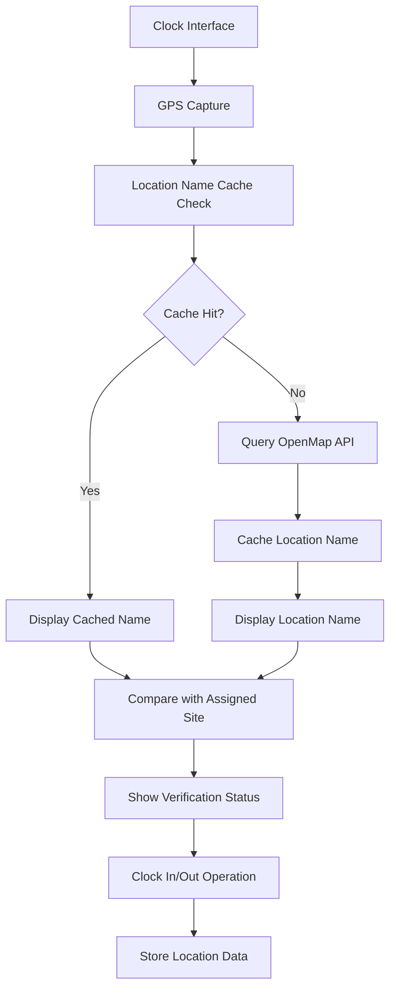

# GPS Location Name Clock Enhancement - Product Requirements Document

## 1. Product Overview

Enhance the existing clock system to display GPS location names alongside current time, providing users with contextual location awareness during clock-in/out operations. This enhancement integrates with the current OpenMap service to retrieve and display human-readable location names from GPS coordinates, improving user experience and operational transparency.

The system addresses the need for better location context in clinical environments where students need to verify their physical presence at assigned sites while maintaining the existing robust clock-in/out functionality.

## 2. Core Features

### 2.1 User Roles

| Role                | Registration Method            | Core Permissions                                                         |
| ------------------- | ------------------------------ | ------------------------------------------------------------------------ |
| Student             | Existing authentication system | Can view location names during clock operations, access location history |
| Clinical Supervisor | Existing authentication system | Can view student location data with names, monitor clock activities      |
| Administrator       | Existing authentication system | Full access to location data, system configuration, and analytics        |

### 2.2 Feature Module

Our GPS location name enhancement consists of the following main components:

1. **Enhanced Clock Interface**: Real-time location name display, GPS coordinate resolution, location verification status
2. **Location Name Service**: OpenMap API integration, location caching, fallback handling
3. **Location Display Component**: Current location name, assigned site comparison, location accuracy indicator
4. **Location History Dashboard**: Historical location data with names, location analytics, site verification reports

### 2.3 Page Details

| Page Name                  | Module Name                | Feature description                                                                                                                              |
| -------------------------- | -------------------------- | ------------------------------------------------------------------------------------------------------------------------------------------------ |
| Enhanced Clock Interface   | Location Name Display      | Display current GPS location name alongside time, show assigned site name for comparison, indicate location accuracy and verification status     |
| Enhanced Clock Interface   | Real-time Location Updates | Continuously update location name as GPS coordinates change, maintain synchronization with time display, handle location permission states       |
| Enhanced Clock Interface   | Location Verification      | Compare current location name with assigned site, provide visual indicators for location match/mismatch, display distance from assigned location |
| Location History Dashboard | Location Analytics         | Show historical location data with resolved names, display time spent at different locations, provide location accuracy statistics               |
| Location History Dashboard | Site Verification Reports  | Generate reports showing clock-in/out locations vs assigned sites, highlight location discrepancies, export location data                        |
| System Settings            | Location Configuration     | Configure location name resolution settings, set cache duration and accuracy thresholds, manage OpenMap API integration                          |

## 3. Core Process

### Student Clock Operation Flow

1. Student accesses clock interface
2. System captures GPS coordinates (existing functionality)
3. System resolves GPS coordinates to location name using OpenMap service
4. Display shows current time, current location name, and assigned site name
5. Student performs clock-in/out with location verification
6. System stores both coordinates and resolved location name
7. Location history is updated with human-readable location data

### Location Name Resolution Flow

1. GPS coordinates are captured from device
2. System checks cache for previously resolved location names
3. If not cached, system queries OpenMap API for location name
4. Location name is cached with timestamp and accuracy data
5. Display is updated with resolved location name
6. Fallback to coordinates if name resolution fails

## 4. User Interface Design

### 4.1 Design Style

* **Primary Colors**: Blue (#3B82F6) for location indicators, Green (#10B981) for verified locations

* **Secondary Colors**: Gray (#6B7280) for inactive states, Red (#EF4444) for location mismatches

* **Button Style**: Rounded corners with subtle shadows, consistent with existing clock interface

* **Font**: Inter font family, 14px for location names, 12px for accuracy indicators

* **Layout Style**: Card-based design maintaining existing clock widget structure

* **Icons**: MapPin for location, CheckCircle for verified, AlertCircle for warnings

### 4.2 Page Design Overview

| Page Name                  | Module Name           | UI Elements                                                                                                   |
| -------------------------- | --------------------- | ------------------------------------------------------------------------------------------------------------- |
| Enhanced Clock Interface   | Location Name Display | Location name text below current time, small accuracy indicator (±5m), color-coded verification badge         |
| Enhanced Clock Interface   | Site Comparison       | Side-by-side display of "Current Location" and "Assigned Site", visual match/mismatch indicator               |
| Enhanced Clock Interface   | Location Status       | Loading spinner during name resolution, error message for failed resolution, refresh button for manual update |
| Location History Dashboard | Location Timeline     | Chronological list with timestamps, location names, and site assignments, expandable details for each entry   |
| Location History Dashboard | Analytics Cards       | Summary cards showing total locations visited, average accuracy, verification success rate                    |
| System Settings            | Configuration Panel   | Toggle switches for location features, slider for cache duration, input fields for accuracy thresholds        |

### 4.3 Responsiveness

The enhancement maintains mobile-first responsive design, optimized for touch interactions on clinical devices. Location names are truncated appropriately on smaller screens with full names available on tap/hover.

## 5. Technical Requirements

### 5.1 Integration Points

* **OpenMap Service**: Existing service enhanced for location name resolution

* **Clock Service**: Extended to store and retrieve location names

* **Location Components**: Enhanced LocationDisplay and LocationPermissionHandler

* **Cache System**: Redis-based caching for location name lookups

### 5.2 Performance Requirements

* Location name resolution within 2 seconds

* Cache hit rate of 80% for frequently visited locations

* Offline fallback to coordinates when network unavailable

* Maximum 100KB memory usage for location name cache

### 5.3 Data Requirements

* Store location names with timestamps in existing time records

* Maintain location name cache with 24-hour expiration

* Track location name resolution accuracy and success rates

* Preserve existing GPS coordinate storage for backup

## 6. Security and Privacy

### 6.1 Data Protection

* Location names stored with same encryption as GPS coordinates

* Cache data encrypted at rest and in transit

* User consent required for location name display

* Audit trail for all location name access

### 6.2 API Security

* Secure OpenMap API key management

* Rate limiting for location name requests

* Fallback mechanisms for API failures

* Input validation for all location data

## 7. Success Metrics

### 7.1 User Experience Metrics

* 95% user satisfaction with location name accuracy

* 90% reduction in location-related support tickets

* 80% improvement in location verification confidence

* 2-second average location name resolution time

### 7.2 Technical Metrics

* 99.5% uptime for location name service

* 80% cache hit rate for location lookups

* <100ms additional latency for enhanced clock interface

* 95% successful location name resolution rate

## 8. Implementation Phases

### Phase 1: Core Integration (Week 1-2)

* Enhance OpenMap service for location name resolution

* Update clock interface to display location names

* Implement basic caching mechanism

### Phase 2: Advanced Features (Week 3-4)

* Add site comparison and verification indicators

* Implement location history with names

* Create configuration settings

### Phase 3: Analytics and Optimization (Week 5-6)

* Add location analytics dashboard

* Optimize caching and performance

* Implement comprehensive error handling

## 9. Risk Mitigation

### 9.1 Technical Risks

* **OpenMap API Failures**: Implement robust fallback to coordinates

* **Performance Impact**: Optimize caching and async operations

* **Location Accuracy**: Provide accuracy indicators and user feedback

### 9.2 User Experience Risks

* **Privacy Concerns**: Clear consent mechanisms and data usage transparency

* **Interface Complexity**: Maintain clean, intuitive design with progressive disclosure

* **Network Dependencies**: Offline-first approach with cached data

