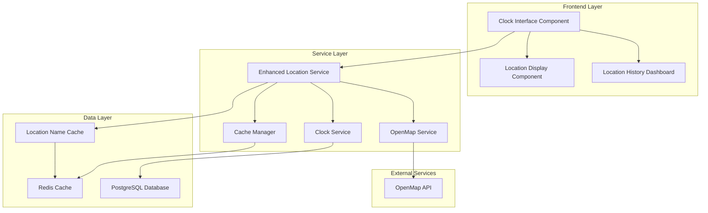
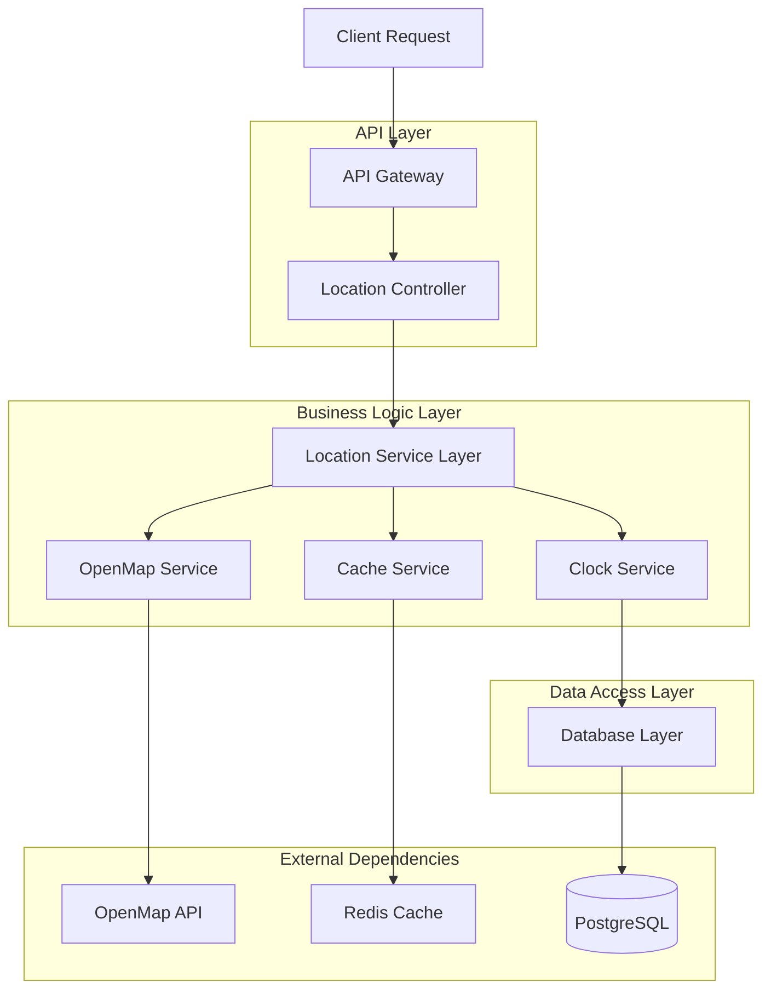
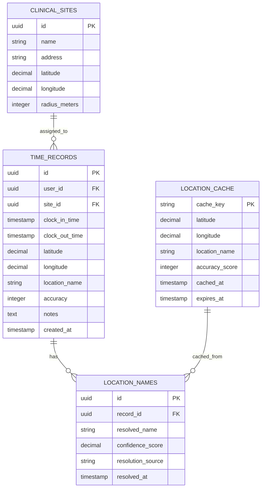

# GPS Location Name Clock Enhancement - Technical Architecture Document

## 1. Architecture Design



## 2. Technology Description

- Frontend: React@18 + TypeScript + Tailwind CSS + Vite
- Backend: Enhanced existing services with location name resolution
- Database: Supabase (PostgreSQL) with additional location name fields
- Cache: Redis for location name caching
- External API: OpenMap API for location name resolution

## 3. Route Definitions

| Route | Purpose |
|-------|---------|
| /student/clock | Enhanced clock interface with GPS location names |
| /student/location-history | Location history dashboard with resolved names |
| /api/location/resolve | API endpoint for GPS coordinate to name resolution |
| /api/location/cache | Cache management for location names |
| /admin/location-settings | Configuration panel for location name features |

## 4. API Definitions

### 4.1 Location Name Resolution API

**Resolve GPS coordinates to location name**
```
POST /api/location/resolve
```

Request:
| Param Name | Param Type | isRequired | Description |
|------------|------------|------------|-------------|
| latitude | number | true | GPS latitude coordinate |
| longitude | number | true | GPS longitude coordinate |
| accuracy | number | false | GPS accuracy in meters |
| cacheKey | string | false | Optional cache key for optimization |

Response:
| Param Name | Param Type | Description |
|------------|------------|-------------|
| locationName | string | Human-readable location name |
| accuracy | number | Resolution accuracy score (0-100) |
| cached | boolean | Whether result was from cache |
| timestamp | string | Resolution timestamp |

Example Request:
```json
{
  "latitude": 40.7128,
  "longitude": -74.0060,
  "accuracy": 5
}
```

Example Response:
```json
{
  "locationName": "New York Presbyterian Hospital",
  "accuracy": 95,
  "cached": false,
  "timestamp": "2024-01-15T10:30:00Z"
}
```

**Get location name cache statistics**
```
GET /api/location/cache/stats
```

Response:
| Param Name | Param Type | Description |
|------------|------------|-------------|
| hitRate | number | Cache hit rate percentage |
| totalRequests | number | Total resolution requests |
| cacheSize | number | Current cache size |
| lastCleanup | string | Last cache cleanup timestamp |

**Clear location name cache**
```
DELETE /api/location/cache
```

Request:
| Param Name | Param Type | isRequired | Description |
|------------|------------|------------|-------------|
| pattern | string | false | Cache key pattern to clear (default: all) |

### 4.2 Enhanced Clock API

**Clock in with location name**
```
POST /api/clock/in
```

Request (Enhanced):
| Param Name | Param Type | isRequired | Description |
|------------|------------|------------|-------------|
| siteId | string | true | Assigned site ID |
| latitude | number | true | GPS latitude |
| longitude | number | true | GPS longitude |
| locationName | string | false | Resolved location name |
| accuracy | number | false | GPS accuracy |

**Get clock status with location**
```
GET /api/clock/status
```

Response (Enhanced):
| Param Name | Param Type | Description |
|------------|------------|-------------|
| clockedIn | boolean | Current clock status |
| currentLocation | object | Current location with name |
| assignedSite | object | Assigned site information |
| locationMatch | boolean | Whether current location matches assigned site |

## 5. Server Architecture Diagram



## 6. Data Model

### 6.1 Data Model Definition



### 6.2 Data Definition Language

**Enhanced Time Records Table**
```sql
-- Add location name fields to existing time_records table
ALTER TABLE time_records 
ADD COLUMN location_name VARCHAR(255),
ADD COLUMN location_accuracy INTEGER DEFAULT 0,
ADD COLUMN location_resolved_at TIMESTAMP WITH TIME ZONE;

-- Create index for location queries
CREATE INDEX idx_time_records_location_name ON time_records(location_name);
CREATE INDEX idx_time_records_coordinates ON time_records(latitude, longitude);
```

**Location Names Table**
```sql
-- Create location names tracking table
CREATE TABLE location_names (
    id UUID PRIMARY KEY DEFAULT gen_random_uuid(),
    record_id UUID REFERENCES time_records(id) ON DELETE CASCADE,
    resolved_name VARCHAR(255) NOT NULL,
    confidence_score DECIMAL(5,2) DEFAULT 0.00,
    resolution_source VARCHAR(50) DEFAULT 'openmap',
    resolved_at TIMESTAMP WITH TIME ZONE DEFAULT NOW(),
    created_at TIMESTAMP WITH TIME ZONE DEFAULT NOW()
);

-- Create indexes
CREATE INDEX idx_location_names_record_id ON location_names(record_id);
CREATE INDEX idx_location_names_resolved_name ON location_names(resolved_name);
CREATE INDEX idx_location_names_confidence ON location_names(confidence_score DESC);

-- Grant permissions
GRANT SELECT ON location_names TO anon;
GRANT ALL PRIVILEGES ON location_names TO authenticated;
```

**Location Cache Table**
```sql
-- Create location name cache table
CREATE TABLE location_cache (
    cache_key VARCHAR(100) PRIMARY KEY,
    latitude DECIMAL(10, 8) NOT NULL,
    longitude DECIMAL(11, 8) NOT NULL,
    location_name VARCHAR(255) NOT NULL,
    accuracy_score INTEGER DEFAULT 0,
    cached_at TIMESTAMP WITH TIME ZONE DEFAULT NOW(),
    expires_at TIMESTAMP WITH TIME ZONE DEFAULT (NOW() + INTERVAL '24 hours')
);

-- Create indexes
CREATE INDEX idx_location_cache_coordinates ON location_cache(latitude, longitude);
CREATE INDEX idx_location_cache_expires ON location_cache(expires_at);
CREATE INDEX idx_location_cache_accuracy ON location_cache(accuracy_score DESC);

-- Grant permissions
GRANT SELECT ON location_cache TO anon;
GRANT ALL PRIVILEGES ON location_cache TO authenticated;

-- Create cache cleanup function
CREATE OR REPLACE FUNCTION cleanup_expired_location_cache()
RETURNS void AS $$
BEGIN
    DELETE FROM location_cache WHERE expires_at < NOW();
END;
$$ LANGUAGE plpgsql;

-- Schedule cache cleanup (requires pg_cron extension)
-- SELECT cron.schedule('cleanup-location-cache', '0 */6 * * *', 'SELECT cleanup_expired_location_cache();');
```

**Enhanced Clinical Sites Table**
```sql
-- Add location verification fields to clinical_sites
ALTER TABLE clinical_sites 
ADD COLUMN verification_radius INTEGER DEFAULT 100,
ADD COLUMN location_name_override VARCHAR(255),
ADD COLUMN auto_resolve_location BOOLEAN DEFAULT true;

-- Create index for location verification
CREATE INDEX idx_clinical_sites_coordinates ON clinical_sites(latitude, longitude);
```

## 7. Component Architecture

### 7.1 Enhanced Location Service

```typescript
interface LocationNameService {
  resolveLocationName(coordinates: LocationCoordinates): Promise<LocationNameResult>
  getCachedLocationName(coordinates: LocationCoordinates): Promise<string | null>
  cacheLocationName(coordinates: LocationCoordinates, name: string, accuracy: number): Promise<void>
  clearCache(pattern?: string): Promise<void>
  getStats(): Promise<CacheStats>
}

interface LocationNameResult {
  locationName: string
  accuracy: number
  cached: boolean
  timestamp: Date
  source: 'openmap' | 'cache' | 'fallback'
}
```

### 7.2 Enhanced Clock Interface Component

```typescript
interface EnhancedClockProps {
  showLocationName?: boolean
  enableLocationVerification?: boolean
  cacheLocationNames?: boolean
  locationUpdateInterval?: number
}

interface LocationDisplayState {
  currentLocationName: string | null
  assignedSiteName: string | null
  locationMatch: boolean
  isResolving: boolean
  accuracy: number
  lastUpdated: Date
}
```

### 7.3 Location Name Cache Manager

```typescript
interface CacheManager {
  generateCacheKey(latitude: number, longitude: number): string
  isExpired(cacheEntry: CacheEntry): boolean
  cleanup(): Promise<number>
  getHitRate(): number
  getTotalSize(): number
}

interface CacheEntry {
  key: string
  locationName: string
  accuracy: number
  cachedAt: Date
  expiresAt: Date
}
```

## 8. Performance Optimizations

### 8.1 Caching Strategy

- **L1 Cache**: In-memory component cache (5 minutes)
- **L2 Cache**: Redis cache (24 hours)
- **L3 Cache**: Database cache (7 days)
- **Cache Key**: `location:${lat.toFixed(4)}:${lng.toFixed(4)}`

### 8.2 API Rate Limiting

- OpenMap API: 100 requests per minute per user
- Location resolution: Debounced to 1 request per 10 seconds
- Batch processing for multiple coordinate resolutions

### 8.3 Offline Support

- Store last known location names in localStorage
- Fallback to coordinates when offline
- Queue resolution requests for when online
- Progressive enhancement approach

## 9. Security Considerations

### 9.1 Data Protection

- Encrypt location names in database using same encryption as coordinates
- Implement data retention policies for location cache
- Audit logging for all location name access
- User consent tracking for location name display

### 9.2 API Security

- Secure OpenMap API key storage in environment variables
- Rate limiting and request validation
- Input sanitization for all location data
- CORS configuration for location endpoints

## 9.3 Privacy Controls

- User opt-out mechanism for location name resolution
- Granular permissions for location name display
- Data anonymization for analytics
- Compliance with healthcare privacy regulations