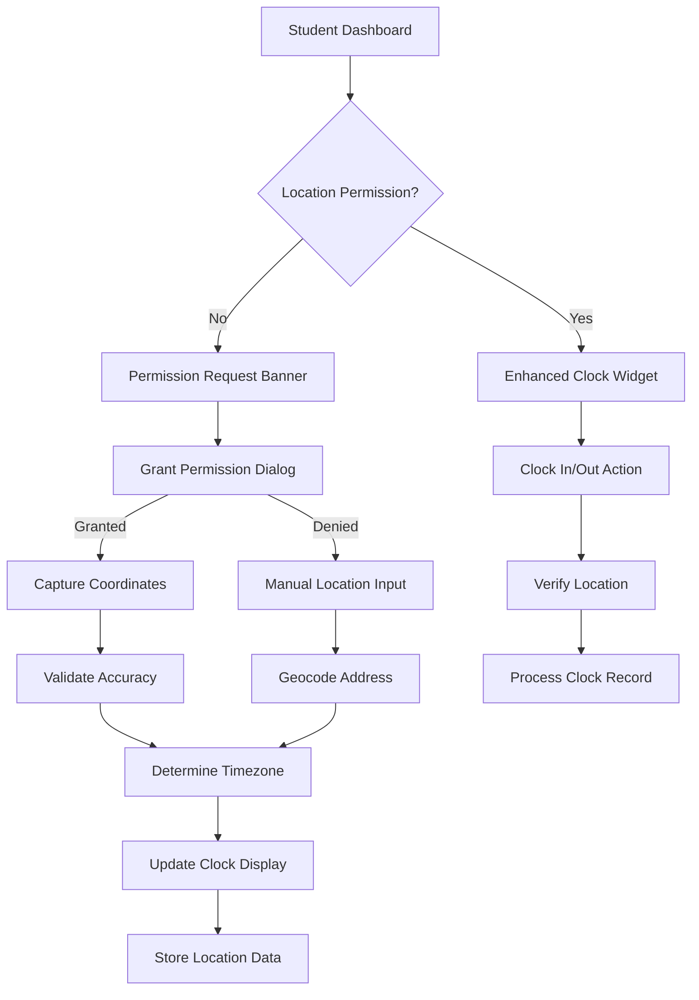

# Geographic Location-Based Clock System - Product Requirements Document

## 1. Product Overview

A comprehensive location-aware clock system that captures, validates, and securely stores user geographic coordinates to provide accurate local time display and enhanced clock-in/out functionality for medical students and healthcare professionals.

The system enhances the existing MedStintClerk clock functionality by adding precise location tracking, timezone-aware time display, and secure location data management while maintaining GDPR compliance and user privacy.

This feature addresses the critical need for accurate time tracking in healthcare environments where location verification is essential for compliance and operational efficiency.

## 2. Core Features

### 2.1 User Roles

| Role | Registration Method | Core Permissions |
|------|---------------------|------------------|
| Student | Existing authentication | Can grant location access, view local time, clock in/out with location verification |
| Administrator | Existing admin access | Can view location data, manage location settings, access location analytics |
| System | Automated processes | Can store location data, perform timezone calculations, cache location information |

### 2.2 Feature Module

Our location-based clock system consists of the following main components:

1. **Location Permission Management**: User consent interface, privacy controls, permission status tracking
2. **Geographic Coordinate Capture**: GPS/browser geolocation, coordinate validation, accuracy assessment
3. **Location Data Storage**: Secure database storage, encryption, data retention policies
4. **Timezone-Aware Time Display**: Local time calculation, timezone detection, daylight saving handling
5. **Manual Location Input**: Fallback interface, address geocoding, coordinate entry
6. **Location Verification**: Accuracy validation, facility matching, distance calculations

### 2.3 Page Details

| Page Name | Module Name | Feature Description |
|-----------|-------------|---------------------|
| Student Dashboard | Location Permission Banner | Display location access status, request permissions with clear privacy messaging, show current location status |
| Student Dashboard | Enhanced Clock Widget | Show timezone-aware local time, display location-based time accuracy, integrate location status indicators |
| Student Dashboard | Location Settings Panel | Configure location preferences, manage privacy settings, view stored location data |
| Clock Interface | Location Capture Dialog | Request geolocation access, show permission prompts, display capture progress with accuracy indicators |
| Clock Interface | Manual Location Input | Provide address search, coordinate entry form, geocoding validation with facility matching |
| Clock Interface | Location Verification | Validate coordinates accuracy, match against known facilities, calculate distances and show verification status |
| Admin Dashboard | Location Analytics | View location usage statistics, monitor accuracy metrics, manage location data retention |
| Admin Dashboard | Privacy Management | Configure data retention policies, manage user consent records, handle data deletion requests |

## 3. Core Process

### Student Location Setup Flow
1. Student accesses dashboard → System checks location permission status
2. If no permission → Display permission request banner with privacy information
3. Student grants permission → System captures coordinates and validates accuracy
4. System determines timezone → Updates clock display with local time
5. If capture fails → Offer manual location input option
6. Location verified → Store securely and enable enhanced clock functionality

### Clock-In/Out with Location Flow
1. Student initiates clock action → System verifies current location access
2. Capture current coordinates → Validate against stored/expected location
3. Calculate facility proximity → Verify location accuracy requirements
4. If location valid → Process clock action with location metadata
5. If location invalid → Show verification dialog with manual override option
6. Store clock record → Include encrypted location data and accuracy metrics

## 4. User Interface Design

### 4.1 Design Style

- **Primary Colors**: Blue (#3B82F6) for location indicators, Green (#10B981) for verified status
- **Secondary Colors**: Orange (#F59E0B) for permission requests, Red (#EF4444) for location errors
- **Button Style**: Rounded corners with subtle shadows, consistent with existing clock interface
- **Font**: Inter font family, 14px for body text, 12px for location metadata
- **Layout Style**: Card-based design with clear visual hierarchy, integrated with existing dashboard
- **Icons**: Lucide React icons - MapPin for location, Shield for privacy, Clock for time display

### 4.2 Page Design Overview

| Page Name | Module Name | UI Elements |
|-----------|-------------|-------------|
| Student Dashboard | Location Permission Banner | Prominent blue banner with MapPin icon, "Enable Location" button, privacy policy link, dismissible design |
| Student Dashboard | Enhanced Clock Widget | Large time display with timezone indicator, location accuracy badge, small location icon with status color |
| Clock Interface | Location Capture Dialog | Modal with progress spinner, accuracy meter, "Detecting Location..." text, cancel option |
| Clock Interface | Manual Location Input | Search input with autocomplete, coordinate entry fields, "Verify Location" button, facility suggestions |
| Clock Interface | Location Verification | Map preview (optional), distance indicator, accuracy badge, facility name display, verification status |
| Admin Dashboard | Location Analytics | Data visualization charts, usage statistics cards, accuracy metrics, privacy compliance indicators |

### 4.3 Responsiveness

Desktop-first design with mobile-adaptive layout. Touch-optimized location input controls for mobile devices. Location capture optimized for both desktop browser geolocation and mobile GPS accuracy.