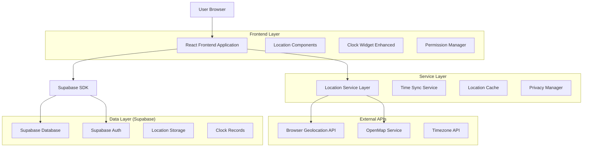
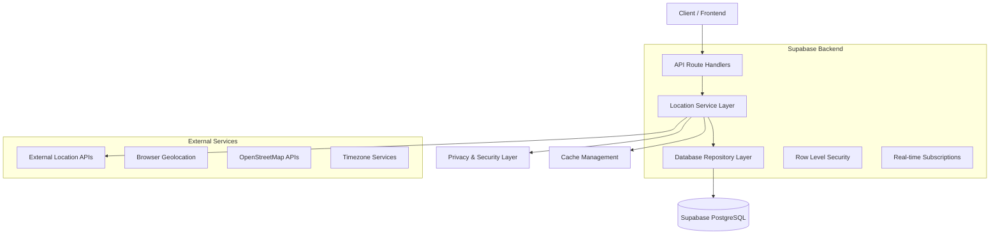
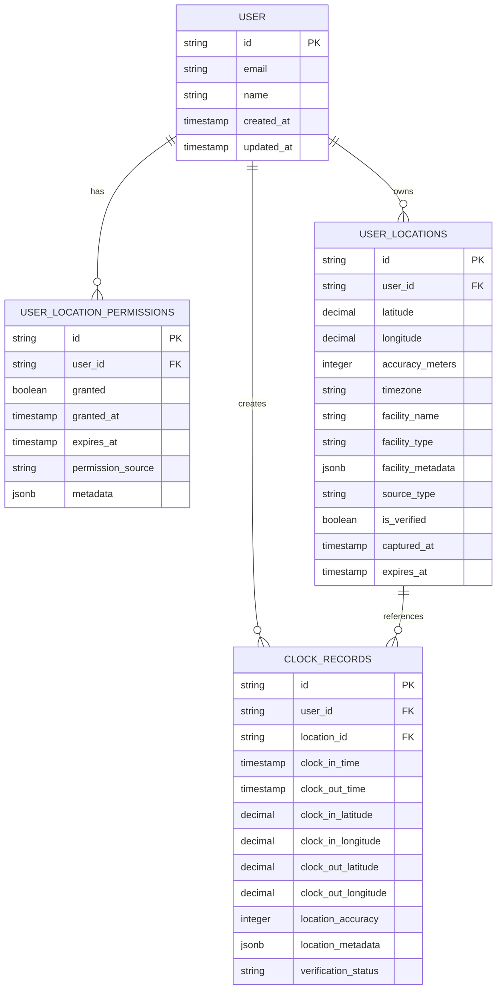

# Geographic Location-Based Clock System - Technical Architecture Document

## 1. Architecture Design



## 2. Technology Description

* **Frontend**: React\@18 + TypeScript + Tailwind CSS + Vite

* **Backend**: Supabase (PostgreSQL + Auth + Real-time)

* **Location Services**: Browser Geolocation API + OpenStreetMap Nominatim

* **Timezone**: Intl.DateTimeFormat API + timezone-aware calculations

* **Caching**: In-memory location cache + Supabase edge caching

* **Security**: Supabase RLS + client-side encryption for sensitive coordinates

## 3. Route Definitions

| Route                                | Purpose                                                     |
| ------------------------------------ | ----------------------------------------------------------- |
| /dashboard/student                   | Enhanced student dashboard with location-aware clock widget |
| /dashboard/student/location-settings | Location preferences and privacy management                 |
| /dashboard/student/clock             | Clock interface with location capture and verification      |
| /admin/location-analytics            | Location usage analytics and privacy compliance dashboard   |

## 4. API Definitions

### 4.1 Core Location APIs

**Location Permission Management**

```
POST /api/location/permission
```

Request:

| Param Name | Param Type | isRequired | Description                              |
| ---------- | ---------- | ---------- | ---------------------------------------- |
| granted    | boolean    | true       | Whether location permission was granted  |
| timestamp  | string     | true       | ISO timestamp of permission grant/denial |
| accuracy   | number     | false      | Requested accuracy in meters             |

Response:

| Param Name   | Param Type | Description                         |
| ------------ | ---------- | ----------------------------------- |
| success      | boolean    | Permission status update result     |
| permissionId | string     | Unique permission record identifier |

**Coordinate Capture**

```
POST /api/location/capture
```

Request:

| Param Name | Param Type | isRequired | Description                  |
| ---------- | ---------- | ---------- | ---------------------------- |
| latitude   | number     | true       | GPS latitude coordinate      |
| longitude  | number     | true       | GPS longitude coordinate     |
| accuracy   | number     | true       | Location accuracy in meters  |
| timestamp  | string     | true       | Capture timestamp            |
| source     | string     | true       | 'gps', 'manual', or 'cached' |

Response:

| Param Name | Param Type | Description                  |
| ---------- | ---------- | ---------------------------- |
| locationId | string     | Unique location record ID    |
| timezone   | string     | Detected timezone identifier |
| facility   | object     | Matched facility information |
| verified   | boolean    | Location verification status |

**Timezone Calculation**

```
GET /api/location/timezone
```

Request:

| Param Name | Param Type | isRequired | Description        |
| ---------- | ---------- | ---------- | ------------------ |
| latitude   | number     | true       | Location latitude  |
| longitude  | number     | true       | Location longitude |

Response:

| Param Name | Param Type | Description                   |
| ---------- | ---------- | ----------------------------- |
| timezone   | string     | IANA timezone identifier      |
| offset     | number     | UTC offset in minutes         |
| dst        | boolean    | Daylight saving time status   |
| localTime  | string     | Current local time ISO string |

## 5. Server Architecture Diagram



## 6. Data Model

### 6.1 Data Model Definition



### 6.2 Data Definition Language

**User Location Permissions Table**

```sql
-- Create user location permissions table
CREATE TABLE user_location_permissions (
    id UUID PRIMARY KEY DEFAULT gen_random_uuid(),
    user_id TEXT NOT NULL REFERENCES auth.users(id) ON DELETE CASCADE,
    granted BOOLEAN NOT NULL DEFAULT false,
    granted_at TIMESTAMP WITH TIME ZONE,
    expires_at TIMESTAMP WITH TIME ZONE,
    permission_source TEXT CHECK (permission_source IN ('browser', 'manual', 'admin')),
    metadata JSONB DEFAULT '{}',
    created_at TIMESTAMP WITH TIME ZONE DEFAULT NOW(),
    updated_at TIMESTAMP WITH TIME ZONE DEFAULT NOW()
);

-- Create indexes
CREATE INDEX idx_user_location_permissions_user_id ON user_location_permissions(user_id);
CREATE INDEX idx_user_location_permissions_granted ON user_location_permissions(granted);
CREATE INDEX idx_user_location_permissions_expires ON user_location_permissions(expires_at);

-- Row Level Security
ALTER TABLE user_location_permissions ENABLE ROW LEVEL SECURITY;

-- Policies
CREATE POLICY "Users can view own location permissions" ON user_location_permissions
    FOR SELECT USING (auth.uid() = user_id);

CREATE POLICY "Users can update own location permissions" ON user_location_permissions
    FOR UPDATE USING (auth.uid() = user_id);

-- Grant permissions
GRANT SELECT ON user_location_permissions TO anon;
GRANT ALL PRIVILEGES ON user_location_permissions TO authenticated;
```

**User Locations Table**

```sql
-- Create user locations table with encrypted coordinates
CREATE TABLE user_locations (
    id UUID PRIMARY KEY DEFAULT gen_random_uuid(),
    user_id TEXT NOT NULL REFERENCES auth.users(id) ON DELETE CASCADE,
    latitude DECIMAL(10, 8) NOT NULL,
    longitude DECIMAL(11, 8) NOT NULL,
    accuracy_meters INTEGER,
    timezone TEXT,
    facility_name TEXT,
    facility_type TEXT,
    facility_metadata JSONB DEFAULT '{}',
    source_type TEXT CHECK (source_type IN ('gps', 'manual', 'cached', 'imported')),
    is_verified BOOLEAN DEFAULT false,
    captured_at TIMESTAMP WITH TIME ZONE DEFAULT NOW(),
    expires_at TIMESTAMP WITH TIME ZONE DEFAULT (NOW() + INTERVAL '30 days'),
    created_at TIMESTAMP WITH TIME ZONE DEFAULT NOW(),
    updated_at TIMESTAMP WITH TIME ZONE DEFAULT NOW()
);

-- Create indexes
CREATE INDEX idx_user_locations_user_id ON user_locations(user_id);
CREATE INDEX idx_user_locations_coordinates ON user_locations(latitude, longitude);
CREATE INDEX idx_user_locations_captured_at ON user_locations(captured_at DESC);
CREATE INDEX idx_user_locations_expires_at ON user_locations(expires_at);
CREATE INDEX idx_user_locations_facility ON user_locations(facility_name, facility_type);

-- Row Level Security
ALTER TABLE user_locations ENABLE ROW LEVEL SECURITY;

-- Policies
CREATE POLICY "Users can view own locations" ON user_locations
    FOR SELECT USING (auth.uid() = user_id);

CREATE POLICY "Users can insert own locations" ON user_locations
    FOR INSERT WITH CHECK (auth.uid() = user_id);

CREATE POLICY "Users can update own locations" ON user_locations
    FOR UPDATE USING (auth.uid() = user_id);

-- Grant permissions
GRANT SELECT ON user_locations TO anon;
GRANT ALL PRIVILEGES ON user_locations TO authenticated;
```

**Enhanced Clock Records Table**

```sql
-- Extend existing clock_records table with location fields
ALTER TABLE clock_records ADD COLUMN IF NOT EXISTS location_id UUID REFERENCES user_locations(id);
ALTER TABLE clock_records ADD COLUMN IF NOT EXISTS clock_in_latitude DECIMAL(10, 8);
ALTER TABLE clock_records ADD COLUMN IF NOT EXISTS clock_in_longitude DECIMAL(11, 8);
ALTER TABLE clock_records ADD COLUMN IF NOT EXISTS clock_out_latitude DECIMAL(10, 8);
ALTER TABLE clock_records ADD COLUMN IF NOT EXISTS clock_out_longitude DECIMAL(11, 8);
ALTER TABLE clock_records ADD COLUMN IF NOT EXISTS location_accuracy INTEGER;
ALTER TABLE clock_records ADD COLUMN IF NOT EXISTS location_metadata JSONB DEFAULT '{}';
ALTER TABLE clock_records ADD COLUMN IF NOT EXISTS verification_status TEXT DEFAULT 'pending' 
    CHECK (verification_status IN ('pending', 'verified', 'failed', 'manual_override'));

-- Create additional indexes for location queries
CREATE INDEX IF NOT EXISTS idx_clock_records_location_id ON clock_records(location_id);
CREATE INDEX IF NOT EXISTS idx_clock_records_coordinates ON clock_records(clock_in_latitude, clock_in_longitude);
CREATE INDEX IF NOT EXISTS idx_clock_records_verification ON clock_records(verification_status);

-- Initial data for testing
INSERT INTO user_location_permissions (user_id, granted, granted_at, permission_source, metadata)
SELECT 
    id,
    true,
    NOW(),
    'browser',
    '{"initial_setup": true, "accuracy_requested": 50}'
FROM auth.users 
WHERE email LIKE '%@medstint%'
ON CONFLICT DO NOTHING;
```

