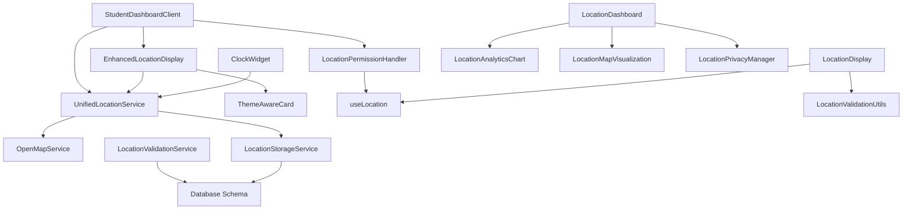

# Location Code Analysis and Cleanup Plan

## 1. Complete Inventory

### 1.1 Location Components (`src/components/location/`)

| Component                     | File Path                                                 | Primary Function                                      | Status                 |
| ----------------------------- | --------------------------------------------------------- | ----------------------------------------------------- | ---------------------- |
| **EnhancedLocationDisplay**   | `src/components/location/enhanced-location-display.tsx`   | Main location display with map, coordinates, accuracy | **ACTIVE**             |
| **LocationDisplay**           | `src/components/location/location-display.tsx`            | Basic location display component                      | **POTENTIALLY UNUSED** |
| **LocationPermissionHandler** | `src/components/location/location-permission-handler.tsx` | Handles location permission requests                  | **ACTIVE**             |
| **LocationStatusIndicator**   | `src/components/location/location-status-indicator.tsx`   | Shows location tracking status                        | **POTENTIALLY UNUSED** |
| **LocationDashboard**         | `src/components/location/location-dashboard.tsx`          | Comprehensive location management dashboard           | **POTENTIALLY UNUSED** |
| **LocationAnalyticsChart**    | `src/components/location/location-analytics-chart.tsx`    | Location analytics and charts                         | **POTENTIALLY UNUSED** |
| **LocationMapVisualization**  | `src/components/location/location-map-visualization.tsx`  | Interactive map visualization                         | **POTENTIALLY UNUSED** |
| **LocationPrivacyManager**    | `src/components/location/location-privacy-manager.tsx`    | Privacy settings and data management                  | **POTENTIALLY UNUSED** |
| **ManualLocationInput**       | `src/components/location/manual-location-input.tsx`       | Manual coordinate input interface                     | **POTENTIALLY UNUSED** |

### 1.2 Location Services (`src/services/`)

| Service                       | File Path                                  | Primary Function                   | Status     |
| ----------------------------- | ------------------------------------------ | ---------------------------------- | ---------- |
| **UnifiedLocationService**    | `src/services/unified-location-service.ts` | Main location capture service      | **ACTIVE** |
| **LocationStorageService**    | `src/services/location-storage.ts`         | Database storage for location data | **ACTIVE** |
| **LocationValidationService** | `src/services/location-validation.ts`      | Location proximity and validation  | **ACTIVE** |

### 1.3 Location Hooks (`src/hooks/`)

| Hook                        | File Path                                | Primary Function               | Status                 |
| --------------------------- | ---------------------------------------- | ------------------------------ | ---------------------- |
| **useLocation**             | `src/hooks/use-location.ts`              | Location state management hook | **POTENTIALLY UNUSED** |
| **useLocationVerification** | `src/hooks/use-location-verification.ts` | Location verification logic    | **ACTIVE**             |

### 1.4 Location Utilities (`src/lib/` and `src/utils/`)

| Utility                     | File Path                          | Primary Function              | Status     |
| --------------------------- | ---------------------------------- | ----------------------------- | ---------- |
| **OpenMapService**          | `src/lib/openmap-service.ts`       | OpenStreetMap API integration | **ACTIVE** |
| **LocationNameService**     | `src/lib/location-name-service.ts` | Coordinate to name conversion | **ACTIVE** |
| **LocationValidationUtils** | `src/utils/location-validation.ts` | Location validation utilities | **ACTIVE** |
| **LocationDebouncer**       | `src/lib/location-debouncer.ts`    | Location capture debouncing   | **ACTIVE** |

### 1.5 Student Components with Location Features

| Component                   | File Path                                               | Location Integration                 | Status     |
| --------------------------- | ------------------------------------------------------- | ------------------------------------ | ---------- |
| **ClockWidget**             | `src/components/student/clock-widget.tsx`               | Uses unified location service        | **ACTIVE** |
| **LocationStatusIndicator** | `src/components/student/location-status-indicator.tsx`  | Student-specific location status     | **ACTIVE** |
| **StudentDashboardClient**  | `src/components/dashboard/student-dashboard-client.tsx` | Main dashboard with location display | **ACTIVE** |

## 2. Dependency Analysis

### 2.1 Core Dependencies Map



### 2.2 Import/Export Analysis

#### **Active Imports (Confirmed Usage)**

* `UnifiedLocationService` ← `StudentDashboardClient`, `ClockWidget`

* `EnhancedLocationDisplay` ← `StudentDashboardClient`

* `LocationPermissionHandler` ← `StudentDashboardClient`

* `OpenMapService` ← `UnifiedLocationService`, `StudentDashboardClient`

* `LocationStorageService` ← `LocationPrivacyManager`

* `LocationValidationUtils` ← `LocationDisplay`, `EnhancedLocationDisplay`

#### **Potentially Unused Imports**

* `LocationDisplay` - No active imports found

* `LocationDashboard` - No active imports found

* `LocationAnalyticsChart` - No active imports found

* `LocationMapVisualization` - No active imports found

* `LocationPrivacyManager` - No active imports found

* `ManualLocationInput` - No active imports found

* `useLocation` hook - Only used by potentially unused components

## 3. Usage Analysis Framework

### 3.1 Static Code Analysis Methodology

#### **Step 1: Import Scanning**

```bash
# Search for all imports of location components
grep -r "from.*location" src/ --include="*.tsx" --include="*.ts"
grep -r "import.*location" src/ --include="*.tsx" --include="*.ts"
```

#### **Step 2: Component Reference Analysis**

```bash
# Search for component usage in JSX
grep -r "<Location" src/ --include="*.tsx"
grep -r "Location.*>" src/ --include="*.tsx"
```

#### **Step 3: Service Usage Analysis**

```bash
# Search for service method calls
grep -r "locationService\." src/ --include="*.tsx" --include="*.ts"
grep -r "unifiedLocationService\." src/ --include="*.tsx" --include="*.ts"
```

### 3.2 Runtime Analysis Strategy

#### **Step 1: Component Mounting Detection**

* Add console.log statements to component constructors

* Monitor browser console during application usage

* Track which components are actually rendered

#### **Step 2: Service Method Tracking**

* Add logging to service method calls

* Monitor API endpoint usage

* Track database queries related to location

#### **Step 3: Route Analysis**

* Analyze which routes use location components

* Check if location test pages are production routes

## 4. Cleanup Strategy

### 4.1 Safe Removal Process

#### **Phase 1: Preparation**

1. **Version Control Tagging**

   ```bash
   git tag -a "pre-location-cleanup-v1.0" -m "Before location code cleanup"
   git push origin --tags
   ```

2. **Backup Creation**

   ```bash
   cp -r src/components/location src/components/location.backup
   cp -r src/services/location* src/services/backup/
   ```

#### **Phase 2: Analysis Execution**

1. Run static analysis scripts
2. Execute runtime analysis during comprehensive testing
3. Document findings in removal candidate list

#### **Phase 3: Incremental Removal**

1. **Remove Test/Demo Components First**

   * `src/app/location-test/` (if exists)

   * `src/app/location-demo/` (if exists)

2. **Remove Unused Components (Confirmed Safe)**

   * Components with zero imports

   * Components not referenced in any route

3. **Remove Unused Services**

   * Services with no active method calls

   * Deprecated service implementations

#### **Phase 4: Dependency Cleanup**

1. Remove unused imports from remaining files
2. Clean up unused type definitions
3. Remove unused database schema elements (if safe)

### 4.2 Version Control Best Practices

#### **Commit Strategy**

```bash
# Individual commits for each removed component
git commit -m "Remove unused LocationDashboard component

- No active imports found in codebase
- Component not referenced in any routes
- Functionality replaced by EnhancedLocationDisplay"

# Separate commit for dependency cleanup
git commit -m "Clean up unused location imports and types

- Remove unused import statements
- Clean up orphaned type definitions
- Update index files"
```

#### **Post-Cleanup Tagging**

```bash
git tag -a "post-location-cleanup-v1.0" -m "After location code cleanup - removed X unused components"
git push origin --tags
```

## 5. Quality Assurance Plan

### 5.1 Pre-Removal Testing

#### **Functional Testing Checklist**

* [ ] Student dashboard loads correctly

* [ ] Location capture works in clock widget

* [ ] Location permissions are handled properly

* [ ] Location display shows accurate coordinates

* [ ] Map visualization functions correctly

* [ ] Clock in/out with location validation works

* [ ] Location-based proximity checking functions

#### **Integration Testing**

* [ ] API endpoints respond correctly

* [ ] Database operations complete successfully

* [ ] Location services integrate properly

* [ ] Error handling works as expected

### 5.2 Post-Removal Verification

#### **Automated Testing**

```bash
# Run existing test suite
npm test

# Run location-specific tests
npm test -- --grep "location"

# Run integration tests
npm run test:integration
```

#### **Manual Testing Protocol**

1. **Core Location Features**

   * Test location capture on student dashboard

   * Verify clock in/out with location

   * Check location permission handling

   * Test location accuracy validation

2. **Error Scenarios**

   * Test with location services disabled

   * Test with permission denied

   * Test with poor GPS signal

   * Test offline scenarios

3. **Performance Testing**

   * Check page load times

   * Monitor memory usage

   * Verify no console errors

   * Test on mobile devices

### 5.3 Rollback Plan

#### **Immediate Rollback**

```bash
# If critical issues found
git reset --hard pre-location-cleanup-v1.0
git push --force-with-lease origin main
```

#### **Selective Rollback**

```bash
# Restore specific components if needed
git checkout pre-location-cleanup-v1.0 -- src/components/location/specific-component.tsx
git commit -m "Restore critical location component due to dependency"
```

## 6. Documentation Requirements

### 6.1 Removal Documentation

#### **Component Removal Log**

For each removed component, document:

* **Component Name**: Full component name

* **File Path**: Original file location

* **Removal Reason**: Why it was considered unused

* **Dependencies Removed**: Associated files/imports removed

* **Replacement**: What component/service replaced its functionality (if any)

* **Risk Assessment**: Potential impact of removal

#### **Example Entry**

```markdown
### LocationDashboard Component
- **File**: `src/components/location/location-dashboard.tsx`
- **Removed**: 2024-01-XX
- **Reason**: No active imports found, functionality superseded by EnhancedLocationDisplay
- **Dependencies**: LocationAnalyticsChart, LocationMapVisualization imports
- **Replacement**: EnhancedLocationDisplay provides core functionality
- **Risk**: Low - comprehensive testing showed no usage
```

### 6.2 Architecture Documentation Updates

#### **Updated Component Architecture**

Document the streamlined location architecture:

* Core active components

* Service layer simplification

* Dependency relationships

* Integration points

#### **Migration Guide**

If any components were consolidated:

* Document API changes

* Provide migration examples

* List breaking changes

* Update component usage examples

## 7. Preliminary Findings

### 7.1 Confirmed Active Components

Based on initial analysis, these components are **actively used**:

* `EnhancedLocationDisplay` (used in StudentDashboardClient)

* `LocationPermissionHandler` (used in StudentDashboardClient)

* `UnifiedLocationService` (used in ClockWidget, StudentDashboardClient)

* `LocationStorageService` (used in LocationPrivacyManager)

* `OpenMapService` (used by multiple services)

* `LocationValidationService` (used in API routes)

### 7.2 Removal Candidates

These components appear **potentially unused**:

* `LocationDisplay` (superseded by EnhancedLocationDisplay)

* `LocationDashboard` (no active imports found)

* `LocationAnalyticsChart` (no active imports found)

* `LocationMapVisualization` (no active imports found)

* `LocationPrivacyManager` (no active imports found)

* `ManualLocationInput` (no active imports found)

* `useLocation` hook (potentially superseded by UnifiedLocationService)

### 7.3 Test/Demo Code

These appear to be test or demo implementations:

* `src/app/location-test/` directory

* `src/app/location-demo/` directory (if exists)

* Location integration tests (keep for testing)

## 8. Next Steps

1. **Execute Static Analysis**: Run the defined scripts to confirm usage patterns
2. **Runtime Analysis**: Deploy logging and monitor actual component usage
3. **Create Detailed Removal Plan**: Based on analysis results
4. **Execute Phased Removal**: Start with confirmed unused components
5. **Comprehensive Testing**: Verify functionality after each removal phase
6. **Documentation**: Update all relevant documentation
7. **Final Verification**: Ensure zero impact on application functionality

## 9. Success Criteria

* ✅ Zero functional regressions in location features

* ✅ Reduced codebase size and complexity

* ✅ Maintained code quality and test coverage

* ✅ Complete documentation of changes

* ✅ Proper version control history

* ✅ Successful deployment without issues

