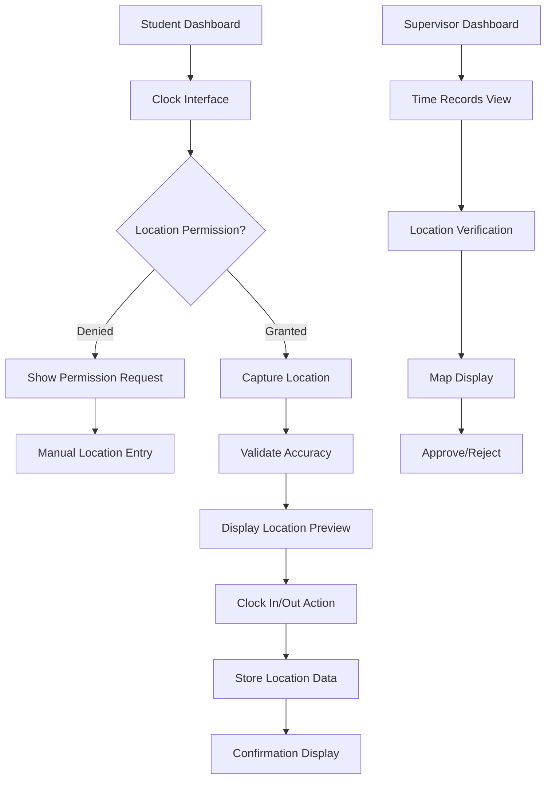

# Location Tracking Clock System - Product Requirements Document

## 1. Product Overview

The Location Tracking Clock System enhances the existing student clock-in/out functionality by capturing and verifying geographical location data during time tracking activities. This system ensures accurate attendance verification while maintaining student privacy and providing reliable location-based validation for clinical hour tracking.

The system addresses the need for location verification in clinical settings, helping institutions ensure students are physically present at assigned clinical sites during their rotations while providing transparent feedback and maintaining compliance with privacy standards.

## 2. Core Features

### 2.1 User Roles

| Role | Registration Method | Core Permissions |
|------|---------------------|------------------|
| Student | Existing authentication | Can clock in/out with location capture, view own location history |
| Clinical Supervisor | Existing authentication | Can view student location data for assigned rotations, approve/reject time records |
| School Administrator | Existing authentication | Can configure location settings, view all location data, manage privacy policies |

### 2.2 Feature Module

Our location tracking enhancement consists of the following main components:

1. **Enhanced Clock Interface**: Location capture UI, permission handling, location display with accuracy indicators
2. **Location Service Management**: GPS/network location services, accuracy validation, privacy controls
3. **Location Verification Dashboard**: Location history view, accuracy reports, compliance monitoring
4. **Privacy & Settings Management**: Location permission controls, data retention settings, privacy policy display

### 2.3 Page Details

| Page Name | Module Name | Feature description |
|-----------|-------------|---------------------|
| Enhanced Clock Interface | Location Capture Widget | Display current location status, capture GPS coordinates during clock-in/out, show location accuracy and address |
| Enhanced Clock Interface | Permission Handler | Request location permissions, handle permission denials, provide fallback options |
| Enhanced Clock Interface | Location Display | Show captured location with map preview, display accuracy radius, format address display |
| Location Service Management | GPS Service | Access device GPS, calculate location accuracy, handle location timeouts |
| Location Service Management | Privacy Controls | Manage location sharing preferences, control data retention, display privacy notices |
| Location Verification Dashboard | Location History | Display chronological location data, show accuracy metrics, filter by date/site |
| Location Verification Dashboard | Compliance Reports | Generate location verification reports, show attendance patterns, highlight discrepancies |
| Privacy & Settings Management | Permission Settings | Configure location sharing levels, set accuracy requirements, manage data retention |
| Privacy & Settings Management | Privacy Policy | Display location data usage policy, show data retention periods, provide opt-out options |

## 3. Core Process

### Student Location Tracking Flow
1. Student navigates to clock interface
2. System requests location permission (if not granted)
3. Student grants/denies location access
4. If granted: System captures current location with accuracy
5. Student selects clinical site and adds notes
6. Student clicks clock-in with location data attached
7. System validates location accuracy and proximity to site
8. Location data is securely transmitted and stored
9. Student receives confirmation with captured location details

### Supervisor Verification Flow
1. Supervisor accesses student time records
2. System displays location data with each clock entry
3. Supervisor reviews location accuracy and site proximity
4. Supervisor can view location on map interface
5. Supervisor approves/rejects time record based on location verification

## 4. User Interface Design

### 4.1 Design Style

- **Primary Colors**: Blue (#3B82F6) for location indicators, Green (#10B981) for accurate locations
- **Secondary Colors**: Orange (#F59E0B) for moderate accuracy, Red (#EF4444) for poor accuracy
- **Button Style**: Rounded corners with subtle shadows, location-specific icons
- **Font**: Inter font family, 14px for body text, 12px for location details
- **Layout Style**: Card-based design with location widgets, integrated map previews
- **Icon Style**: Outline icons for location services, filled icons for status indicators

### 4.2 Page Design Overview

| Page Name | Module Name | UI Elements |
|-----------|-------------|-------------|
| Enhanced Clock Interface | Location Capture Widget | Floating location card with GPS icon, accuracy indicator (green/orange/red), formatted address display, "Refresh Location" button |
| Enhanced Clock Interface | Permission Handler | Modal dialog with location icon, clear permission request text, "Allow Location" and "Use Manual Entry" buttons |
| Enhanced Clock Interface | Location Display | Compact map preview (150x100px), accuracy radius visualization, address text with copy button |
| Location Verification Dashboard | Location History | Table with location pins, accuracy badges, expandable map rows, date/time stamps |
| Location Verification Dashboard | Compliance Reports | Chart visualizations, accuracy statistics, site proximity indicators, export buttons |

### 4.3 Responsiveness

The system is mobile-first with touch-optimized location controls. Location capture works seamlessly on mobile devices with native GPS access. Desktop users receive browser-based location services with appropriate fallbacks for accuracy limitations.