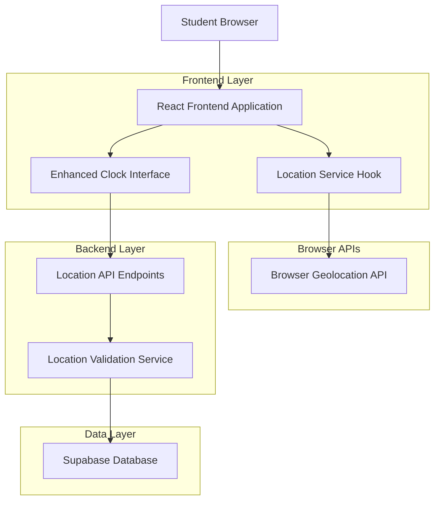
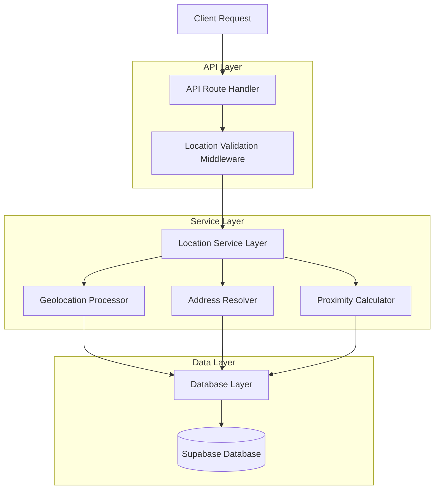
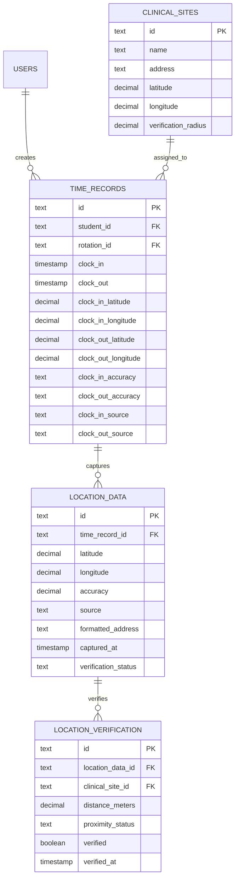

# Location Tracking Clock System - Technical Architecture Document

## 1. Architecture Design



## 2. Technology Description

- Frontend: React@18 + TypeScript + tailwindcss@3 + vite + @supabase/supabase-js
- Backend: Next.js API Routes + Supabase SDK
- Database: Supabase (PostgreSQL) with location field extensions
- Location Services: Browser Geolocation API + IP-based fallback

## 3. Route Definitions

| Route | Purpose |
|-------|---------|
| /dashboard/student | Enhanced student dashboard with location-enabled clock interface |
| /dashboard/student/location-history | Student's location tracking history and privacy controls |
| /dashboard/supervisor/time-records | Supervisor view with location verification capabilities |
| /dashboard/admin/location-settings | Administrative location tracking configuration |
| /api/location/capture | Endpoint for capturing and validating location data |
| /api/location/verify | Endpoint for location verification and accuracy validation |

## 4. API Definitions

### 4.1 Core API

Location capture and validation

```
POST /api/location/capture
```

Request:
| Param Name | Param Type | isRequired | Description |
|------------|------------|------------|-------------|
| latitude | number | true | GPS latitude coordinate (-90 to 90) |
| longitude | number | true | GPS longitude coordinate (-180 to 180) |
| accuracy | number | true | Location accuracy in meters |
| timestamp | string | true | ISO timestamp of location capture |
| source | string | true | Location source: 'gps', 'network', 'manual' |

Response:
| Param Name | Param Type | Description |
|------------|------------|-------------|
| success | boolean | Location capture success status |
| locationId | string | Unique identifier for captured location |
| formattedAddress | string | Human-readable address |
| accuracy | string | Accuracy classification: 'high', 'medium', 'low' |

Example Request:
```json
{
  "latitude": 40.7128,
  "longitude": -74.0060,
  "accuracy": 15.5,
  "timestamp": "2024-01-15T10:30:00Z",
  "source": "gps"
}
```

Example Response:
```json
{
  "success": true,
  "locationId": "loc_abc123",
  "formattedAddress": "123 Medical Center Dr, New York, NY 10001",
  "accuracy": "high"
}
```

Enhanced clock operations with location

```
POST /api/time-records/clock
```

Request:
| Param Name | Param Type | isRequired | Description |
|------------|------------|------------|-------------|
| action | string | true | Clock action: 'clock-in' or 'clock-out' |
| locationData | object | false | Location information object |
| locationData.latitude | number | false | GPS latitude coordinate |
| locationData.longitude | number | false | GPS longitude coordinate |
| locationData.accuracy | number | false | Location accuracy in meters |
| locationData.source | string | false | Location source type |
| siteId | string | true | Clinical site identifier |
| notes | string | false | Optional notes for the time record |

Response:
| Param Name | Param Type | Description |
|------------|------------|-------------|
| success | boolean | Clock operation success status |
| recordId | string | Time record identifier |
| locationVerified | boolean | Whether location was successfully verified |
| proximityStatus | string | Site proximity: 'on-site', 'nearby', 'remote' |

Location verification

```
GET /api/location/verify/{recordId}
```

Response:
| Param Name | Param Type | Description |
|------------|------------|-------------|
| verified | boolean | Location verification status |
| accuracy | string | Location accuracy level |
| distance | number | Distance from assigned site in meters |
| address | string | Formatted address of recorded location |

## 5. Server Architecture Diagram



## 6. Data Model

### 6.1 Data Model Definition



### 6.2 Data Definition Language

Enhanced Time Records Table with Location Fields
```sql
-- Add location fields to existing time_records table
ALTER TABLE time_records ADD COLUMN IF NOT EXISTS clock_in_latitude DECIMAL(10, 8);
ALTER TABLE time_records ADD COLUMN IF NOT EXISTS clock_in_longitude DECIMAL(11, 8);
ALTER TABLE time_records ADD COLUMN IF NOT EXISTS clock_out_latitude DECIMAL(10, 8);
ALTER TABLE time_records ADD COLUMN IF NOT EXISTS clock_out_longitude DECIMAL(11, 8);
ALTER TABLE time_records ADD COLUMN IF NOT EXISTS clock_in_accuracy DECIMAL(8, 2);
ALTER TABLE time_records ADD COLUMN IF NOT EXISTS clock_out_accuracy DECIMAL(8, 2);
ALTER TABLE time_records ADD COLUMN IF NOT EXISTS clock_in_source TEXT CHECK (clock_in_source IN ('gps', 'network', 'manual'));
ALTER TABLE time_records ADD COLUMN IF NOT EXISTS clock_out_source TEXT CHECK (clock_out_source IN ('gps', 'network', 'manual'));

-- Location data tracking table
CREATE TABLE location_data (
    id TEXT PRIMARY KEY DEFAULT gen_random_uuid(),
    time_record_id TEXT REFERENCES time_records(id) ON DELETE CASCADE,
    latitude DECIMAL(10, 8) NOT NULL,
    longitude DECIMAL(11, 8) NOT NULL,
    accuracy DECIMAL(8, 2) NOT NULL,
    source TEXT NOT NULL CHECK (source IN ('gps', 'network', 'manual')),
    formatted_address TEXT,
    captured_at TIMESTAMP WITH TIME ZONE DEFAULT NOW(),
    verification_status TEXT DEFAULT 'pending' CHECK (verification_status IN ('pending', 'verified', 'failed')),
    created_at TIMESTAMP WITH TIME ZONE DEFAULT NOW(),
    updated_at TIMESTAMP WITH TIME ZONE DEFAULT NOW()
);

-- Location verification results
CREATE TABLE location_verification (
    id TEXT PRIMARY KEY DEFAULT gen_random_uuid(),
    location_data_id TEXT REFERENCES location_data(id) ON DELETE CASCADE,
    clinical_site_id TEXT REFERENCES clinical_sites(id),
    distance_meters DECIMAL(10, 2),
    proximity_status TEXT CHECK (proximity_status IN ('on-site', 'nearby', 'remote')),
    verified BOOLEAN DEFAULT FALSE,
    verified_at TIMESTAMP WITH TIME ZONE,
    created_at TIMESTAMP WITH TIME ZONE DEFAULT NOW()
);

-- Add location fields to clinical sites for verification
ALTER TABLE clinical_sites ADD COLUMN IF NOT EXISTS latitude DECIMAL(10, 8);
ALTER TABLE clinical_sites ADD COLUMN IF NOT EXISTS longitude DECIMAL(11, 8);
ALTER TABLE clinical_sites ADD COLUMN IF NOT EXISTS verification_radius DECIMAL(8, 2) DEFAULT 100.0;

-- Create indexes for location queries
CREATE INDEX IF NOT EXISTS idx_location_data_time_record ON location_data(time_record_id);
CREATE INDEX IF NOT EXISTS idx_location_data_coordinates ON location_data(latitude, longitude);
CREATE INDEX IF NOT EXISTS idx_location_verification_site ON location_verification(clinical_site_id);
CREATE INDEX IF NOT EXISTS idx_time_records_location ON time_records(clock_in_latitude, clock_in_longitude);

-- Row Level Security policies
ALTER TABLE location_data ENABLE ROW LEVEL SECURITY;
ALTER TABLE location_verification ENABLE ROW LEVEL SECURITY;

-- Students can only access their own location data
CREATE POLICY "Students can view own location data" ON location_data
    FOR SELECT USING (
        time_record_id IN (
            SELECT id FROM time_records WHERE student_id = auth.uid()
        )
    );

-- Supervisors can view location data for their assigned students
CREATE POLICY "Supervisors can view assigned student locations" ON location_data
    FOR SELECT USING (
        time_record_id IN (
            SELECT tr.id FROM time_records tr
            JOIN rotations r ON tr.rotation_id = r.id
            WHERE r.supervisor_id = auth.uid()
        )
    );

-- Grant permissions
GRANT SELECT ON location_data TO anon;
GRANT ALL PRIVILEGES ON location_data TO authenticated;
GRANT SELECT ON location_verification TO anon;
GRANT ALL PRIVILEGES ON location_verification TO authenticated;
```