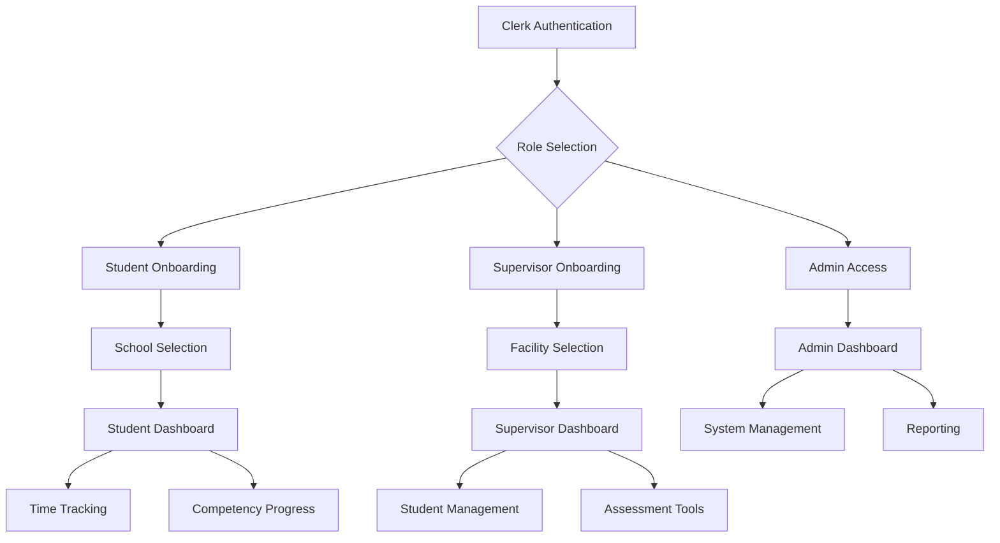

# MedStint Clinical Tracking Application - Complete Rebuild Requirements

## 1. Product Overview

A comprehensive medical student clinical tracking platform that manages student rotations, competency assessments, and clinical hour tracking with role-based access control and seamless onboarding.

The application serves medical students, clinical supervisors, and school administrators by providing tools for rotation management, competency tracking, assessment workflows, and administrative oversight. Built with modern web technologies to ensure reliability, security, and scalability for medical education institutions.

## 2. Core Features

### 2.1 User Roles

| Role                 | Registration Method                  | Core Permissions                                                                                         |
| -------------------- | ------------------------------------ | -------------------------------------------------------------------------------------------------------- |
| Student              | School selection during onboarding   | Access personal dashboard, track clinical hours, view competency progress, submit assessments            |
| Clinical Supervisor  | Facility selection during onboarding | Manage assigned students, conduct assessments, approve clinical hours, view rotation progress            |
| School Administrator | Direct admin access                  | Manage all students and rotations, oversee competency frameworks, generate reports, system configuration |

### 2.2 Feature Module

Our medical tracking application consists of the following essential pages:

1. **Authentication & Onboarding**: Clerk-based login, role selection, school/facility assignment, profile completion
2. **Student Dashboard**: Personal statistics, current rotation details, competency progress, clinical hours summary
3. **Clinical Supervisor Dashboard**: Assigned students overview, pending assessments, rotation management, student progress tracking
4. **School Admin Dashboard**: Institution overview, student management, rotation scheduling, competency framework management
5. **Competency Tracking**: Assessment forms, progress visualization, competency categories, evaluation history
6. **Time Tracking**: Clock in/out functionality, clinical hours logging, supervisor approval, timesheet management
7. **Rotation Management**: Rotation assignments, schedule management, facility coordination, student-supervisor matching

### 2.3 Page Details

| Page Name                     | Module Name            | Feature Description                                                                                      |
| ----------------------------- | ---------------------- | -------------------------------------------------------------------------------------------------------- |
| Authentication & Onboarding   | Clerk Integration      | Secure login with Clerk, role-based onboarding flow, school/facility selection, profile setup            |
| Authentication & Onboarding   | Role Selection         | Dynamic onboarding based on user type, school directory for students, facility directory for supervisors |
| Student Dashboard             | Personal Overview      | Current rotation status, clinical hours summary, competency progress charts, upcoming assessments        |
| Student Dashboard             | Quick Actions          | Clock in/out buttons, assessment submissions, rotation schedule view, contact supervisor                 |
| Clinical Supervisor Dashboard | Student Management     | View assigned students, track individual progress, approve clinical hours, schedule assessments          |
| Clinical Supervisor Dashboard | Assessment Tools       | Create and conduct competency assessments, provide feedback, track student performance                   |
| School Admin Dashboard        | Institution Overview   | System-wide statistics, student enrollment, rotation capacity, competency completion rates               |
| School Admin Dashboard        | Management Tools       | Add/edit students and supervisors, manage rotation schedules, configure competency frameworks            |
| Competency Tracking           | Assessment Interface   | Interactive assessment forms, competency scoring, progress tracking, evaluation history                  |
| Competency Tracking           | Progress Visualization | Charts and graphs showing competency completion, category breakdowns, performance trends                 |
| Time Tracking                 | Clock Management       | Real-time clock in/out, location verification, break tracking, overtime calculations                     |
| Time Tracking                 | Approval Workflow      | Supervisor review and approval, timesheet corrections, hour validation, reporting                        |
| Rotation Management           | Schedule Coordination  | Rotation calendar, student assignments, facility capacity, supervisor allocation                         |
| Rotation Management           | Assignment Tools       | Match students to rotations, manage prerequisites, track completion status, generate reports             |

## 3. Core Process

### Student Flow

1. **Registration**: User signs up through Clerk authentication
2. **Onboarding**: Selects role as "Student", chooses school from directory, completes profile
3. **Dashboard Access**: Views personal dashboard with rotation status and competency progress
4. **Daily Activities**: Clocks in/out for clinical hours, completes assessments, tracks progress
5. **Rotation Management**: Views assigned rotations, contacts supervisors, submits required documentation

### Clinical Supervisor Flow

1. **Registration**: User signs up through Clerk authentication
2. **Onboarding**: Selects role as "Clinical Supervisor", chooses facility, completes professional profile
3. **Dashboard Access**: Views assigned students and pending assessments
4. **Student Management**: Conducts assessments, approves clinical hours, provides feedback
5. **Reporting**: Generates progress reports and communicates with school administrators

### School Administrator Flow

1. **Direct Access**: Admin users have pre-configured access to the system
2. **System Management**: Manages student enrollments, supervisor assignments, rotation schedules
3. **Oversight**: Monitors system-wide progress, generates institutional reports
4. **Configuration**: Sets up competency frameworks, manages user permissions, system settings

## 4. User Interface Design

### 4.1 Design Style

* **Primary Colors**: Medical blue (#2563eb), Clean white (#ffffff)

* **Secondary Colors**: Success green (#10b981), Warning amber (#f59e0b), Error red (#ef4444)

* **Button Style**: Rounded corners (8px), subtle shadows, hover animations

* **Typography**: Inter font family, 16px base size, clear hierarchy with 14px-32px range

* **Layout Style**: Card-based design, clean navigation, responsive grid system

* **Icons**: Lucide React icons, medical-themed iconography, consistent 20px-24px sizing

### 4.2 Page Design Overview

| Page Name                     | Module Name           | UI Elements                                                                            |
| ----------------------------- | --------------------- | -------------------------------------------------------------------------------------- |
| Authentication & Onboarding   | Clerk Integration     | Centered login form, branded header, progress indicators, role selection cards         |
| Student Dashboard             | Personal Overview     | Grid layout with stat cards, progress charts, quick action buttons, navigation sidebar |
| Clinical Supervisor Dashboard | Student Management    | Table view of assigned students, filter controls, action buttons, assessment modals    |
| School Admin Dashboard        | Institution Overview  | Comprehensive metrics dashboard, data tables, management panels, system controls       |
| Competency Tracking           | Assessment Interface  | Form-based assessment tools, progress bars, category tabs, evaluation history          |
| Time Tracking                 | Clock Management      | Large clock in/out buttons, timer display, location status, timesheet table            |
| Rotation Management           | Schedule Coordination | Calendar view, assignment cards, drag-drop interface, filter and search tools          |

### 4.3 Responsiveness

Desktop-first design with mobile-adaptive layouts, touch-optimized interactions for mobile devices, responsive breakpoints at 768px (tablet) and 1024px (desktop), collapsible navigation for smaller screens.

## 5. Technical Requirements

### 5.1 Technology Stack

* **Frontend**: React 18+ with Next.js 15+, TypeScript for type safety

* **Authentication**: Clerk for user management and authentication

* **Database**: Neon PostgreSQL with Drizzle ORM

* **Styling**: Tailwind CSS with shadcn/ui components

* **State Management**: React Server Components with server actions

### 5.2 Security & Performance

* **Authentication**: Secure JWT tokens, role-based access control

* **Data Protection**: Encrypted sensitive data, HIPAA compliance considerations

* **Performance**: Server-side rendering, optimized database queries, image optimization

* **Error Handling**: Comprehensive error boundaries, graceful fallbacks, user-friendly error messages

### 5.3 Database Schema Requirements

* **Users**: Integration with Clerk user management

* **Schools**: Institution directory with contact information

* **Facilities**: Clinical facility directory with supervisor assignments

* **Rotations**: Rotation schedules with student-supervisor assignments

* **Competencies**: Competency frameworks with assessment criteria

* **Assessments**: Assessment records with scoring and feedback

* **Time Records**: Clinical hour tracking with approval workflows

## 6. Implementation Priorities

### Phase 1: Core Authentication & Onboarding

* Clerk authentication integration

* Role-based onboarding flow

* Basic dashboard structure

### Phase 2: Dashboard Functionality

* Student dashboard with core features

* Clinical supervisor dashboard

* School admin dashboard

### Phase 3: Core Features

* Time tracking system

* Competency tracking

* Basic rotation management

### Phase 4: Advanced Features

* Assessment workflows

* Reporting and analytics

* System administration tools

