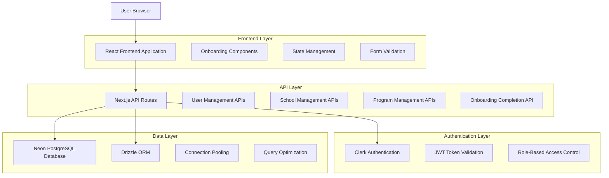
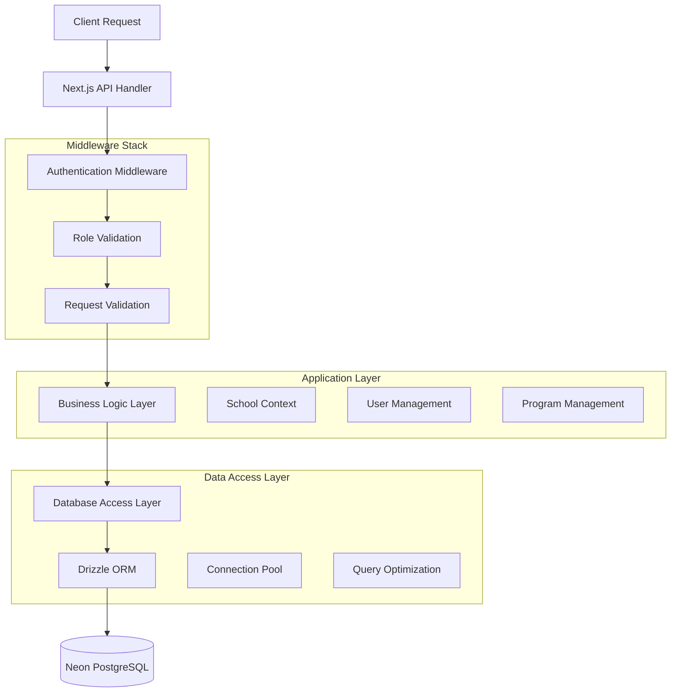
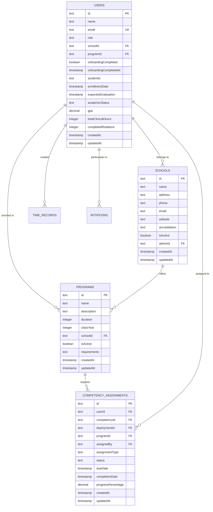

# MedStint Onboarding Technical Architecture

## 1. Architecture Design



## 2. Technology Description

- **Frontend**: React@18 + Next.js@14 + TypeScript + Tailwind CSS
- **Authentication**: Clerk (JWT-based)
- **Database**: Neon PostgreSQL with Drizzle ORM
- **Validation**: Zod schemas
- **UI Components**: Shadcn/ui + Lucide React icons
- **State Management**: React hooks + useTransition
- **Notifications**: Sonner toast library

## 3. Route Definitions

| Route | Purpose | Components |
|-------|---------|------------|
| `/onboarding/user-type` | Initial role selection and user creation | `OnboardingFlow` |
| `/onboarding/student` | Student-specific onboarding | `StudentOnboarding` |
| `/onboarding/school` | School admin and clinical staff setup | `SchoolOnboarding` |
| `/onboarding/super-admin` | Super admin configuration | `SuperAdminOnboarding` |
| `/onboarding/complete` | Completion confirmation and next steps | `OnboardingCompletion` |

## 4. API Definitions

### 4.1 User Management APIs

**Update User Profile**
```
POST /api/user/update
```

Request:
| Param Name | Param Type | isRequired | Description |
|------------|------------|------------|-------------|
| role | UserRole | false | User role assignment |
| schoolId | string | false | Associated school ID |
| programId | string | false | Associated program ID |

Response:
| Param Name | Param Type | Description |
|------------|------------|-------------|
| success | boolean | Operation status |
| data | UserData | Updated user information |

Example:
```json
{
  "role": "STUDENT",
  "schoolId": "school_123",
  "programId": "program_456"
}
```

**Complete Onboarding**
```
POST /api/user/onboarding-complete
```

Request: No body required (uses authenticated user context)

Response:
| Param Name | Param Type | Description |
|------------|------------|-------------|
| success | boolean | Completion status |
| redirectUrl | string | Dashboard redirect URL |

### 4.2 School Management APIs

**Create School**
```
POST /api/schools/create
```

Request:
| Param Name | Param Type | isRequired | Description |
|------------|------------|------------|-------------|
| name | string | true | School name |
| address | string | true | School address |
| email | string | false | Contact email |
| accreditation | string | true | Accreditation type |

Response:
| Param Name | Param Type | Description |
|------------|------------|-------------|
| success | boolean | Creation status |
| data | SchoolData | Created school information |

### 4.3 Program Management APIs

**Get Programs**
```
GET /api/programs
```

Query Parameters:
| Param Name | Param Type | Description |
|------------|------------|-------------|
| schoolId | string | Filter by school |
| search | string | Search program names |
| isActive | boolean | Filter active programs |
| includeStats | boolean | Include enrollment statistics |

Response:
| Param Name | Param Type | Description |
|------------|------------|-------------|
| success | boolean | Request status |
| data | Program[] | Array of programs |
| pagination | object | Pagination metadata |

**Create Program**
```
POST /api/programs
```

Request:
| Param Name | Param Type | isRequired | Description |
|------------|------------|------------|-------------|
| name | string | true | Program name |
| description | string | true | Program description |
| duration | number | true | Duration in months |
| schoolId | string | true | Associated school ID |
| requirements | string[] | false | Program requirements |

## 5. Server Architecture Diagram



## 6. Data Model

### 6.1 Data Model Definition



### 6.2 Data Definition Language

**Users Table**
```sql
-- Users table with onboarding tracking
CREATE TABLE users (
    id TEXT PRIMARY KEY,
    name TEXT,
    email TEXT NOT NULL UNIQUE,
    email_verified BOOLEAN NOT NULL DEFAULT FALSE,
    image TEXT,
    avatar TEXT,
    avatar_url TEXT,
    role TEXT NOT NULL DEFAULT 'STUDENT' CHECK (role IN ('SUPER_ADMIN', 'SCHOOL_ADMIN', 'CLINICAL_PRECEPTOR', 'CLINICAL_SUPERVISOR', 'STUDENT')),
    school_id TEXT,
    department TEXT,
    phone TEXT,
    address TEXT,
    is_active BOOLEAN NOT NULL DEFAULT TRUE,
    student_id TEXT,
    program_id TEXT,
    enrollment_date TIMESTAMP,
    expected_graduation TIMESTAMP,
    academic_status TEXT CHECK (academic_status IN ('ACTIVE', 'PROBATION', 'SUSPENDED', 'GRADUATED', 'WITHDRAWN')),
    gpa DECIMAL(3,2),
    total_clinical_hours INTEGER DEFAULT 0,
    completed_rotations INTEGER DEFAULT 0,
    onboarding_completed BOOLEAN NOT NULL DEFAULT FALSE,
    onboarding_completed_at TIMESTAMP,
    created_at TIMESTAMP NOT NULL DEFAULT NOW(),
    updated_at TIMESTAMP NOT NULL DEFAULT NOW(),
    stripe_customer_id TEXT
);

-- Indexes for performance
CREATE INDEX idx_users_email ON users(email);
CREATE INDEX idx_users_role ON users(role);
CREATE INDEX idx_users_school_id ON users(school_id);
CREATE INDEX idx_users_program_id ON users(program_id);
CREATE INDEX idx_users_onboarding_completed ON users(onboarding_completed);
```

**Schools Table**
```sql
-- Schools table
CREATE TABLE schools (
    id TEXT PRIMARY KEY,
    name TEXT NOT NULL,
    address TEXT,
    phone TEXT,
    email TEXT,
    website TEXT,
    accreditation TEXT NOT NULL,
    is_active BOOLEAN NOT NULL DEFAULT TRUE,
    admin_id TEXT REFERENCES users(id),
    created_at TIMESTAMP NOT NULL DEFAULT NOW(),
    updated_at TIMESTAMP NOT NULL DEFAULT NOW()
);

-- Indexes
CREATE INDEX idx_schools_name ON schools(name);
CREATE INDEX idx_schools_admin_id ON schools(admin_id);
CREATE INDEX idx_schools_is_active ON schools(is_active);
```

**Programs Table**
```sql
-- Programs table
CREATE TABLE programs (
    id TEXT PRIMARY KEY,
    name TEXT NOT NULL,
    description TEXT NOT NULL,
    duration INTEGER NOT NULL, -- in months
    class_year INTEGER NOT NULL, -- graduation year
    school_id TEXT NOT NULL REFERENCES schools(id),
    is_active BOOLEAN NOT NULL DEFAULT TRUE,
    requirements TEXT, -- JSON array
    created_at TIMESTAMP NOT NULL DEFAULT NOW(),
    updated_at TIMESTAMP NOT NULL DEFAULT NOW()
);

-- Indexes
CREATE INDEX idx_programs_school_id ON programs(school_id);
CREATE INDEX idx_programs_name ON programs(name);
CREATE INDEX idx_programs_is_active ON programs(is_active);
CREATE INDEX idx_programs_class_year ON programs(class_year);
```

**Competency Management Tables**
```sql
-- Competency Templates
CREATE TABLE competency_templates (
    id TEXT PRIMARY KEY,
    name TEXT NOT NULL,
    description TEXT NOT NULL,
    category TEXT NOT NULL,
    level TEXT NOT NULL CHECK (level IN ('FUNDAMENTAL', 'INTERMEDIATE', 'ADVANCED', 'EXPERT')),
    type TEXT NOT NULL CHECK (type IN ('COMPETENCY', 'RUBRIC')),
    content TEXT, -- JSON object
    tags TEXT, -- JSON array
    is_public BOOLEAN NOT NULL DEFAULT FALSE,
    source TEXT NOT NULL CHECK (source IN ('STANDARD', 'CUSTOM')),
    version TEXT NOT NULL DEFAULT '1.0',
    is_active BOOLEAN NOT NULL DEFAULT TRUE,
    metadata TEXT, -- JSON object
    created_by TEXT REFERENCES users(id),
    created_at TIMESTAMP NOT NULL DEFAULT NOW(),
    updated_at TIMESTAMP NOT NULL DEFAULT NOW()
);

-- Competency Assignments
CREATE TABLE competency_assignments (
    id TEXT PRIMARY KEY,
    user_id TEXT NOT NULL REFERENCES users(id) ON DELETE CASCADE,
    competency_id TEXT NOT NULL,
    deployment_id TEXT,
    program_id TEXT REFERENCES programs(id),
    assigned_by TEXT NOT NULL REFERENCES users(id),
    assignment_type TEXT NOT NULL CHECK (assignment_type IN ('REQUIRED', 'OPTIONAL', 'SUPPLEMENTARY')),
    status TEXT NOT NULL DEFAULT 'ASSIGNED' CHECK (status IN ('ASSIGNED', 'IN_PROGRESS', 'COMPLETED', 'OVERDUE')),
    due_date TIMESTAMP,
    completion_date TIMESTAMP,
    progress_percentage DECIMAL(5,2) DEFAULT 0.0,
    notes TEXT,
    created_at TIMESTAMP NOT NULL DEFAULT NOW(),
    updated_at TIMESTAMP NOT NULL DEFAULT NOW()
);

-- Indexes for competency system
CREATE INDEX idx_competency_assignments_user_id ON competency_assignments(user_id);
CREATE INDEX idx_competency_assignments_program_id ON competency_assignments(program_id);
CREATE INDEX idx_competency_assignments_status ON competency_assignments(status);
CREATE INDEX idx_competency_assignments_due_date ON competency_assignments(due_date);
```

**Initial Data**
```sql
-- Insert default accreditation options
INSERT INTO accreditation_options (id, name, abbreviation, description, is_default, sort_order) VALUES
('acc_1', 'Accreditation Council for Graduate Medical Education', 'ACGME', 'Primary accrediting body for graduate medical education programs', true, 1),
('acc_2', 'Commission on Collegiate Nursing Education', 'CCNE', 'Specialized accrediting agency for nursing education', false, 2),
('acc_3', 'Liaison Committee on Medical Education', 'LCME', 'Accrediting authority for medical education programs', false, 3);

-- Insert default competency templates
INSERT INTO competency_templates (id, name, description, category, level, type, source, created_at) VALUES
('comp_1', 'Clinical Skills Assessment', 'Basic clinical skills evaluation framework', 'Clinical Skills', 'FUNDAMENTAL', 'RUBRIC', 'STANDARD', NOW()),
('comp_2', 'Patient Communication', 'Patient interaction and communication competency', 'Communication', 'INTERMEDIATE', 'COMPETENCY', 'STANDARD', NOW()),
('comp_3', 'Medical Documentation', 'Electronic health record documentation skills', 'Documentation', 'FUNDAMENTAL', 'COMPETENCY', 'STANDARD', NOW());
```

## 7. Component Architecture

### 7.1 Onboarding Flow Components

**OnboardingFlow Component**
- Manages multi-step onboarding process
- Handles role-based step progression
- Integrates with authentication and user management APIs
- Provides form validation and error handling

**Key Props:**
```typescript
interface OnboardingFlowProps {
  user: UserData
  clerkUser: ClerkUser
  availableSchools: School[]
  availablePrograms: Program[]
  initialStep?: string
  initialRole?: string
}
```

**State Management:**
```typescript
const [currentStep, setCurrentStep] = useState<OnboardingStep>()
const [selectedRole, setSelectedRole] = useState<UserRole | null>()
const [selectedSchool, setSelectedSchool] = useState<string | null>()
const [selectedProgram, setSelectedProgram] = useState<string | null>()
```

### 7.2 Validation Layer

**Zod Schemas:**
```typescript
// User update validation
const updateUserSchema = z.object({
  role: z.enum(['SUPER_ADMIN', 'SCHOOL_ADMIN', 'CLINICAL_PRECEPTOR', 'CLINICAL_SUPERVISOR', 'STUDENT']).optional(),
  schoolId: z.string().min(1).optional(),
  programId: z.string().min(1).optional()
})

// School creation validation
const createSchoolSchema = z.object({
  name: z.string().min(1, 'School name is required'),
  address: z.string().min(1, 'Address is required'),
  accreditation: z.string().min(1, 'Accreditation is required')
})

// Program creation validation
const createProgramSchema = z.object({
  name: z.string().min(1, 'Name is required'),
  description: z.string().min(1, 'Description is required'),
  duration: z.number().min(1, 'Duration must be at least 1 month'),
  schoolId: z.string().min(1, 'School ID is required'),
  requirements: z.array(z.string()).optional()
})
```

## 8. Security Implementation

### 8.1 Authentication Flow

1. **Clerk Integration**: JWT token-based authentication
2. **Role Validation**: Server-side role verification
3. **School Context**: Institution-based access control
4. **API Protection**: All endpoints require authentication

### 8.2 Data Validation

- **Input Sanitization**: Zod schema validation
- **SQL Injection Prevention**: Parameterized queries via Drizzle ORM
- **XSS Protection**: React's built-in escaping
- **CSRF Protection**: Next.js built-in protection

### 8.3 Error Handling

```typescript
// Standardized error response
interface ApiError {
  error: string
  code?: string
  details?: any
}

// Error handling middleware
try {
  // API logic
} catch (error) {
  console.error('API Error:', error)
  return NextResponse.json(
    { error: 'Internal server error' },
    { status: 500 }
  )
}
```

## 9. Performance Optimization

### 9.1 Database Optimization

- **Connection Pooling**: Neon PostgreSQL connection pool
- **Query Optimization**: Efficient JOIN operations
- **Indexing Strategy**: Strategic index placement
- **Batch Operations**: Bulk data processing

### 9.2 Frontend Optimization

- **Code Splitting**: Next.js automatic splitting
- **Lazy Loading**: Component-level lazy loading
- **Caching**: React Query for API caching
- **Bundle Optimization**: Tree shaking and minification

### 9.3 Monitoring

- **Performance Metrics**: API response time tracking
- **Error Tracking**: Comprehensive error logging
- **User Analytics**: Onboarding completion rates
- **Database Monitoring**: Query performance analysis

This technical architecture ensures scalable, secure, and maintainable onboarding functionality that aligns with the current MedStint application state.