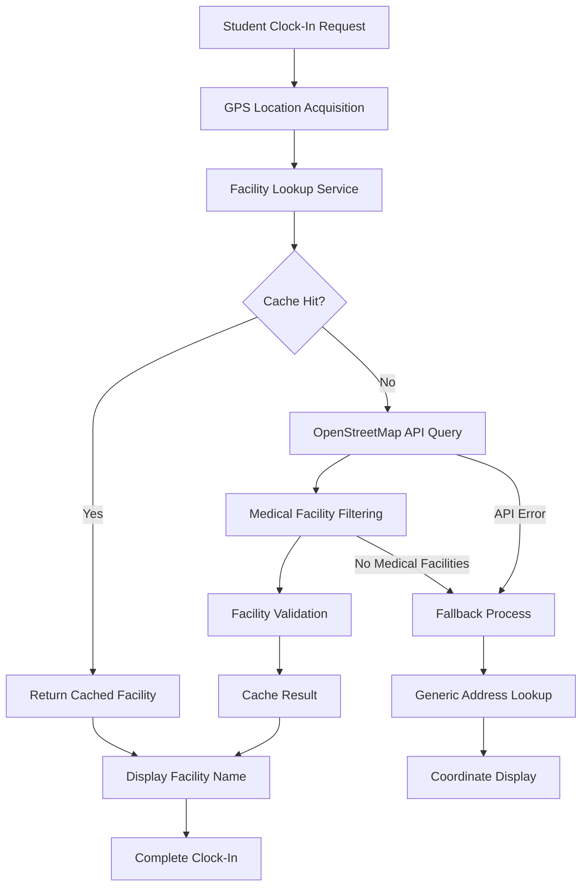

# OpenMap Location Enhancement - Product Requirements Document

## 1. Product Overview

Enhance the MedStint clock system by replacing raw GPS coordinates with intelligent facility name display using OpenStreetMap integration. This improvement will provide students and administrators with meaningful location context, showing "St. Mary's Hospital" instead of "40.123456, -74.654321" for better user experience and clinical site identification.

The enhancement prioritizes medical facilities (hospitals, clinics, medical centers) over generic addresses, ensuring accurate clinical site recognition while maintaining existing geofencing and security features. This upgrade supports both automatic GPS detection and manual location entry with comprehensive fallback mechanisms.

## 2. Core Features

### 2.1 User Roles

| Role | Registration Method | Core Permissions |
|------|---------------------|------------------|
| Student | Existing Clerk authentication | Can view enhanced location names during clock operations, access facility-based location history |
| Clinical Supervisor | Existing role-based access | Can monitor student locations with facility names, access location analytics |
| School Administrator | Existing admin privileges | Full access to location data, facility management, system configuration |

### 2.2 Feature Module

Our OpenMap location enhancement consists of the following main components:

1. **Enhanced Clock Widget**: Intelligent facility name display, fallback coordinate display, location status indicators
2. **Facility Lookup Service**: OpenStreetMap integration, medical facility prioritization, caching mechanisms
3. **Location Management Interface**: Manual facility override, location history with facility names, geofencing configuration
4. **Administrative Dashboard**: Facility database management, location analytics, system monitoring

### 2.3 Page Details

| Page Name | Module Name | Feature description |
|-----------|-------------|---------------------|
| Student Dashboard | Enhanced Clock Widget | Display facility names instead of coordinates. Show "St. Mary's Hospital - Emergency Department" with fallback to coordinates if lookup fails. Include location confidence indicators and manual override options. |
| Clock Interface | Facility Lookup Display | Real-time facility name resolution during clock-in/out operations. Prioritize medical facilities within 500m radius. Cache successful lookups for offline access. |
| Location History | Facility-Based Records | Transform historical coordinate data to facility names. Display time records with "Clocked in at General Hospital - ICU" format. Include map view with facility markers. |
| Admin Dashboard | Facility Management | Configure facility database, manage location overrides, monitor API usage. Set geofencing rules based on facility boundaries rather than coordinate zones. |
| Settings Page | Location Preferences | Allow users to set location accuracy preferences, enable/disable facility lookup, manage cached facility data. Configure privacy settings for location sharing. |

## 3. Core Process

**Student Clock-In Flow:**
1. Student navigates to dashboard and initiates clock-in
2. System requests GPS location (if permitted) or uses manual entry
3. Facility lookup service queries OpenStreetMap for nearby medical facilities
4. System displays "Clocking in at [Facility Name]" with confidence indicator
5. Student confirms location and completes clock-in with facility-tagged record
6. System caches facility data for future offline access

**Facility Lookup Process:**
1. Receive GPS coordinates from user device or manual input
2. Query local cache for previously resolved facilities within 100m radius
3. If cache miss, query OpenStreetMap Nominatim API for reverse geocoding
4. Filter results to prioritize medical facilities (hospitals, clinics, medical centers)
5. Validate facility relevance using Overpass API for detailed medical facility data
6. Return facility name with confidence score and cache result
7. Fallback to generic address or coordinates if no medical facilities found

**Administrative Monitoring Flow:**
1. Admin accesses location analytics dashboard
2. System displays facility-based location patterns and usage statistics
3. Admin can override facility names, configure geofencing boundaries
4. Monitor API usage and system performance metrics
5. Export location reports with facility names for compliance

## 4. User Interface Design

### 4.1 Design Style

- **Primary Colors**: Medical blue (#2563eb) for facility names, success green (#16a34a) for confirmed locations
- **Secondary Colors**: Warning amber (#f59e0b) for fallback states, neutral gray (#6b7280) for coordinates
- **Button Style**: Rounded corners with subtle shadows, medical-themed iconography
- **Font**: Inter font family, 14px for facility names (bold), 12px for secondary location info
- **Layout Style**: Card-based design with clear visual hierarchy, facility names prominently displayed
- **Icons**: Medical cross for hospitals, building icon for clinics, map pin for generic locations

### 4.2 Page Design Overview

| Page Name | Module Name | UI Elements |
|-----------|-------------|-------------|
| Student Dashboard | Enhanced Clock Widget | Facility name display with medical icon, confidence indicator badge, "📍 St. Mary's Hospital - Emergency Dept" format with blue accent color and bold typography |
| Clock Interface | Location Confirmation | Large facility name header, smaller address subtitle, confidence meter (High/Medium/Low), manual override button with pencil icon |
| Location History | Facility Timeline | Timeline view with facility names as primary labels, timestamps and duration as secondary info, map markers for each location |
| Admin Dashboard | Facility Management | Data table with facility names, usage statistics, override controls, API status indicators with green/red status dots |

### 4.3 Responsiveness

Desktop-first design with mobile-adaptive layout. Touch-optimized facility selection on mobile devices with larger tap targets for location confirmation. Facility names truncated intelligently on smaller screens with tooltip expansion. Offline indicator when cached facility data is being used.