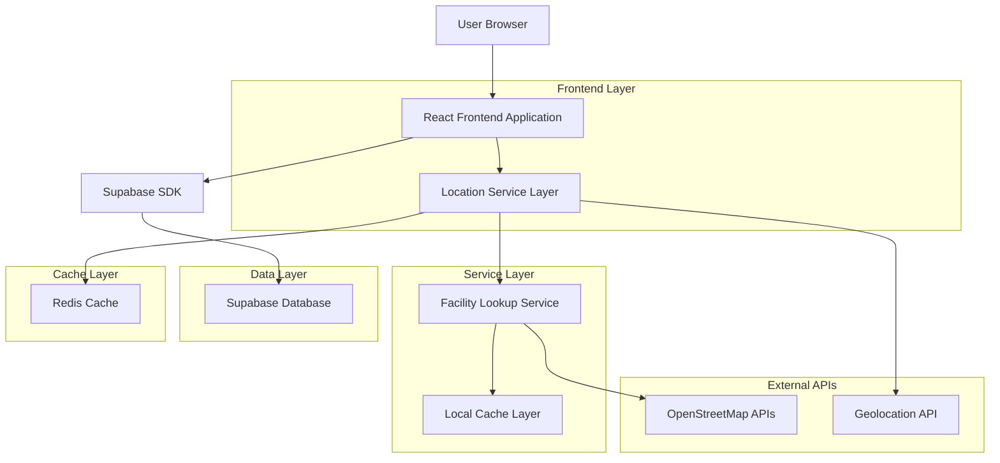
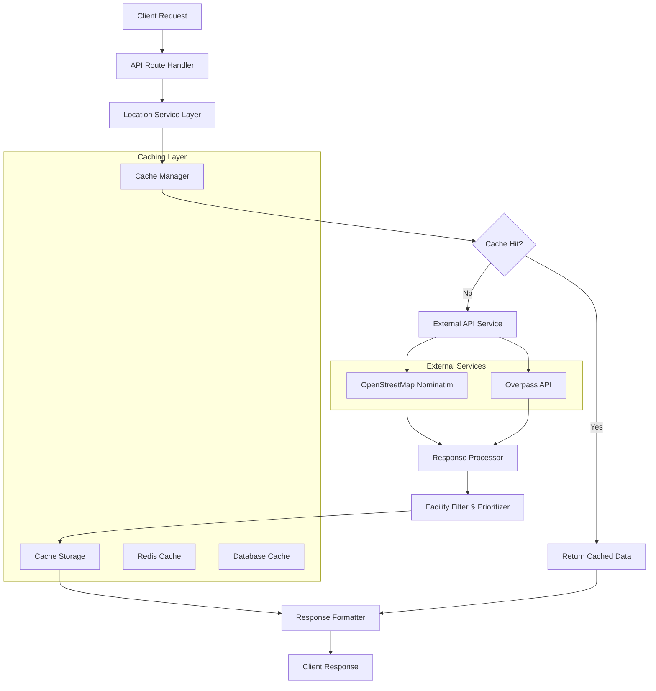
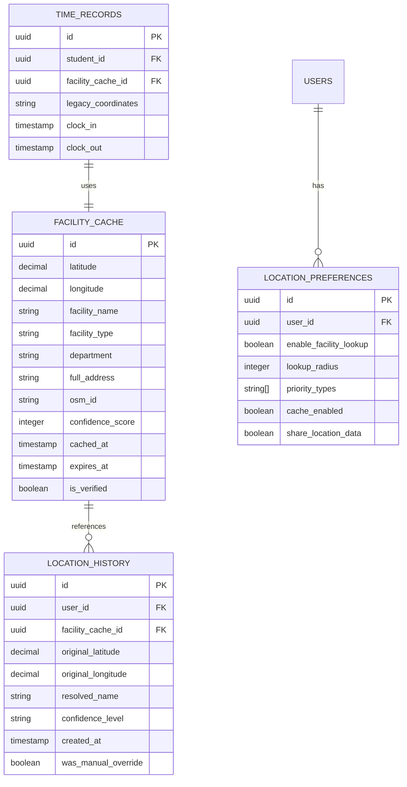

# OpenMap Location Enhancement - Technical Architecture Document

## 1. Architecture Design



## 2. Technology Description

- Frontend: React@18 + TypeScript + TailwindCSS + Vite
- Backend: Next.js API Routes + Supabase
- External APIs: OpenStreetMap Nominatim API + Overpass API
- Caching: Redis + Browser LocalStorage
- Database: Supabase (PostgreSQL)

## 3. Route Definitions

| Route | Purpose |
|-------|---------|
| /dashboard | Enhanced student dashboard with facility-based location display |
| /api/location/facility-lookup | Facility name resolution from coordinates |
| /api/location/cache | Cached facility data management |
| /api/admin/facilities | Administrative facility management interface |
| /settings/location | User location preferences and privacy settings |

## 4. API Definitions

### 4.1 Core API

**Facility Lookup Service**
```
POST /api/location/facility-lookup
```

Request:
| Param Name | Param Type | isRequired | Description |
|------------|------------|------------|-------------|
| latitude | number | true | GPS latitude coordinate |
| longitude | number | true | GPS longitude coordinate |
| radius | number | false | Search radius in meters (default: 500) |
| priorityTypes | string[] | false | Facility types to prioritize (default: ['hospital', 'clinic']) |

Response:
| Param Name | Param Type | Description |
|------------|------------|-------------|
| success | boolean | Operation success status |
| facility | FacilityInfo | Resolved facility information |
| confidence | string | Confidence level (high/medium/low) |
| fallback | AddressInfo | Fallback address if no facility found |

Example Request:
```json
{
  "latitude": 40.123456,
  "longitude": -74.654321,
  "radius": 500,
  "priorityTypes": ["hospital", "clinic", "medical_center"]
}
```

Example Response:
```json
{
  "success": true,
  "facility": {
    "name": "St. Mary's Hospital",
    "type": "hospital",
    "department": "Emergency Department",
    "address": "123 Medical Center Dr, City, State 12345",
    "distance": 45,
    "osmId": "way/123456789"
  },
  "confidence": "high",
  "cached": false
}
```

**Cache Management**
```
GET /api/location/cache/{coordinates}
POST /api/location/cache/invalidate
```

**Administrative Facility Management**
```
GET /api/admin/facilities
POST /api/admin/facilities/override
DELETE /api/admin/facilities/cache
```

## 5. Server Architecture Diagram



## 6. Data Model

### 6.1 Data Model Definition



### 6.2 Data Definition Language

**Facility Cache Table**
```sql
-- Create facility cache table
CREATE TABLE facility_cache (
    id UUID PRIMARY KEY DEFAULT gen_random_uuid(),
    latitude DECIMAL(10, 8) NOT NULL,
    longitude DECIMAL(11, 8) NOT NULL,
    facility_name VARCHAR(255) NOT NULL,
    facility_type VARCHAR(100) NOT NULL,
    department VARCHAR(255),
    full_address TEXT NOT NULL,
    osm_id VARCHAR(50),
    confidence_score INTEGER CHECK (confidence_score BETWEEN 0 AND 100),
    cached_at TIMESTAMP WITH TIME ZONE DEFAULT NOW(),
    expires_at TIMESTAMP WITH TIME ZONE DEFAULT (NOW() + INTERVAL '30 days'),
    is_verified BOOLEAN DEFAULT false,
    created_at TIMESTAMP WITH TIME ZONE DEFAULT NOW(),
    updated_at TIMESTAMP WITH TIME ZONE DEFAULT NOW()
);

-- Create indexes for performance
CREATE INDEX idx_facility_cache_coordinates ON facility_cache(latitude, longitude);
CREATE INDEX idx_facility_cache_name ON facility_cache(facility_name);
CREATE INDEX idx_facility_cache_type ON facility_cache(facility_type);
CREATE INDEX idx_facility_cache_expires ON facility_cache(expires_at);

-- Create location history table
CREATE TABLE location_history (
    id UUID PRIMARY KEY DEFAULT gen_random_uuid(),
    user_id UUID NOT NULL REFERENCES auth.users(id),
    facility_cache_id UUID REFERENCES facility_cache(id),
    original_latitude DECIMAL(10, 8) NOT NULL,
    original_longitude DECIMAL(11, 8) NOT NULL,
    resolved_name VARCHAR(255),
    confidence_level VARCHAR(20) CHECK (confidence_level IN ('high', 'medium', 'low')),
    was_manual_override BOOLEAN DEFAULT false,
    created_at TIMESTAMP WITH TIME ZONE DEFAULT NOW()
);

-- Create location preferences table
CREATE TABLE location_preferences (
    id UUID PRIMARY KEY DEFAULT gen_random_uuid(),
    user_id UUID NOT NULL REFERENCES auth.users(id) UNIQUE,
    enable_facility_lookup BOOLEAN DEFAULT true,
    lookup_radius INTEGER DEFAULT 500 CHECK (lookup_radius BETWEEN 50 AND 2000),
    priority_types TEXT[] DEFAULT ARRAY['hospital', 'clinic', 'medical_center'],
    cache_enabled BOOLEAN DEFAULT true,
    share_location_data BOOLEAN DEFAULT true,
    created_at TIMESTAMP WITH TIME ZONE DEFAULT NOW(),
    updated_at TIMESTAMP WITH TIME ZONE DEFAULT NOW()
);

-- Add facility reference to existing time_records table
ALTER TABLE time_records 
ADD COLUMN facility_cache_id UUID REFERENCES facility_cache(id),
ADD COLUMN legacy_coordinates TEXT;

-- Create indexes for new columns
CREATE INDEX idx_time_records_facility ON time_records(facility_cache_id);
CREATE INDEX idx_location_history_user ON location_history(user_id);
CREATE INDEX idx_location_history_facility ON location_history(facility_cache_id);

-- Grant permissions
GRANT SELECT, INSERT, UPDATE ON facility_cache TO authenticated;
GRANT SELECT, INSERT, UPDATE ON location_history TO authenticated;
GRANT SELECT, INSERT, UPDATE, DELETE ON location_preferences TO authenticated;

-- Row Level Security policies
ALTER TABLE facility_cache ENABLE ROW LEVEL SECURITY;
ALTER TABLE location_history ENABLE ROW LEVEL SECURITY;
ALTER TABLE location_preferences ENABLE ROW LEVEL SECURITY;

-- Policies for facility_cache (public read, authenticated write)
CREATE POLICY "Public can read facility cache" ON facility_cache FOR SELECT USING (true);
CREATE POLICY "Authenticated can insert facility cache" ON facility_cache FOR INSERT WITH CHECK (auth.role() = 'authenticated');
CREATE POLICY "Authenticated can update facility cache" ON facility_cache FOR UPDATE USING (auth.role() = 'authenticated');

-- Policies for location_history (user owns their data)
CREATE POLICY "Users can read own location history" ON location_history FOR SELECT USING (auth.uid() = user_id);
CREATE POLICY "Users can insert own location history" ON location_history FOR INSERT WITH CHECK (auth.uid() = user_id);

-- Policies for location_preferences (user owns their preferences)
CREATE POLICY "Users can manage own location preferences" ON location_preferences FOR ALL USING (auth.uid() = user_id);

-- Initial data for common facility types
INSERT INTO facility_cache (latitude, longitude, facility_name, facility_type, full_address, confidence_score, is_verified)
VALUES 
  (40.7589, -73.9851, 'NewYork-Presbyterian Hospital', 'hospital', '525 E 68th St, New York, NY 10065', 95, true),
  (34.0522, -118.2437, 'Cedars-Sinai Medical Center', 'hospital', '8700 Beverly Blvd, Los Angeles, CA 90048', 95, true);
```