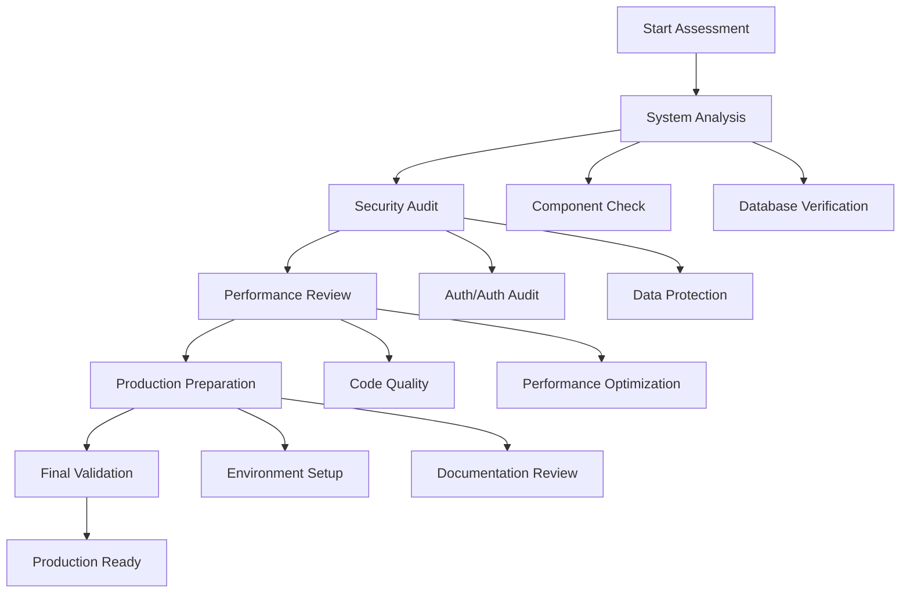

# MedStintClerk Production Readiness Assessment

## 1. Project Overview

This document provides a comprehensive framework for assessing and preparing the MedStintClerk application for production deployment. The assessment covers system integrity, security vulnerabilities, performance optimization, and production standards compliance.

## 2. Core Features

### 2.1 Assessment Methodology

The production readiness assessment follows a systematic approach:
- **Component Analysis**: Identify broken or missing components across frontend and backend
- **System Verification**: Validate frontend-backend integration with Neon database
- **Security Audit**: Comprehensive vulnerability assessment and remediation
- **Performance Optimization**: Code quality improvements and performance enhancements
- **Documentation Review**: Ensure complete and accurate project documentation

### 2.2 Assessment Areas

Our production readiness assessment consists of the following main areas:

1. **System Architecture Analysis**: Component integrity, dependency validation, configuration verification
2. **Database Integration Testing**: Neon database connectivity, query optimization, data integrity
3. **Security Vulnerability Assessment**: Authentication flows, authorization controls, data protection
4. **Performance Optimization Review**: Code quality metrics, performance bottlenecks, scalability assessment
5. **Production Deployment Preparation**: Environment configuration, monitoring setup, documentation completeness

### 2.3 Assessment Details

| Assessment Area | Component | Feature Description |
|-----------------|-----------|--------------------|
| System Architecture | Component Integrity | Verify all frontend components render correctly, validate API endpoints functionality, check for missing dependencies or broken imports |
| System Architecture | Configuration Validation | Validate environment variables, verify build configurations, ensure proper TypeScript compilation |
| Database Integration | Neon Connectivity | Test database connection pools, validate authentication with Neon, verify SSL/TLS configuration |
| Database Integration | Query Performance | Analyze slow queries, validate indexes, test connection limits and timeouts |
| Security Assessment | Authentication Flow | Audit Clerk integration, validate JWT handling, test session management |
| Security Assessment | Authorization Controls | Review role-based access control, validate API endpoint permissions, test data access restrictions |
| Security Assessment | Data Protection | Audit sensitive data handling, validate encryption at rest and in transit, review GDPR compliance |
| Performance Review | Code Quality | Run ESLint and TypeScript checks, validate component performance, identify memory leaks |
| Performance Review | Optimization | Bundle size analysis, lazy loading implementation, caching strategy validation |
| Production Deployment | Environment Setup | Production environment variables, monitoring configuration, error tracking setup |
| Production Deployment | Documentation | API documentation completeness, deployment guides, troubleshooting procedures |

## 3. Assessment Process

### 3.1 Phase 1: System Analysis

**Component Integrity Check**
- Scan all React components for rendering issues
- Validate API route handlers and middleware
- Check for broken imports and missing dependencies
- Verify TypeScript compilation without errors

**Database Integration Verification**
- Test Neon database connectivity across all environments
- Validate Drizzle ORM schema consistency
- Check connection pool configuration and limits
- Verify database migration status

### 3.2 Phase 2: Security Audit

**Authentication & Authorization**
- Audit Clerk authentication implementation
- Validate JWT token handling and expiration
- Test role-based access control across all routes
- Review session management and logout procedures

**Data Protection Assessment**
- Audit sensitive data encryption
- Validate HTTPS enforcement
- Review CORS configuration
- Check for SQL injection vulnerabilities
- Assess XSS protection measures

### 3.3 Phase 3: Performance Optimization

**Code Quality Review**
- Run comprehensive linting and type checking
- Identify performance bottlenecks in components
- Review bundle size and optimization opportunities
- Validate caching strategies

**Database Performance**
- Analyze query performance and optimization
- Review index usage and effectiveness
- Test connection pool efficiency
- Validate transaction handling

### 3.4 Phase 4: Production Preparation

**Environment Configuration**
- Validate production environment variables
- Configure monitoring and logging
- Set up error tracking and alerting
- Prepare deployment scripts and CI/CD pipelines

**Documentation Completeness**
- API documentation accuracy
- Deployment and configuration guides
- Troubleshooting and maintenance procedures
- Security incident response plans

## 4. Security Audit Framework

### 4.1 Authentication Security

**Clerk Integration Audit**
- Validate API key security and rotation policies
- Review webhook signature verification
- Test authentication flow edge cases
- Audit session timeout and renewal mechanisms

**JWT Security Assessment**
- Validate token signing and verification
- Review token expiration and refresh logic
- Test token revocation mechanisms
- Audit token storage security (httpOnly cookies)

### 4.2 Authorization Controls

**Role-Based Access Control (RBAC)**
- Audit role definitions and permissions
- Test privilege escalation prevention
- Validate API endpoint authorization
- Review database-level access controls

**Data Access Security**
- Audit user data isolation
- Validate multi-tenant data separation
- Test unauthorized data access prevention
- Review audit logging for access attempts

### 4.3 Data Protection Measures

**Encryption Standards**
- Validate TLS 1.3 implementation
- Review database encryption at rest
- Audit sensitive data field encryption
- Test key management procedures

**Input Validation & Sanitization**
- Review Zod schema validation coverage
- Test SQL injection prevention
- Validate XSS protection measures
- Audit file upload security

### 4.4 Infrastructure Security

**Network Security**
- Review CORS configuration
- Validate CSP headers implementation
- Test rate limiting effectiveness
- Audit firewall and network policies

**Monitoring & Incident Response**
- Validate security event logging
- Test intrusion detection systems
- Review incident response procedures
- Audit security monitoring dashboards

## 5. Performance Optimization Standards

### 5.1 Frontend Performance

**React Component Optimization**
- Implement React.memo for expensive components
- Optimize re-renders with useMemo and useCallback
- Implement code splitting and lazy loading
- Validate bundle size and tree shaking

**Asset Optimization**
- Optimize images with next/image
- Implement proper caching headers
- Minimize CSS and JavaScript bundles
- Use CDN for static assets

### 5.2 Backend Performance

**API Optimization**
- Implement response caching strategies
- Optimize database queries and indexes
- Use connection pooling effectively
- Implement request/response compression

**Database Performance**
- Analyze and optimize slow queries
- Implement proper indexing strategies
- Use database connection pooling
- Monitor query execution plans

### 5.3 Caching Strategies

**Application-Level Caching**
- Implement Redis for session storage
- Cache frequently accessed data
- Use query result caching
- Implement cache invalidation strategies

**CDN and Edge Caching**
- Configure Vercel Edge Functions
- Implement static asset caching
- Use geographic content distribution
- Optimize cache-control headers

## 6. Code Quality Standards

### 6.1 TypeScript Configuration

**Strict Type Checking**
- Enable strict mode in tsconfig.json
- Eliminate any types usage
- Implement proper type definitions
- Use discriminated unions for complex types

**Code Organization**
- Implement consistent file naming conventions
- Use proper import/export patterns
- Organize components by feature domains
- Maintain clean architecture principles

### 6.2 Testing Standards

**Unit Testing Coverage**
- Achieve >80% code coverage
- Test critical business logic
- Mock external dependencies
- Implement snapshot testing for UI components

**Integration Testing**
- Test API endpoints with real database
- Validate authentication flows
- Test error handling scenarios
- Implement end-to-end testing

### 6.3 Code Review Standards

**Review Checklist**
- Security vulnerability assessment
- Performance impact analysis
- Code maintainability review
- Documentation completeness check

## 7. Production Deployment Requirements

### 7.1 Environment Configuration

**Production Environment Variables**
- Secure API key management
- Database connection strings
- Third-party service configurations
- Feature flags and environment-specific settings

**Infrastructure Requirements**
- Vercel deployment configuration
- Neon database production setup
- CDN and caching configuration
- Monitoring and logging setup

### 7.2 Monitoring and Observability

**Application Monitoring**
- Error tracking with Sentry or similar
- Performance monitoring with real user metrics
- Database performance monitoring
- API response time tracking

**Health Checks and Alerts**
- Implement comprehensive health check endpoints
- Configure uptime monitoring
- Set up performance degradation alerts
- Monitor database connection health

### 7.3 Backup and Recovery

**Data Backup Strategy**
- Automated database backups
- Point-in-time recovery capability
- Cross-region backup replication
- Backup verification procedures

**Disaster Recovery Plan**
- Service restoration procedures
- Data recovery protocols
- Communication plans for outages
- Regular disaster recovery testing

## 8. Documentation Standards

### 8.1 Technical Documentation

**API Documentation**
- Complete endpoint documentation
- Request/response examples
- Authentication requirements
- Error code definitions

**Architecture Documentation**
- System architecture diagrams
- Database schema documentation
- Integration flow diagrams
- Security architecture overview

### 8.2 Operational Documentation

**Deployment Guides**
- Step-by-step deployment procedures
- Environment setup instructions
- Configuration management guides
- Rollback procedures

**Troubleshooting Guides**
- Common issue resolution
- Performance troubleshooting
- Security incident response
- Database maintenance procedures

### 8.3 User Documentation

**User Guides**
- Feature usage instructions
- Role-specific workflows
- Best practices documentation
- FAQ and support resources

## 9. Assessment Checklist

### 9.1 Pre-Production Checklist

- [ ] All components render without errors
- [ ] API endpoints respond correctly
- [ ] Database connectivity verified
- [ ] Authentication flows tested
- [ ] Authorization controls validated
- [ ] Security vulnerabilities addressed
- [ ] Performance benchmarks met
- [ ] Code quality standards achieved
- [ ] Documentation completed
- [ ] Monitoring configured
- [ ] Backup procedures tested
- [ ] Disaster recovery plan validated

### 9.2 Go-Live Checklist

- [ ] Production environment configured
- [ ] SSL certificates installed
- [ ] DNS configuration verified
- [ ] CDN setup completed
- [ ] Monitoring dashboards active
- [ ] Error tracking configured
- [ ] Performance baselines established
- [ ] Support procedures documented
- [ ] Incident response team notified
- [ ] Rollback procedures tested

## 10. Continuous Improvement

### 10.1 Post-Launch Monitoring

**Performance Metrics**
- Monitor application performance trends
- Track user experience metrics
- Analyze database performance patterns
- Review security event logs

**Optimization Opportunities**
- Identify performance bottlenecks
- Optimize based on usage patterns
- Implement user feedback improvements
- Update security measures as needed

### 10.2 Regular Assessment Schedule

**Monthly Reviews**
- Security vulnerability scans
- Performance metric analysis
- Code quality assessments
- Documentation updates

**Quarterly Assessments**
- Comprehensive security audits
- Architecture review and optimization
- Disaster recovery testing
- Technology stack updates

This assessment framework ensures the MedStintClerk application meets enterprise-grade production standards while maintaining system reliability and security.