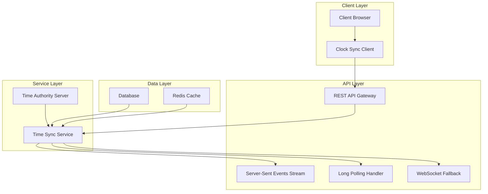
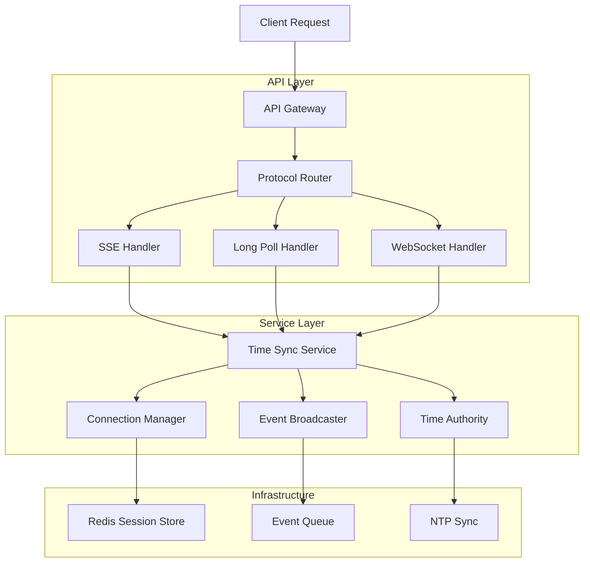
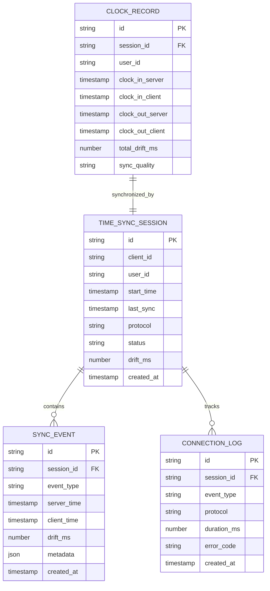

# Real-Time Clock Synchronization System - Technical Architecture

## 1. Architecture Design



## 2. Technology Description

- **Frontend**: React@18 + TypeScript + Custom Sync Hooks
- **Backend**: Next.js API Routes + Node.js Streams
- **Real-time**: Server-Sent Events (Primary) + Long Polling (Fallback) + WebSocket (Emergency)
- **Database**: Neon PostgreSQL + Redis Cache
- **Time Authority**: NTP-synchronized server timestamps

## 3. Route Definitions

| Route | Purpose |
|-------|---------|
| `/api/time-sync/connect` | Establish SSE connection for real-time sync |
| `/api/time-sync/poll` | Long polling endpoint for fallback sync |
| `/api/time-sync/websocket` | WebSocket endpoint for emergency fallback |
| `/api/time-sync/status` | Get current server time and sync status |
| `/api/time-sync/heartbeat` | Client heartbeat for connection monitoring |
| `/api/clock/sync-in` | Synchronized clock-in with time validation |
| `/api/clock/sync-out` | Synchronized clock-out with time validation |

## 4. API Definitions

### 4.1 Core Time Sync API

**Server-Sent Events Connection**
```
GET /api/time-sync/connect
```

Headers:
| Header Name | Header Type | Required | Description |
|-------------|-------------|----------|-------------|
| Accept | string | true | text/event-stream |
| Cache-Control | string | true | no-cache |
| Connection | string | true | keep-alive |

Response Stream:
```
event: time-sync
data: {"timestamp": "2024-01-15T10:30:00.000Z", "serverTime": 1705315800000, "drift": 0}

event: heartbeat
data: {"status": "connected", "clientCount": 42}

event: clock-event
data: {"type": "clock-in", "userId": "user123", "timestamp": "2024-01-15T10:30:00.000Z"}
```

**Long Polling Fallback**
```
GET /api/time-sync/poll
```

Query Parameters:
| Param Name | Param Type | Required | Description |
|------------|------------|----------|-------------|
| lastSync | number | true | Last sync timestamp |
| timeout | number | false | Polling timeout (default: 30s) |
| clientId | string | true | Unique client identifier |

Response:
```json
{
  "timestamp": "2024-01-15T10:30:00.000Z",
  "serverTime": 1705315800000,
  "events": [
    {
      "type": "time-sync",
      "data": {"drift": 0, "accuracy": "high"}
    }
  ],
  "nextPoll": 1705315830000
}
```

**Synchronized Clock Operations**
```
POST /api/clock/sync-in
```

Request:
| Param Name | Param Type | Required | Description |
|------------|------------|----------|-------------|
| rotationId | string | true | Clinical rotation identifier |
| clientTime | number | true | Client timestamp |
| serverTime | number | true | Expected server timestamp |
| location | object | false | GPS coordinates |
| notes | string | false | Clock-in notes |

Response:
```json
{
  "success": true,
  "data": {
    "recordId": "rec_123",
    "clockInTime": "2024-01-15T10:30:00.000Z",
    "serverTime": 1705315800000,
    "timeDrift": 50,
    "accuracy": "synchronized"
  }
}
```

### 4.2 Time Synchronization Protocol

**Time Sync Message Format**
```typescript
interface TimeSyncMessage {
  timestamp: string;           // ISO 8601 timestamp
  serverTime: number;          // Unix timestamp in milliseconds
  drift: number;               // Client-server time drift in ms
  accuracy: 'high' | 'medium' | 'low';
  sequenceId: number;          // Message sequence for ordering
  clientId: string;            // Client identifier
}

interface ClockEvent {
  type: 'clock-in' | 'clock-out' | 'sync-update';
  userId: string;
  timestamp: string;
  data: Record<string, any>;
}
```

## 5. Server Architecture Diagram



## 6. Data Model

### 6.1 Data Model Definition



### 6.2 Data Definition Language

**Time Sync Session Table**
```sql
-- Create time sync session tracking
CREATE TABLE time_sync_sessions (
    id UUID PRIMARY KEY DEFAULT gen_random_uuid(),
    client_id VARCHAR(255) NOT NULL,
    user_id UUID REFERENCES users(id),
    start_time TIMESTAMP WITH TIME ZONE DEFAULT NOW(),
    last_sync TIMESTAMP WITH TIME ZONE DEFAULT NOW(),
    protocol VARCHAR(20) NOT NULL CHECK (protocol IN ('sse', 'longpoll', 'websocket')),
    status VARCHAR(20) DEFAULT 'active' CHECK (status IN ('active', 'inactive', 'error')),
    drift_ms INTEGER DEFAULT 0,
    created_at TIMESTAMP WITH TIME ZONE DEFAULT NOW(),
    updated_at TIMESTAMP WITH TIME ZONE DEFAULT NOW()
);

-- Create sync event tracking
CREATE TABLE sync_events (
    id UUID PRIMARY KEY DEFAULT gen_random_uuid(),
    session_id UUID REFERENCES time_sync_sessions(id) ON DELETE CASCADE,
    event_type VARCHAR(50) NOT NULL,
    server_time TIMESTAMP WITH TIME ZONE NOT NULL,
    client_time TIMESTAMP WITH TIME ZONE NOT NULL,
    drift_ms INTEGER NOT NULL,
    metadata JSONB DEFAULT '{}',
    created_at TIMESTAMP WITH TIME ZONE DEFAULT NOW()
);

-- Create connection logging
CREATE TABLE connection_logs (
    id UUID PRIMARY KEY DEFAULT gen_random_uuid(),
    session_id UUID REFERENCES time_sync_sessions(id) ON DELETE CASCADE,
    event_type VARCHAR(50) NOT NULL,
    protocol VARCHAR(20) NOT NULL,
    duration_ms INTEGER,
    error_code VARCHAR(50),
    created_at TIMESTAMP WITH TIME ZONE DEFAULT NOW()
);

-- Create synchronized clock records
CREATE TABLE synchronized_clock_records (
    id UUID PRIMARY KEY DEFAULT gen_random_uuid(),
    session_id UUID REFERENCES time_sync_sessions(id),
    user_id UUID REFERENCES users(id) NOT NULL,
    clock_in_server TIMESTAMP WITH TIME ZONE,
    clock_in_client TIMESTAMP WITH TIME ZONE,
    clock_out_server TIMESTAMP WITH TIME ZONE,
    clock_out_client TIMESTAMP WITH TIME ZONE,
    total_drift_ms INTEGER DEFAULT 0,
    sync_quality VARCHAR(20) DEFAULT 'medium' CHECK (sync_quality IN ('high', 'medium', 'low')),
    created_at TIMESTAMP WITH TIME ZONE DEFAULT NOW(),
    updated_at TIMESTAMP WITH TIME ZONE DEFAULT NOW()
);

-- Create indexes for performance
CREATE INDEX idx_time_sync_sessions_client_id ON time_sync_sessions(client_id);
CREATE INDEX idx_time_sync_sessions_user_id ON time_sync_sessions(user_id);
CREATE INDEX idx_time_sync_sessions_status ON time_sync_sessions(status);
CREATE INDEX idx_sync_events_session_id ON sync_events(session_id);
CREATE INDEX idx_sync_events_created_at ON sync_events(created_at DESC);
CREATE INDEX idx_connection_logs_session_id ON connection_logs(session_id);
CREATE INDEX idx_synchronized_clock_records_user_id ON synchronized_clock_records(user_id);

-- Grant permissions
GRANT SELECT, INSERT, UPDATE ON time_sync_sessions TO authenticated;
GRANT SELECT, INSERT ON sync_events TO authenticated;
GRANT SELECT, INSERT ON connection_logs TO authenticated;
GRANT SELECT, INSERT, UPDATE ON synchronized_clock_records TO authenticated;

-- Initial configuration data
INSERT INTO system_config (key, value, description) VALUES
('time_sync_interval_ms', '1000', 'Default time sync interval in milliseconds'),
('max_drift_tolerance_ms', '5000', 'Maximum acceptable time drift in milliseconds'),
('connection_timeout_ms', '30000', 'Connection timeout for sync protocols'),
('heartbeat_interval_ms', '10000', 'Heartbeat interval for connection monitoring');
```

## 7. Implementation Phases

### Phase 1: Core Synchronization Infrastructure (Week 1-2)
- Implement Server-Sent Events endpoint for real-time sync
- Create time authority service with NTP synchronization
- Build basic client-side sync hook
- Establish Redis-based session management

### Phase 2: Client-Side Integration (Week 3)
- Integrate sync system with existing clock widget
- Implement automatic protocol fallback logic
- Add client-side time drift detection and correction
- Create sync status indicators in UI

### Phase 3: Fallback and Error Handling (Week 4)
- Implement long polling fallback mechanism
- Add WebSocket emergency fallback
- Create comprehensive error recovery system
- Implement offline mode with sync queue

### Phase 4: Performance Optimization (Week 5-6)
- Optimize network overhead and bandwidth usage
- Implement adaptive sync intervals based on drift
- Add connection pooling and load balancing
- Create monitoring and analytics dashboard

## 8. Performance Requirements

### 8.1 Accuracy Targets
- **Time Synchronization Accuracy**: ±100ms under normal conditions
- **Clock Event Accuracy**: ±50ms for clock-in/out operations
- **Drift Detection**: Real-time detection of >1 second drift
- **Correction Speed**: <2 seconds to correct detected drift

### 8.2 Network Efficiency
- **Bandwidth Usage**: <1KB/minute per active client
- **Connection Overhead**: <100ms initial connection time
- **Heartbeat Frequency**: 10-second intervals with adaptive scaling
- **Compression**: Gzip compression for all sync messages

### 8.3 Reliability Standards
- **Uptime**: 99.9% availability for sync services
- **Failover Time**: <5 seconds to fallback protocol
- **Data Consistency**: 100% accuracy for clock events
- **Recovery Time**: <30 seconds from connection loss

### 8.4 Scalability Considerations
- **Concurrent Connections**: Support 1000+ simultaneous clients
- **Horizontal Scaling**: Load balancer with sticky sessions
- **Database Performance**: <100ms query response time
- **Memory Usage**: <50MB per 100 active connections

## 9. Security Considerations

### 9.1 Authentication & Authorization
- JWT-based authentication for all sync connections
- Role-based access control for clock operations
- Client certificate validation for high-security environments
- Session timeout and automatic re-authentication

### 9.2 Data Protection
- TLS 1.3 encryption for all communications
- Message integrity verification using HMAC
- Client-side timestamp validation to prevent replay attacks
- Audit logging for all time-sensitive operations

### 9.3 Rate Limiting & DDoS Protection
- Per-client connection limits (max 3 concurrent)
- Adaptive rate limiting based on client behavior
- Geographic IP filtering for suspicious activity
- Circuit breaker pattern for service protection

## 10. Monitoring and Logging Requirements

### 10.1 Real-Time Metrics
- Active connection count by protocol type
- Average time drift across all clients
- Sync success/failure rates
- Network latency and bandwidth usage

### 10.2 Performance Monitoring
- API response times for sync endpoints
- Database query performance metrics
- Redis cache hit/miss ratios
- Server resource utilization (CPU, memory, network)

### 10.3 Business Intelligence
- Clock-in/out accuracy statistics
- User engagement with sync features
- Protocol usage distribution (SSE vs polling vs WebSocket)
- Error patterns and resolution times

### 10.4 Alerting System
- Critical: >5 second time drift detected
- Warning: >50% clients using fallback protocols
- Info: New client connections and disconnections
- Error: Sync service failures or database issues