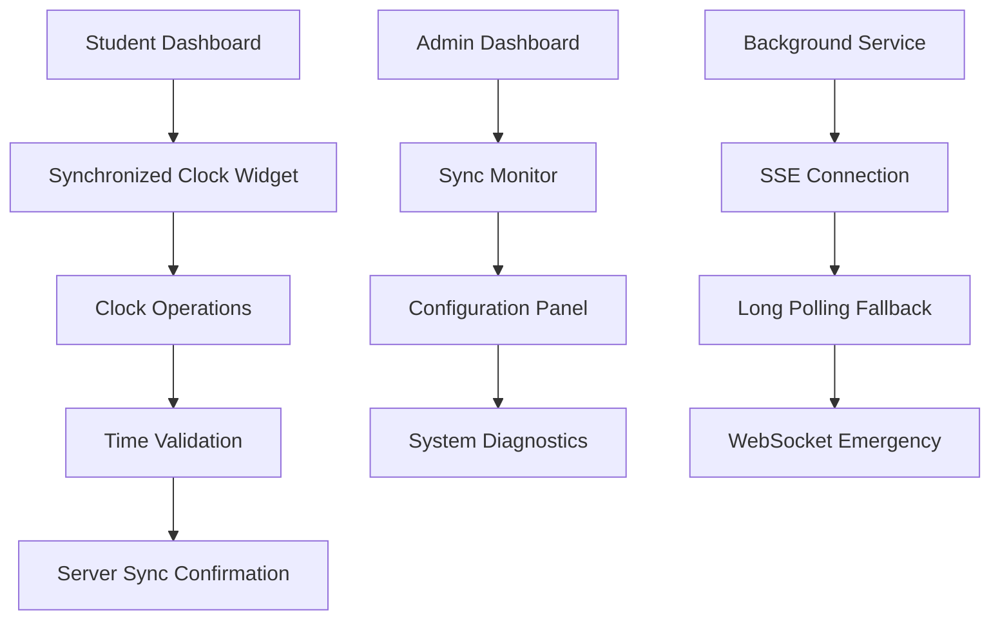

# Reliable Real-Time Clock Solution - Product Requirements Document

## 1. Product Overview

This document outlines the requirements for implementing a reliable real-time clock solution that maintains consistent time synchronization across the MedStint clinical tracking application. The solution addresses critical timing accuracy needs for student clock-in/out operations, ensuring precise attendance tracking and compliance with clinical hour requirements.

The system will provide seamless integration with existing clock widgets while delivering accurate timekeeping across all system operations, handling network challenges, and maintaining synchronization without requiring additional logging overhead for end users.

## 2. Core Features

### 2.1 User Roles

| Role | Registration Method | Core Permissions |
|------|---------------------|------------------|
| Clinical Student | Existing Clerk authentication | Can view synchronized time, perform clock operations with time validation |
| Clinical Supervisor | Existing admin authentication | Can monitor time accuracy, view synchronization status, access timing reports |
| System Administrator | Admin panel access | Can configure sync settings, monitor system health, manage time authority |

### 2.2 Feature Module

Our reliable real-time clock solution consists of the following main components:

1. **Synchronized Clock Display**: Real-time clock widget with server synchronization, drift detection, and accuracy indicators.
2. **Time Synchronization Service**: Background service managing time sync protocols, fallback mechanisms, and connection monitoring.
3. **Clock Operation Validation**: Enhanced clock-in/out operations with time validation, drift correction, and accuracy verification.
4. **Sync Status Dashboard**: Administrative interface for monitoring synchronization health, connection status, and timing accuracy.
5. **Offline Resilience**: Graceful degradation for offline scenarios with sync queue and automatic recovery.

### 2.3 Page Details

| Page Name | Module Name | Feature description |
|-----------|-------------|---------------------|
| Student Dashboard | Synchronized Clock Widget | Display real-time synchronized clock with accuracy indicator, automatic drift correction, seamless time updates without flickering, live status indicator showing sync quality |
| Student Dashboard | Clock Operations Panel | Enhanced clock-in/out buttons with time validation, server timestamp verification, drift warning alerts, operation confirmation with synchronized timestamps |
| Admin Dashboard | Time Sync Monitor | Real-time monitoring of sync status across all clients, connection health indicators, drift statistics, protocol usage analytics |
| Admin Dashboard | Sync Configuration | Configure sync intervals, drift tolerance settings, fallback protocol preferences, time authority server settings |
| System Status | Connection Diagnostics | Display active connections by protocol type, network latency metrics, sync success rates, error recovery statistics |
| System Status | Performance Metrics | Show bandwidth usage, server resource utilization, database performance, cache efficiency metrics |

## 3. Core Process

**Student Clock Operation Flow:**
Students access the dashboard and see a synchronized clock display with live accuracy indicators. When performing clock-in/out operations, the system validates timestamps against server time, detects any drift, and provides immediate feedback. If drift exceeds tolerance, users receive clear warnings and automatic correction options.

**Time Synchronization Flow:**
The system establishes real-time connections using Server-Sent Events as the primary protocol, with automatic fallback to long polling and WebSocket if needed. Background synchronization occurs every second with adaptive intervals based on connection quality and detected drift.

**Administrative Monitoring Flow:**
Administrators can monitor synchronization health across all connected clients, view real-time metrics, configure sync parameters, and receive alerts for critical timing issues or system failures.

## 4. User Interface Design

### 4.1 Design Style

- **Primary Colors**: Maintain existing theme with success green (#22c55e) for sync indicators, warning amber (#f59e0b) for drift alerts, error red (#ef4444) for sync failures
- **Button Style**: Consistent with existing ThemeAwareButton components, rounded corners with subtle shadows
- **Font**: Inter font family, 14px base size for sync status, 48px+ for main clock display
- **Layout Style**: Card-based design using existing ThemeAwareCard components, clean spacing with 16px padding
- **Icon Style**: Lucide React icons for sync status (CheckCircle, AlertCircle, Wifi, WifiOff), subtle animations for live indicators

### 4.2 Page Design Overview

| Page Name | Module Name | UI Elements |
|-----------|-------------|-------------|
| Student Dashboard | Synchronized Clock Widget | Large digital clock display with monospace font, small "LIVE" indicator with pulsing animation, sync accuracy badge (High/Medium/Low), subtle drift correction notifications |
| Student Dashboard | Clock Operations Panel | Enhanced clock-in/out buttons with timestamp preview, sync status indicator next to buttons, drift warning modal with clear messaging, success confirmation with server timestamp |
| Admin Dashboard | Time Sync Monitor | Grid layout with connection status cards, real-time charts for drift metrics, color-coded protocol indicators, expandable client details with connection info |
| Admin Dashboard | Sync Configuration | Form-based settings panel with input validation, slider controls for intervals and tolerances, toggle switches for protocol preferences, save confirmation with impact warnings |
| System Status | Connection Diagnostics | Dashboard-style metrics with progress bars, connection map showing protocol distribution, real-time log stream with filtering, export functionality for reports |

### 4.3 Responsiveness

The solution is designed mobile-first with adaptive layouts for all screen sizes. Touch interactions are optimized for mobile clock operations, with larger tap targets and swipe gestures for admin panels. Desktop versions include hover states and keyboard shortcuts for power users.

## 5. Technical Requirements

### 5.1 Performance Standards

- **Time Accuracy**: ±100ms synchronization accuracy under normal network conditions
- **Update Frequency**: 1-second intervals with adaptive scaling based on drift detection
- **Connection Recovery**: <5 seconds automatic failover to backup protocols
- **Bandwidth Efficiency**: <1KB/minute per active client for sync operations
- **UI Responsiveness**: <100ms response time for clock display updates

### 5.2 Reliability Requirements

- **Uptime Target**: 99.9% availability for time synchronization services
- **Drift Detection**: Real-time detection of >1 second time drift with immediate correction
- **Offline Resilience**: Graceful degradation with local time display and sync queue for operations
- **Data Consistency**: 100% accuracy for clock-in/out timestamp recording
- **Error Recovery**: Automatic retry with exponential backoff for failed sync attempts

### 5.3 Integration Requirements

- **Seamless Integration**: No changes required to existing clock widget API or user workflows
- **Backward Compatibility**: Existing clock operations continue to function during sync service outages
- **Theme Consistency**: Full support for existing dark/light theme system
- **Authentication**: Integration with existing Clerk authentication without additional login requirements
- **Database Compatibility**: Works with current Neon PostgreSQL setup and Drizzle ORM

## 6. Success Metrics

### 6.1 User Experience Metrics

- **Clock Accuracy Satisfaction**: >95% of users report accurate time display
- **Operation Confidence**: >90% of clock-in/out operations completed without drift warnings
- **UI Responsiveness**: <2% of users report clock display lag or freezing
- **Error Recovery**: >98% automatic recovery from sync connection issues

### 6.2 Technical Performance Metrics

- **Sync Accuracy**: Average drift <50ms across all active connections
- **Connection Stability**: >99% uptime for primary SSE connections
- **Fallback Efficiency**: <5 second transition time to backup protocols
- **Resource Usage**: <2% additional CPU overhead on client devices

### 6.3 Business Impact Metrics

- **Attendance Accuracy**: >99.5% accurate clock-in/out timestamp recording
- **Compliance Reporting**: Zero timing discrepancies in clinical hour reports
- **Support Reduction**: <1% of support tickets related to clock timing issues
- **System Reliability**: >99.9% uptime for critical timing operations

## 7. Risk Mitigation

### 7.1 Technical Risks

- **Network Connectivity**: Multiple fallback protocols (SSE → Long Polling → WebSocket) ensure continuous operation
- **Server Overload**: Connection pooling and rate limiting prevent resource exhaustion
- **Time Authority Failure**: Multiple NTP sources with automatic failover for time reference
- **Client Clock Drift**: Real-time drift detection with automatic correction and user notifications

### 7.2 User Experience Risks

- **Sync Notification Fatigue**: Intelligent alerting with progressive disclosure and user preferences
- **Performance Impact**: Lightweight implementation with minimal battery and bandwidth usage
- **Learning Curve**: Zero additional training required due to seamless integration
- **Accessibility**: Full screen reader support and keyboard navigation for sync status

### 7.3 Business Continuity Risks

- **Regulatory Compliance**: Audit trail for all timing operations with tamper-proof logging
- **Data Integrity**: Cryptographic verification of timestamps to prevent manipulation
- **Scalability Limits**: Horizontal scaling architecture supports 10x current user base
- **Vendor Dependencies**: Open-source protocols reduce dependency on third-party services

## 8. Implementation Timeline

### 8.1 Phase 1: Core Infrastructure (Weeks 1-2)
- Implement Server-Sent Events synchronization endpoint
- Create time authority service with NTP integration
- Build basic client-side sync hook with drift detection
- Establish Redis session management for connection tracking

### 8.2 Phase 2: UI Integration (Week 3)
- Enhance existing clock widget with sync indicators
- Add time validation to clock-in/out operations
- Implement sync status notifications and user feedback
- Create administrative monitoring interface

### 8.3 Phase 3: Resilience & Fallbacks (Week 4)
- Implement long polling and WebSocket fallback protocols
- Add offline mode with operation queuing
- Create comprehensive error recovery system
- Implement connection health monitoring

### 8.4 Phase 4: Optimization & Launch (Weeks 5-6)
- Performance optimization and load testing
- Security audit and penetration testing
- User acceptance testing with clinical staff
- Production deployment with gradual rollout

## 9. Acceptance Criteria

### 9.1 Functional Requirements
- [ ] Clock display updates in real-time with <100ms accuracy
- [ ] Automatic drift detection and correction within 2 seconds
- [ ] Seamless fallback between sync protocols without user intervention
- [ ] Clock operations validate timestamps against server time
- [ ] Administrative dashboard shows real-time sync status for all clients

### 9.2 Performance Requirements
- [ ] Sync service maintains 99.9% uptime during testing period
- [ ] Average time drift across all clients remains <50ms
- [ ] Connection recovery completes within 5 seconds of network restoration
- [ ] UI remains responsive with <100ms update latency
- [ ] Bandwidth usage stays under 1KB/minute per active client

### 9.3 User Experience Requirements
- [ ] No additional login or setup required for existing users
- [ ] Clock widget maintains existing visual design and functionality
- [ ] Sync status indicators are clear and non-intrusive
- [ ] Error messages provide actionable guidance for users
- [ ] Mobile and desktop interfaces work consistently across devices

### 9.4 Integration Requirements
- [ ] Existing clock-in/out API endpoints continue to function
- [ ] Theme system (dark/light mode) applies to all sync components
- [ ] Database schema changes are backward compatible
- [ ] Authentication integrates seamlessly with existing Clerk setup
- [ ] No breaking changes to current user workflows or data structures