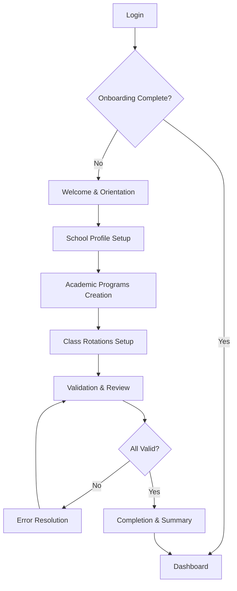

# School Administrator Onboarding Process - Product Requirements Document

## 1. Product Overview

A comprehensive onboarding system that guides school administrators through the initial setup of academic programs and class rotations within the MedStint platform. The system ensures proper configuration of essential educational components while maintaining data integrity and providing an intuitive user experience.

This onboarding process addresses the critical need for systematic setup of academic infrastructure, helping administrators establish their school's operational framework efficiently. The target is to reduce setup time by 70% while ensuring 100% data accuracy through guided workflows.

## 2. Core Features

### 2.1 User Roles

| Role | Registration Method | Core Permissions |
|------|---------------------|------------------|
| School Administrator | Clerk Auth with role assignment | Full access to school setup, program creation, rotation management |
| Super Administrator | System-level access | Override capabilities, multi-school management, system configuration |

### 2.2 Feature Module

Our school administrator onboarding consists of the following main pages:

1. **Welcome & Orientation Page**: System introduction, progress overview, getting started guide
2. **School Profile Setup**: Basic school information, accreditation details, contact information
3. **Academic Programs Creation**: Program definition, duration settings, requirement specifications
4. **Class Rotations Setup**: Scheduling framework, room assignments, teacher allocations
5. **Validation & Review**: Data integrity checks, configuration summary, error resolution
6. **Completion & Summary**: Setup confirmation, next steps guidance, resource access

### 2.3 Page Details

| Page Name | Module Name | Feature Description |
|-----------|-------------|---------------------|
| Welcome & Orientation | Welcome Banner | Display personalized greeting, system overview, and estimated completion time |
| Welcome & Orientation | Progress Tracker | Show 6-step progress indicator with current position and completion status |
| Welcome & Orientation | Quick Start Guide | Provide overview of what will be accomplished and preparation checklist |
| School Profile Setup | Basic Information Form | Capture school name, address, phone, email, website with validation |
| School Profile Setup | Accreditation Selection | Choose from predefined accreditation options with descriptions |
| School Profile Setup | Contact Management | Set primary and secondary contacts with role assignments |
| Academic Programs Creation | Program Builder | Create programs with name, description, duration, and classification |
| Academic Programs Creation | Requirements Matrix | Define graduation requirements, credit hours, and prerequisite courses |
| Academic Programs Creation | Class Year Configuration | Set up graduation years and cohort management |
| Class Rotations Setup | Rotation Framework | Define rotation types, specialties, and duration parameters |
| Class Rotations Setup | Scheduling Engine | Create rotation schedules with date ranges and capacity limits |
| Class Rotations Setup | Resource Assignment | Assign clinical sites, preceptors, and supervisors to rotations |
| Validation & Review | Data Integrity Checker | Validate all entered data for completeness and consistency |
| Validation & Review | Configuration Summary | Display comprehensive overview of all setup configurations |
| Validation & Review | Error Resolution | Highlight and guide resolution of any validation issues |
| Completion & Summary | Setup Confirmation | Confirm successful completion with detailed summary |
| Completion & Summary | Next Steps Guide | Provide guidance on immediate next actions and ongoing management |
| Completion & Summary | Resource Center | Link to documentation, training materials, and support resources |

## 3. Core Process

### School Administrator Flow

1. **Initial Access**: Administrator logs in and is automatically directed to onboarding if setup is incomplete
2. **Welcome & Orientation**: Review system overview and preparation requirements
3. **School Profile Setup**: Complete basic school information and accreditation details
4. **Academic Programs Creation**: Define all academic programs with requirements and specifications
5. **Class Rotations Setup**: Establish rotation framework with scheduling and resource assignments
6. **Validation & Review**: Verify all configurations and resolve any data integrity issues
7. **Completion**: Receive confirmation and access to ongoing management tools

### Super Administrator Override Flow

1. **System Access**: Can access any school's onboarding process for assistance or correction
2. **Bulk Operations**: Ability to set up multiple schools or programs simultaneously
3. **Template Management**: Create and manage setup templates for different school types

## 4. User Interface Design

### 4.1 Design Style

- **Primary Colors**: Blue (#2563eb) for primary actions, Green (#16a34a) for success states
- **Secondary Colors**: Gray (#64748b) for secondary text, Red (#dc2626) for errors
- **Button Style**: Rounded corners (8px), solid fills for primary actions, outlined for secondary
- **Font**: Inter font family, 16px base size, 14px for secondary text, 24px for headings
- **Layout Style**: Card-based design with clean spacing, left sidebar navigation for progress tracking
- **Icons**: Lucide React icons with consistent 20px sizing, contextual colors

### 4.2 Page Design Overview

| Page Name | Module Name | UI Elements |
|-----------|-------------|-------------|
| Welcome & Orientation | Welcome Banner | Hero section with gradient background, large welcome text, school logo placeholder |
| Welcome & Orientation | Progress Tracker | Horizontal stepper with numbered circles, connecting lines, current step highlighted |
| School Profile Setup | Information Form | Two-column layout, labeled input fields, inline validation messages |
| Academic Programs Creation | Program Builder | Modal-based program creation, drag-and-drop requirement ordering |
| Class Rotations Setup | Scheduling Engine | Calendar-style interface, time slot selection, capacity indicators |
| Validation & Review | Summary Cards | Expandable cards for each section, checkmark icons for valid items |
| Completion & Summary | Success Animation | Animated checkmark, confetti effect, progress completion celebration |

### 4.3 Responsiveness

Desktop-first design with mobile-adaptive breakpoints at 768px and 1024px. Touch-optimized interactions for tablet users, with larger touch targets (44px minimum) and swipe gestures for navigation between steps.

## 5. Technical Requirements

### 5.1 Database Integration Patterns

- **Connection Management**: Use Neon serverless connection pooling with automatic scaling
- **Transaction Handling**: Implement atomic transactions for multi-step data creation
- **Data Validation**: Server-side validation using Zod schemas before database operations
- **Error Recovery**: Automatic retry logic for transient connection issues
- **Performance Optimization**: Batch operations where possible, lazy loading for large datasets

### 5.2 Security & Compliance

- **Authentication**: Clerk Auth integration with role-based access control
- **Data Encryption**: All sensitive data encrypted at rest and in transit
- **Audit Logging**: Complete audit trail of all setup actions and modifications
- **Input Sanitization**: XSS protection and SQL injection prevention
- **Rate Limiting**: API rate limiting to prevent abuse

### 5.3 Validation Requirements

- **Real-time Validation**: Immediate feedback on form field completion
- **Cross-field Validation**: Ensure data consistency across related fields
- **Business Rule Validation**: Enforce institutional policies and accreditation requirements
- **Data Integrity Checks**: Verify referential integrity and constraint compliance
- **Duplicate Prevention**: Check for existing programs or rotations before creation

## 6. User Experience Specifications

### 6.1 Progress Tracking

- **Visual Progress Bar**: 6-step horizontal progress indicator with completion percentages
- **Step Validation**: Each step must be completed and validated before proceeding
- **Save & Resume**: Ability to save progress and resume onboarding later
- **Time Estimation**: Display estimated time remaining based on current progress

### 6.2 Contextual Help System

- **Inline Help**: Tooltip explanations for complex fields and concepts
- **Help Sidebar**: Collapsible help panel with step-specific guidance
- **Video Tutorials**: Embedded video walkthroughs for complex processes
- **Documentation Links**: Direct links to relevant documentation sections
- **Live Chat Support**: Integration with support system for real-time assistance

### 6.3 Error Handling & Recovery

- **Graceful Degradation**: System continues to function with reduced features during issues
- **Error Messages**: Clear, actionable error messages with suggested solutions
- **Auto-save**: Automatic saving of progress to prevent data loss
- **Rollback Capability**: Ability to undo recent changes if errors occur
- **Support Integration**: Easy escalation to support team for complex issues

## 7. Accessibility & Usability

### 7.1 Accessibility Standards

- **WCAG 2.1 AA Compliance**: Full compliance with accessibility guidelines
- **Keyboard Navigation**: Complete keyboard accessibility for all interactions
- **Screen Reader Support**: Proper ARIA labels and semantic HTML structure
- **Color Contrast**: Minimum 4.5:1 contrast ratio for all text elements
- **Focus Management**: Clear focus indicators and logical tab order

### 7.2 Usability Guidelines

- **Cognitive Load Reduction**: Break complex tasks into manageable steps
- **Consistent Patterns**: Use familiar UI patterns and consistent terminology
- **Error Prevention**: Design to prevent common mistakes before they occur
- **Feedback Systems**: Immediate feedback for all user actions
- **Mobile Optimization**: Touch-friendly interface for tablet and mobile users

## 8. Performance Requirements

### 8.1 Response Times

- **Page Load**: Initial page load under 2 seconds
- **Form Submission**: Form processing under 1 second
- **Validation**: Real-time validation under 300ms
- **Database Operations**: CRUD operations under 500ms

### 8.2 Scalability

- **Concurrent Users**: Support 100+ concurrent onboarding sessions
- **Data Volume**: Handle schools with 50+ programs and 500+ rotations
- **Geographic Distribution**: Optimized for global access with CDN integration

## 9. Success Metrics

### 9.1 Completion Metrics

- **Onboarding Completion Rate**: Target 95% completion rate
- **Time to Complete**: Average completion time under 45 minutes
- **Error Rate**: Less than 5% of sessions encounter blocking errors
- **User Satisfaction**: Net Promoter Score above 8.0

### 9.2 Quality Metrics

- **Data Accuracy**: 99.9% accuracy in setup configurations
- **Support Tickets**: Less than 10% of users require support assistance
- **Revision Rate**: Less than 15% of setups require post-completion modifications

## 10. Future Enhancements

### 10.1 Advanced Features

- **Template System**: Pre-built templates for common school configurations
- **Bulk Import**: CSV/Excel import for large-scale program and rotation setup
- **Integration Hub**: Connections to external SIS and LMS systems
- **Analytics Dashboard**: Setup completion analytics and optimization insights

### 10.2 Automation Opportunities

- **Smart Suggestions**: AI-powered recommendations based on school type and size
- **Auto-scheduling**: Intelligent rotation scheduling based on constraints
- **Compliance Checking**: Automated verification against accreditation standards
- **Workflow Automation**: Automated notifications and follow-up tasks