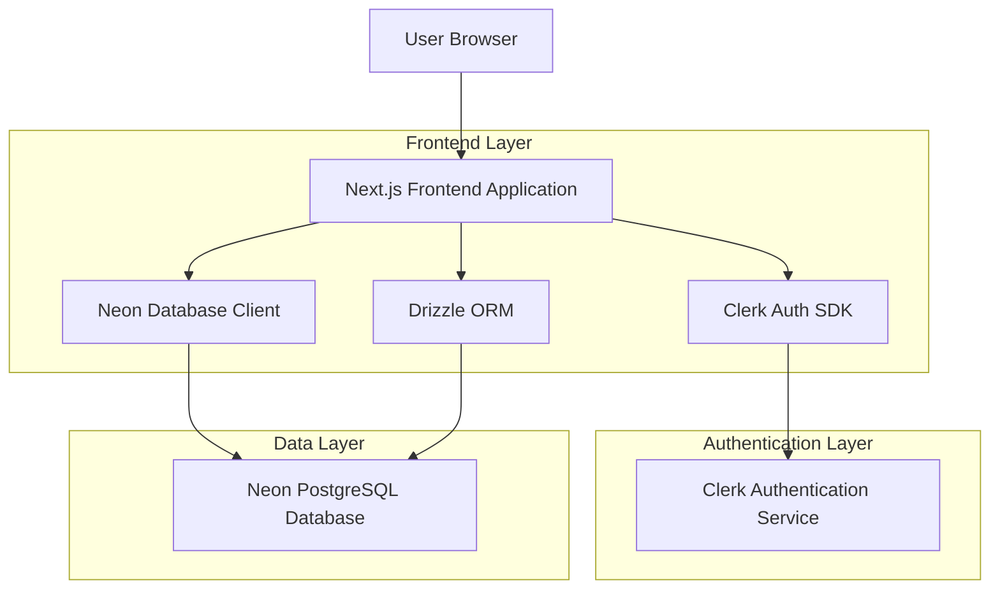
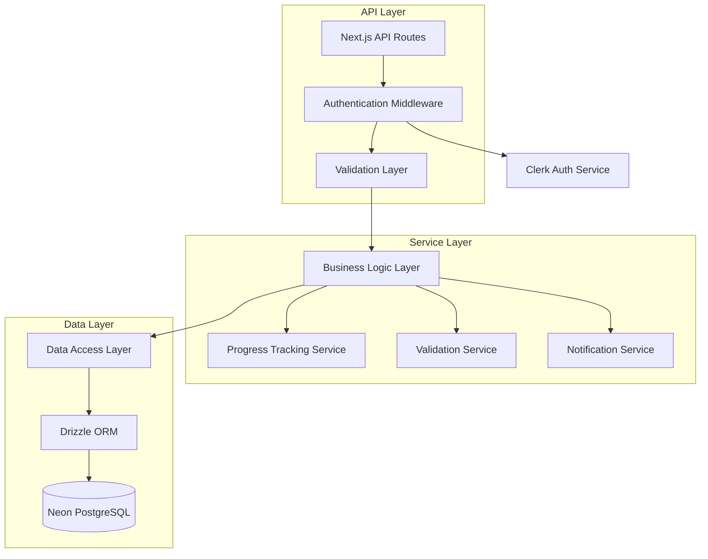
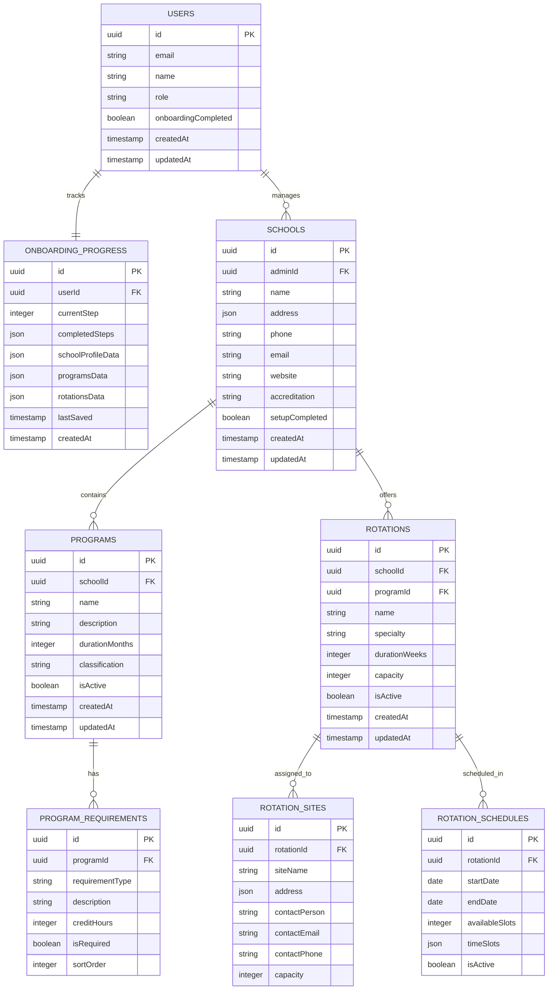

# School Administrator Onboarding - Technical Architecture Document

## 1. Architecture Design



## 2. Technology Description

* Frontend: Next.js\@14 + React\@18 + TypeScript + Tailwind CSS + Shadcn/ui

* Authentication: Clerk Auth with role-based access control

* Database: Neon PostgreSQL with Drizzle ORM

* State Management: React Context + useState/useReducer

* Form Handling: React Hook Form + Zod validation

* UI Components: Shadcn/ui + Lucide React icons

## 3. Route Definitions

| Route                         | Purpose                                       |
| ----------------------------- | --------------------------------------------- |
| /onboarding                   | Main onboarding entry point with step routing |
| /onboarding/welcome           | Welcome and orientation page                  |
| /onboarding/school-profile    | School information setup                      |
| /onboarding/programs          | Academic programs creation                    |
| /onboarding/rotations         | Class rotations setup                         |
| /onboarding/review            | Validation and review page                    |
| /onboarding/complete          | Completion and summary page                   |
| /api/onboarding/validate      | Server-side validation endpoint               |
| /api/onboarding/save-progress | Progress saving endpoint                      |
| /api/onboarding/complete      | Final completion processing                   |

## 4. API Definitions

### 4.1 Core API Endpoints

**Progress Management**

```
GET /api/onboarding/progress
```

Response:

| Param Name     | Param Type | Description                     |
| -------------- | ---------- | ------------------------------- |
| currentStep    | number     | Current onboarding step (1-6)   |
| completedSteps | number\[]  | Array of completed step numbers |
| schoolProfile  | object     | Saved school profile data       |
| programs       | array      | Saved academic programs         |
| rotations      | array      | Saved rotation configurations   |

**School Profile Creation**

```
POST /api/onboarding/school-profile
```

Request:

| Param Name    | Param Type | isRequired | Description                  |
| ------------- | ---------- | ---------- | ---------------------------- |
| name          | string     | true       | School name                  |
| address       | object     | true       | Complete address information |
| phone         | string     | true       | Primary phone number         |
| email         | string     | true       | Primary email address        |
| website       | string     | false      | School website URL           |
| accreditation | string     | true       | Accreditation type           |

**Academic Program Creation**

```
POST /api/onboarding/programs
```

Request:

| Param Name                 | Param Type | isRequired | Description                 |
| -------------------------- | ---------- | ---------- | --------------------------- |
| programs                   | array      | true       | Array of program objects    |
| programs\[].name           | string     | true       | Program name                |
| programs\[].duration       | number     | true       | Duration in months          |
| programs\[].requirements   | array      | true       | Graduation requirements     |
| programs\[].classification | string     | true       | Program type classification |

**Rotation Configuration**

```
POST /api/onboarding/rotations
```

Request:

| Param Name             | Param Type | isRequired | Description               |
| ---------------------- | ---------- | ---------- | ------------------------- |
| rotations              | array      | true       | Array of rotation objects |
| rotations\[].name      | string     | true       | Rotation name             |
| rotations\[].specialty | string     | true       | Medical specialty         |
| rotations\[].duration  | number     | true       | Duration in weeks         |
| rotations\[].capacity  | number     | true       | Student capacity          |
| rotations\[].sites     | array      | true       | Clinical site assignments |

**Validation Check**

```
POST /api/onboarding/validate
```

Request:

| Param Name | Param Type | isRequired | Description                    |
| ---------- | ---------- | ---------- | ------------------------------ |
| step       | number     | true       | Step number to validate        |
| data       | object     | true       | Step-specific data to validate |

Response:

| Param Name | Param Type | Description                       |
| ---------- | ---------- | --------------------------------- |
| isValid    | boolean    | Overall validation status         |
| errors     | array      | Array of validation error objects |
| warnings   | array      | Array of warning messages         |

## 5. Server Architecture Diagram



## 6. Data Model

### 6.1 Data Model Definition



### 6.2 Data Definition Language

**Onboarding Progress Table**

```sql
-- Create onboarding_progress table
CREATE TABLE onboarding_progress (
    id UUID PRIMARY KEY DEFAULT gen_random_uuid(),
    user_id UUID NOT NULL REFERENCES users(id) ON DELETE CASCADE,
    current_step INTEGER DEFAULT 1 CHECK (current_step >= 1 AND current_step <= 6),
    completed_steps JSONB DEFAULT '[]'::jsonb,
    school_profile_data JSONB DEFAULT '{}'::jsonb,
    programs_data JSONB DEFAULT '[]'::jsonb,
    rotations_data JSONB DEFAULT '[]'::jsonb,
    last_saved TIMESTAMP WITH TIME ZONE DEFAULT NOW(),
    created_at TIMESTAMP WITH TIME ZONE DEFAULT NOW(),
    updated_at TIMESTAMP WITH TIME ZONE DEFAULT NOW()
);

-- Create unique constraint for user onboarding progress
CREATE UNIQUE INDEX idx_onboarding_progress_user_id ON onboarding_progress(user_id);

-- Create index for efficient queries
CREATE INDEX idx_onboarding_progress_current_step ON onboarding_progress(current_step);
CREATE INDEX idx_onboarding_progress_last_saved ON onboarding_progress(last_saved DESC);
```

**Schools Table Enhancement**

```sql
-- Add onboarding-specific columns to schools table
ALTER TABLE schools ADD COLUMN IF NOT EXISTS setup_completed BOOLEAN DEFAULT FALSE;
ALTER TABLE schools ADD COLUMN IF NOT EXISTS onboarding_completed_at TIMESTAMP WITH TIME ZONE;
ALTER TABLE schools ADD COLUMN IF NOT EXISTS accreditation VARCHAR(100);
ALTER TABLE schools ADD COLUMN IF NOT EXISTS admin_id UUID REFERENCES users(id);

-- Create index for admin queries
CREATE INDEX idx_schools_admin_id ON schools(admin_id);
CREATE INDEX idx_schools_setup_completed ON schools(setup_completed);
```

**Programs Table**

```sql
-- Create programs table
CREATE TABLE programs (
    id UUID PRIMARY KEY DEFAULT gen_random_uuid(),
    school_id UUID NOT NULL REFERENCES schools(id) ON DELETE CASCADE,
    name VARCHAR(255) NOT NULL,
    description TEXT,
    duration_months INTEGER NOT NULL CHECK (duration_months > 0),
    classification VARCHAR(100) NOT NULL,
    is_active BOOLEAN DEFAULT TRUE,
    created_at TIMESTAMP WITH TIME ZONE DEFAULT NOW(),
    updated_at TIMESTAMP WITH TIME ZONE DEFAULT NOW()
);

-- Create indexes
CREATE INDEX idx_programs_school_id ON programs(school_id);
CREATE INDEX idx_programs_is_active ON programs(is_active);
CREATE UNIQUE INDEX idx_programs_school_name ON programs(school_id, name) WHERE is_active = TRUE;
```

**Program Requirements Table**

```sql
-- Create program_requirements table
CREATE TABLE program_requirements (
    id UUID PRIMARY KEY DEFAULT gen_random_uuid(),
    program_id UUID NOT NULL REFERENCES programs(id) ON DELETE CASCADE,
    requirement_type VARCHAR(100) NOT NULL,
    description TEXT NOT NULL,
    credit_hours INTEGER DEFAULT 0,
    is_required BOOLEAN DEFAULT TRUE,
    sort_order INTEGER DEFAULT 0,
    created_at TIMESTAMP WITH TIME ZONE DEFAULT NOW()
);

-- Create indexes
CREATE INDEX idx_program_requirements_program_id ON program_requirements(program_id);
CREATE INDEX idx_program_requirements_sort_order ON program_requirements(program_id, sort_order);
```

**Rotations Table**

```sql
-- Create rotations table
CREATE TABLE rotations (
    id UUID PRIMARY KEY DEFAULT gen_random_uuid(),
    school_id UUID NOT NULL REFERENCES schools(id) ON DELETE CASCADE,
    program_id UUID REFERENCES programs(id) ON DELETE SET NULL,
    name VARCHAR(255) NOT NULL,
    specialty VARCHAR(100) NOT NULL,
    duration_weeks INTEGER NOT NULL CHECK (duration_weeks > 0),
    capacity INTEGER NOT NULL CHECK (capacity > 0),
    is_active BOOLEAN DEFAULT TRUE,
    created_at TIMESTAMP WITH TIME ZONE DEFAULT NOW(),
    updated_at TIMESTAMP WITH TIME ZONE DEFAULT NOW()
);

-- Create indexes
CREATE INDEX idx_rotations_school_id ON rotations(school_id);
CREATE INDEX idx_rotations_program_id ON rotations(program_id);
CREATE INDEX idx_rotations_specialty ON rotations(specialty);
CREATE INDEX idx_rotations_is_active ON rotations(is_active);
```

**Rotation Sites Table**

```sql
-- Create rotation_sites table
CREATE TABLE rotation_sites (
    id UUID PRIMARY KEY DEFAULT gen_random_uuid(),
    rotation_id UUID NOT NULL REFERENCES rotations(id) ON DELETE CASCADE,
    site_name VARCHAR(255) NOT NULL,
    address JSONB NOT NULL,
    contact_person VARCHAR(255),
    contact_email VARCHAR(255),
    contact_phone VARCHAR(50),
    capacity INTEGER NOT NULL CHECK (capacity > 0),
    created_at TIMESTAMP WITH TIME ZONE DEFAULT NOW()
);

-- Create indexes
CREATE INDEX idx_rotation_sites_rotation_id ON rotation_sites(rotation_id);
CREATE INDEX idx_rotation_sites_site_name ON rotation_sites(site_name);
```

**Rotation Schedules Table**

```sql
-- Create rotation_schedules table
CREATE TABLE rotation_schedules (
    id UUID PRIMARY KEY DEFAULT gen_random_uuid(),
    rotation_id UUID NOT NULL REFERENCES rotations(id) ON DELETE CASCADE,
    start_date DATE NOT NULL,
    end_date DATE NOT NULL,
    available_slots INTEGER NOT NULL CHECK (available_slots >= 0),
    time_slots JSONB DEFAULT '[]'::jsonb,
    is_active BOOLEAN DEFAULT TRUE,
    created_at TIMESTAMP WITH TIME ZONE DEFAULT NOW(),
    CONSTRAINT valid_date_range CHECK (end_date > start_date)
);

-- Create indexes
CREATE INDEX idx_rotation_schedules_rotation_id ON rotation_schedules(rotation_id);
CREATE INDEX idx_rotation_schedules_date_range ON rotation_schedules(start_date, end_date);
CREATE INDEX idx_rotation_schedules_is_active ON rotation_schedules(is_active);
```

**Row Level Security (RLS) Policies**

```sql
-- Enable RLS on all tables
ALTER TABLE onboarding_progress ENABLE ROW LEVEL SECURITY;
ALTER TABLE schools ENABLE ROW LEVEL SECURITY;
ALTER TABLE programs ENABLE ROW LEVEL SECURITY;
ALTER TABLE program_requirements ENABLE ROW LEVEL SECURITY;
ALTER TABLE rotations ENABLE ROW LEVEL SECURITY;
ALTER TABLE rotation_sites ENABLE ROW LEVEL SECURITY;
ALTER TABLE rotation_schedules ENABLE ROW LEVEL SECURITY;

-- Onboarding progress policies
CREATE POLICY "Users can view own onboarding progress" ON onboarding_progress
    FOR SELECT USING (user_id = auth.uid());

CREATE POLICY "Users can update own onboarding progress" ON onboarding_progress
    FOR ALL USING (user_id = auth.uid());

-- Schools policies
CREATE POLICY "Admins can manage their schools" ON schools
    FOR ALL USING (admin_id = auth.uid());

CREATE POLICY "Super admins can manage all schools" ON schools
    FOR ALL USING (EXISTS (
        SELECT 1 FROM users WHERE id = auth.uid() AND role = 'SUPER_ADMIN'
    ));

-- Programs policies
CREATE POLICY "School admins can manage their programs" ON programs
    FOR ALL USING (EXISTS (
        SELECT 1 FROM schools WHERE id = programs.school_id AND admin_id = auth.uid()
    ));

-- Similar policies for other tables...
```

**Initial Data**

```sql
-- Insert default onboarding progress for new users (handled by trigger)
CREATE OR REPLACE FUNCTION create_onboarding_progress()
RETURNS TRIGGER AS $$
BEGIN
    IF NEW.role IN ('ADMIN', 'SUPER_ADMIN') THEN
        INSERT INTO onboarding_progress (user_id, current_step)
        VALUES (NEW.id, 1)
        ON CONFLICT (user_id) DO NOTHING;
    END IF;
    RETURN NEW;
END;
$$ LANGUAGE plpgsql;

CREATE TRIGGER trigger_create_onboarding_progress
    AFTER INSERT ON users
    FOR EACH ROW
    EXECUTE FUNCTION create_onboarding_progress();
```

