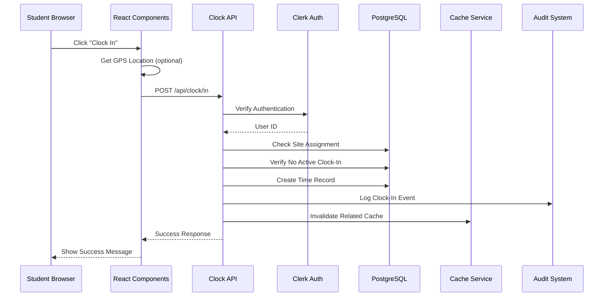
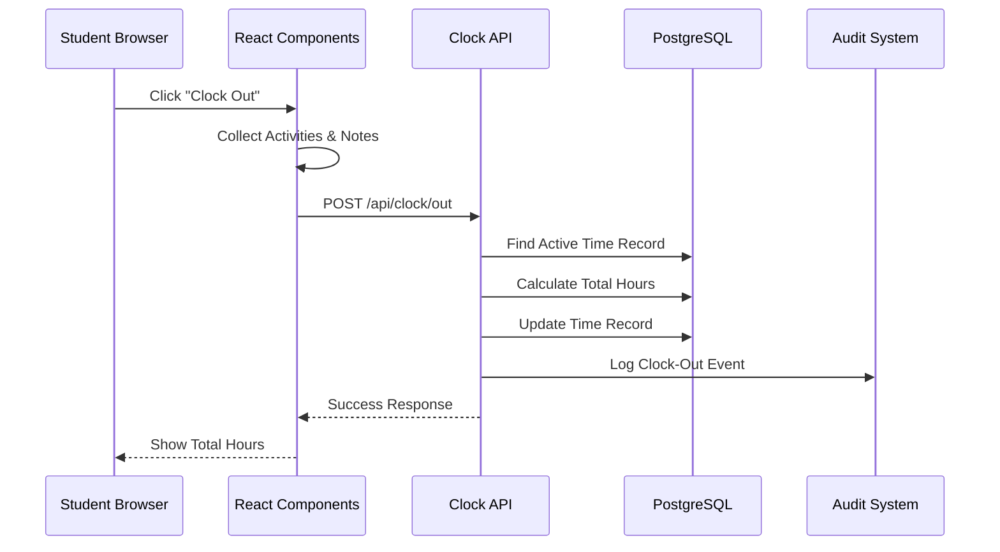
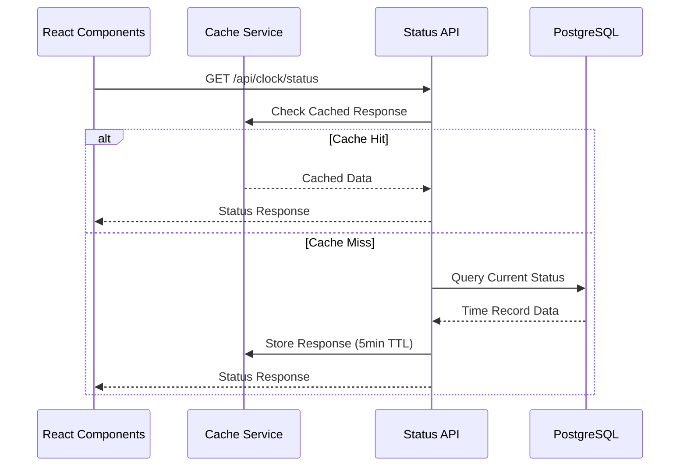

# Student Clinical Clock-In/Out System Analysis

## Executive Summary

The MedStint application implements a comprehensive student clinical clock-in/out system that tracks student attendance, activities, and time spent at clinical sites. This analysis examines the current implementation across all architectural layers and provides recommendations for system improvements.

## 1. Current API Endpoints and Route Functionality

### 1.1 Primary Clock API Endpoints

#### `/api/clock/in` (POST)
- **Purpose**: Handle student clock-in operations
- **Authentication**: Clerk-based user authentication required
- **Parameters**:
  ```typescript
  interface ClockInRequest {
    siteId: string          // Required: Clinical site identifier
    latitude?: number       // Optional: GPS latitude
    longitude?: number      // Optional: GPS longitude
    notes?: string         // Optional: Initial notes
  }
  ```
- **Validation**: 
  - Verifies user assignment to clinical site
  - Checks for active rotation
  - Prevents duplicate clock-ins for the same day
- **Response**: Returns success status, record ID, and clock-in timestamp
- **Audit Logging**: Creates comprehensive audit trail with IP, user agent, and location data

#### `/api/clock/out` (POST)
- **Purpose**: Handle student clock-out operations
- **Authentication**: Clerk-based user authentication required
- **Parameters**:
  ```typescript
  interface ClockOutRequest {
    recordId?: string       // Optional: Specific record ID
    latitude?: number       // Optional: GPS latitude
    longitude?: number      // Optional: GPS longitude
    activities?: string[]   // Optional: Activities performed
    notes?: string         // Optional: Session notes
  }
  ```
- **Logic**: 
  - Finds active time record (by ID or today's record)
  - Calculates total hours worked
  - Updates record with clock-out data
- **Response**: Returns success status, total hours, and timestamps

#### `/api/clock/status` (GET)
- **Purpose**: Retrieve current clock-in status for authenticated user
- **Caching**: Implements 5-minute TTL cache via `cacheIntegrationService`
- **Response**:
  ```typescript
  {
    status: "clocked_in" | "clocked_out" | "not_clocked_in",
    clockedIn: boolean,
    currentSite: { name: string, address: string } | null,
    clockInTime: Date | null,
    clockOutTime: Date | null,
    totalHours: string,
    recordId: string
  }
  ```

### 1.2 Alternative Time Records API

#### `/api/time-records/clock` (POST/GET)
- **Purpose**: Alternative implementation with enhanced validation
- **Features**:
  - Action-based routing (`clock-in` | `clock-out`)
  - Enhanced Zod schema validation
  - School context integration
  - More comprehensive error handling

### 1.3 Legacy API Endpoints
- `/api/clock/in.ts`, `/api/clock/out.ts`, `/api/clock/status.ts` (in `/api` directory)
- These appear to be legacy endpoints that should be consolidated

## 2. Data Flow Diagrams

### 2.1 Clock-In Flow


### 2.2 Clock-Out Flow


### 2.3 Status Check Flow


## 3. Performance Metrics and Bottlenecks

### 3.1 Current Performance Issues

#### Database Query Optimization
- **Issue**: Multiple database queries for single operations
- **Impact**: Clock-in requires 3-4 separate queries (assignment check, duplicate check, insert, audit log)
- **Recommendation**: Implement database transactions and query optimization

#### Caching Implementation
- **Current**: Basic in-memory caching with 5-minute TTL
- **Issues**: 
  - Cache invalidation is too broad (`invalidateAllCache()`)
  - No distributed caching for multi-instance deployments
  - Cache errors are only logged as warnings

#### Frontend Performance
- **Issue**: Full page reload after clock operations
- **Impact**: Poor user experience and unnecessary data refetching
- **Current Code**: `window.location.reload()` in success handlers

### 3.2 Performance Metrics

#### API Response Times (Estimated)
- Clock-in: 200-500ms (depending on database load)
- Clock-out: 150-400ms
- Status check: 50-200ms (cached) / 100-300ms (uncached)

#### Database Operations
- Time record queries: 2-4 queries per operation
- Audit logging: Additional 1-2 queries per operation
- Site assignment validation: 1 complex join query

## 4. Security Considerations

### 4.1 Current Security Measures

#### Authentication & Authorization
- **Strength**: Clerk-based authentication with JWT tokens
- **Implementation**: Consistent auth checks across all endpoints
- **User Context**: Proper user ID extraction and validation

#### Data Protection
- **Location Data**: Optional GPS coordinates stored securely
- **IP Tracking**: Client IP addresses logged for audit purposes
- **User Agent**: Browser information captured for security analysis

#### Audit Logging
- **Comprehensive**: All clock operations logged with full context
- **Data Captured**: User ID, action, resource, IP, user agent, timestamp
- **Severity Levels**: Appropriate severity classification (LOW for normal operations, HIGH for errors)

### 4.2 Security Vulnerabilities

#### Input Validation
- **Issue**: Limited input sanitization for notes and activities
- **Risk**: Potential XSS or injection attacks through user-generated content
- **Current**: Basic type checking but no content validation

#### Rate Limiting
- **Missing**: No rate limiting on clock operations
- **Risk**: Potential abuse or DoS attacks
- **Impact**: Users could spam clock-in/out operations

#### Location Verification
- **Issue**: GPS coordinates are not validated for reasonableness
- **Risk**: Users could submit false location data
- **Missing**: Geofencing or location boundary validation

## 5. Suggested Architectural Enhancements

### 5.1 Database Optimization

#### Transaction Implementation
```typescript
// Recommended: Wrap clock operations in transactions
await db.transaction(async (tx) => {
  // Validate assignment
  // Check for duplicates
  // Insert time record
  // Create audit log
})
```

#### Query Optimization
- Implement single-query operations where possible
- Add database indexes for frequently queried fields
- Use prepared statements for better performance

### 5.2 Caching Strategy Enhancement

#### Distributed Caching
- Implement Redis-based caching for multi-instance support
- Use cache tags for granular invalidation
- Implement cache warming strategies

#### Smart Cache Invalidation
```typescript
// Instead of invalidateAllCache()
await cacheIntegrationService.invalidateByTags([
  `user:${userId}:clock-status`,
  `site:${siteId}:records`
])
```

### 5.3 Real-time Updates

#### WebSocket Integration
- Implement real-time status updates for supervisors
- Live dashboard updates for clock-in/out events
- Real-time notifications for compliance issues

### 5.4 Enhanced Validation

#### Input Sanitization
```typescript
import { z } from 'zod'

const clockInSchema = z.object({
  siteId: z.string().uuid(),
  latitude: z.number().min(-90).max(90).optional(),
  longitude: z.number().min(-180).max(180).optional(),
  notes: z.string().max(1000).optional()
})
```

#### Geofencing
- Implement location-based validation
- Define acceptable radius around clinical sites
- Alert supervisors for out-of-bounds clock-ins

## 6. Compatibility Requirements with Other Application Components

### 6.1 Integration Points

#### Competency Tracking System
- **Current**: Time records linked to rotations
- **Enhancement**: Direct integration with competency assessments
- **Data Flow**: Clock-out should trigger competency evaluation prompts

#### Reporting System
- **Current**: Time data available for reports
- **Enhancement**: Real-time reporting dashboard updates
- **Requirements**: Standardized data format for report generation

#### Notification System
- **Missing**: Email notifications for clock-in/out events
- **Requirements**: Integration with Resend email service
- **Use Cases**: Late clock-in alerts, missing clock-out notifications

### 6.2 Data Consistency

#### Schema Alignment
- Ensure time record schema matches reporting requirements
- Standardize activity categorization across components
- Maintain referential integrity with rotation and site data

#### API Standardization
- Consolidate duplicate API endpoints
- Implement consistent error response formats
- Standardize authentication patterns

## 7. Error Handling and Logging Mechanisms

### 7.1 Current Error Handling

#### API Level
- **Strengths**: Comprehensive try-catch blocks
- **Audit Integration**: Errors logged to audit system
- **Response Format**: Consistent error response structure

#### Frontend Level
- **Toast Notifications**: User-friendly error messages
- **Loading States**: Proper loading indicators
- **Fallback Handling**: Graceful degradation for location services

### 7.2 Logging Analysis

#### Audit Log Structure
```typescript
{
  id: string,
  userId: string,
  action: "CLOCK_IN" | "CLOCK_OUT",
  resource: "time_record",
  resourceId: string,
  details: JSON,
  ipAddress: string,
  userAgent: string,
  severity: "LOW" | "HIGH",
  status: "SUCCESS" | "ERROR"
}
```

#### Logging Gaps
- **Missing**: Performance metrics logging
- **Limited**: Error context in some scenarios
- **No**: Structured logging for monitoring systems

### 7.3 Recommended Improvements

#### Enhanced Error Handling
```typescript
// Implement structured error responses
interface ApiError {
  code: string
  message: string
  details?: Record<string, any>
  timestamp: string
  requestId: string
}
```

#### Monitoring Integration
- Implement application performance monitoring (APM)
- Add structured logging for better observability
- Create alerting for critical errors

## 8. Specific Areas for Optimization

### 8.1 High Priority Optimizations

1. **Database Transaction Implementation**
   - Wrap multi-query operations in transactions
   - Reduce database round trips
   - Improve data consistency

2. **Cache Strategy Overhaul**
   - Implement Redis for distributed caching
   - Add granular cache invalidation
   - Implement cache warming

3. **Frontend State Management**
   - Remove full page reloads
   - Implement optimistic updates
   - Add real-time status synchronization

### 8.2 Medium Priority Enhancements

1. **Input Validation Enhancement**
   - Implement comprehensive Zod schemas
   - Add content sanitization
   - Implement geofencing validation

2. **API Consolidation**
   - Remove duplicate endpoints
   - Standardize response formats
   - Implement consistent error handling

3. **Performance Monitoring**
   - Add APM integration
   - Implement performance metrics
   - Create monitoring dashboards

### 8.3 Long-term Architectural Improvements

1. **Microservices Architecture**
   - Separate time tracking into dedicated service
   - Implement event-driven architecture
   - Add service mesh for communication

2. **Advanced Analytics**
   - Real-time analytics dashboard
   - Predictive analytics for compliance
   - Machine learning for anomaly detection

## 9. Actionable Steps for System Refinement

### Phase 1: Critical Fixes (1-2 weeks)
1. Implement database transactions for clock operations
2. Fix cache invalidation strategy
3. Remove full page reloads from frontend
4. Add input validation and sanitization

### Phase 2: Performance Optimization (2-4 weeks)
1. Implement Redis caching
2. Optimize database queries and add indexes
3. Add rate limiting to API endpoints
4. Implement geofencing validation

### Phase 3: Feature Enhancement (4-8 weeks)
1. Add real-time WebSocket updates
2. Integrate with notification system
3. Implement advanced reporting features
4. Add performance monitoring and alerting

### Phase 4: Architectural Improvements (8-12 weeks)
1. Consolidate API endpoints
2. Implement microservices architecture
3. Add advanced analytics capabilities
4. Implement comprehensive testing suite

## Conclusion

The current clock-in/out system provides a solid foundation with comprehensive audit logging and proper authentication. However, significant improvements are needed in performance optimization, caching strategy, and user experience. The recommended phased approach will systematically address these issues while maintaining system stability and adding new capabilities.

Key focus areas should be database optimization, cache strategy enhancement, and frontend user experience improvements. The system's integration with other application components is well-designed but requires standardization and real-time capabilities to reach its full potential.