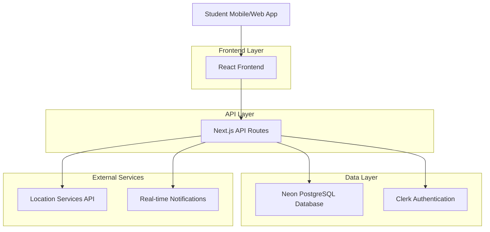
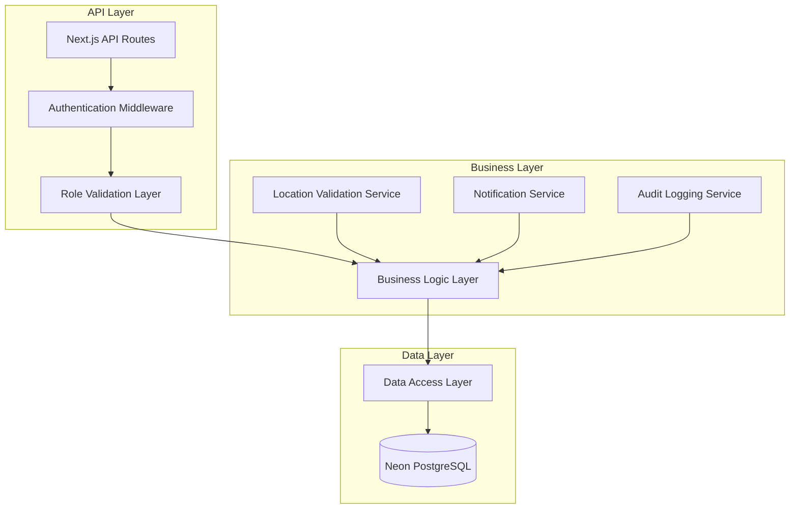
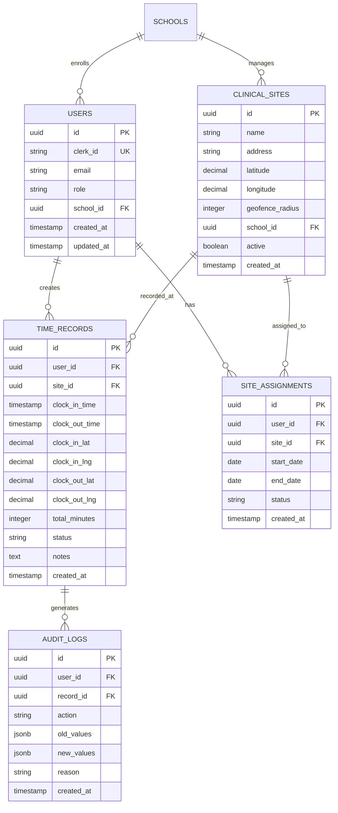

# Student Clock In/Out System - Technical Architecture Document

## 1. Architecture Design



## 2. Technology Description

* Frontend: React\@18 + Next.js\@14 + TypeScript + Tailwind CSS + Framer Motion

* Backend: Next.js API Routes + Drizzle ORM

* Database: Neon PostgreSQL with real-time subscriptions

* Authentication: Clerk with role-based access control

* Location Services: Browser Geolocation API + Google Maps API

* Real-time: Server-Sent Events for live clock status updates

## 3. Route Definitions

| Route                             | Purpose                                             |
| --------------------------------- | --------------------------------------------------- |
| /dashboard/student/clock          | Main clock in/out interface with status display     |
| /dashboard/student/sites          | Site selection and management interface             |
| /dashboard/student/timesheet      | Personal time records and history                   |
| /dashboard/admin/clock-management | Administrative clock oversight and site management  |
| /api/clock/status                 | Get current clock status for authenticated student  |
| /api/clock/in                     | Clock in endpoint with location and site validation |
| /api/clock/out                    | Clock out endpoint with time calculation            |
| /api/sites/available              | Get available clinical sites for student            |
| /api/sites/change-request         | Submit site change request                          |
| /api/timesheet/records            | Get time records with filtering and pagination      |

## 4. API Definitions

### 4.1 Core Clock API

**Get Clock Status**

```
GET /api/clock/status
```

Response:

| Param Name  | Param Type | Description                  |
| ----------- | ---------- | ---------------------------- |
| isClocked   | boolean    | Current clock status         |
| currentSite | object     | Active clinical site details |
| clockInTime | string     | ISO timestamp of clock in    |
| elapsedTime | number     | Minutes since clock in       |
| todayTotal  | number     | Total minutes worked today   |

Example:

```json
{
  "isClocked": true,
  "currentSite": {
    "id": "site_123",
    "name": "General Hospital - ICU",
    "address": "123 Medical Center Dr"
  },
  "clockInTime": "2024-01-15T08:00:00Z",
  "elapsedTime": 240,
  "todayTotal": 240
}
```

**Clock In**

```
POST /api/clock/in
```

Request:

| Param Name | Param Type | isRequired | Description              |
| ---------- | ---------- | ---------- | ------------------------ |
| siteId     | string     | true       | Clinical site identifier |
| latitude   | number     | true       | GPS latitude coordinate  |
| longitude  | number     | true       | GPS longitude coordinate |
| notes      | string     | false      | Optional clock in notes  |

Response:

| Param Name  | Param Type | Description              |
| ----------- | ---------- | ------------------------ |
| success     | boolean    | Operation success status |
| clockRecord | object     | Created time record      |
| message     | string     | Success or error message |

**Clock Out**

```
POST /api/clock/out
```

Request:

| Param Name | Param Type | isRequired | Description              |
| ---------- | ---------- | ---------- | ------------------------ |
| latitude   | number     | true       | GPS latitude coordinate  |
| longitude  | number     | true       | GPS longitude coordinate |
| notes      | string     | false      | Optional clock out notes |

Response:

| Param Name  | Param Type | Description              |
| ----------- | ---------- | ------------------------ |
| success     | boolean    | Operation success status |
| totalTime   | number     | Total minutes worked     |
| clockRecord | object     | Updated time record      |

### 4.2 Site Management API

**Get Available Sites**

```
GET /api/sites/available
```

Response:

| Param Name        | Param Type | Description              |
| ----------------- | ---------- | ------------------------ |
| sites             | array      | Available clinical sites |
| currentAssignment | object     | Current site assignment  |

**Request Site Change**

```
POST /api/sites/change-request
```

Request:

| Param Name    | Param Type | isRequired | Description                    |
| ------------- | ---------- | ---------- | ------------------------------ |
| newSiteId     | string     | true       | Requested site ID              |
| reason        | string     | true       | Reason for site change         |
| effectiveDate | string     | true       | When change should take effect |

## 5. Server Architecture Diagram



## 6. Data Model

### 6.1 Data Model Definition



### 6.2 Data Definition Language

**Clinical Sites Table**

```sql
CREATE TABLE clinical_sites (
    id UUID PRIMARY KEY DEFAULT gen_random_uuid(),
    name VARCHAR(255) NOT NULL,
    address TEXT NOT NULL,
    latitude DECIMAL(10, 8) NOT NULL,
    longitude DECIMAL(11, 8) NOT NULL,
    geofence_radius INTEGER DEFAULT 100, -- meters
    school_id UUID NOT NULL,
    active BOOLEAN DEFAULT true,
    created_at TIMESTAMP WITH TIME ZONE DEFAULT NOW(),
    updated_at TIMESTAMP WITH TIME ZONE DEFAULT NOW()
);

CREATE INDEX idx_clinical_sites_school_id ON clinical_sites(school_id);
CREATE INDEX idx_clinical_sites_location ON clinical_sites(latitude, longitude);
```

**Site Assignments Table**

```sql
CREATE TABLE site_assignments (
    id UUID PRIMARY KEY DEFAULT gen_random_uuid(),
    user_id UUID NOT NULL,
    site_id UUID NOT NULL,
    start_date DATE NOT NULL,
    end_date DATE,
    status VARCHAR(20) DEFAULT 'active' CHECK (status IN ('active', 'pending', 'completed', 'cancelled')),
    created_at TIMESTAMP WITH TIME ZONE DEFAULT NOW(),
    UNIQUE(user_id, site_id, start_date)
);

CREATE INDEX idx_site_assignments_user_id ON site_assignments(user_id);
CREATE INDEX idx_site_assignments_site_id ON site_assignments(site_id);
CREATE INDEX idx_site_assignments_dates ON site_assignments(start_date, end_date);
```

**Time Records Table**

```sql
CREATE TABLE time_records (
    id UUID PRIMARY KEY DEFAULT gen_random_uuid(),
    user_id UUID NOT NULL,
    site_id UUID NOT NULL,
    clock_in_time TIMESTAMP WITH TIME ZONE NOT NULL,
    clock_out_time TIMESTAMP WITH TIME ZONE,
    clock_in_lat DECIMAL(10, 8),
    clock_in_lng DECIMAL(11, 8),
    clock_out_lat DECIMAL(10, 8),
    clock_out_lng DECIMAL(11, 8),
    total_minutes INTEGER,
    status VARCHAR(20) DEFAULT 'active' CHECK (status IN ('active', 'completed', 'disputed', 'approved')),
    notes TEXT,
    created_at TIMESTAMP WITH TIME ZONE DEFAULT NOW(),
    updated_at TIMESTAMP WITH TIME ZONE DEFAULT NOW()
);

CREATE INDEX idx_time_records_user_id ON time_records(user_id);
CREATE INDEX idx_time_records_site_id ON time_records(site_id);
CREATE INDEX idx_time_records_clock_in ON time_records(clock_in_time DESC);
CREATE INDEX idx_time_records_status ON time_records(status);
```

**Audit Logs Table**

```sql
CREATE TABLE audit_logs (
    id UUID PRIMARY KEY DEFAULT gen_random_uuid(),
    user_id UUID NOT NULL,
    record_id UUID,
    action VARCHAR(50) NOT NULL,
    old_values JSONB,
    new_values JSONB,
    reason TEXT,
    created_at TIMESTAMP WITH TIME ZONE DEFAULT NOW()
);

CREATE INDEX idx_audit_logs_user_id ON audit_logs(user_id);
CREATE INDEX idx_audit_logs_record_id ON audit_logs(record_id);
CREATE INDEX idx_audit_logs_created_at ON audit_logs(created_at DESC);
```

**Initial Data**

```sql
-- Sample clinical sites
INSERT INTO clinical_sites (name, address, latitude, longitude, school_id) VALUES
('General Hospital - ICU', '123 Medical Center Dr, City, State', 40.7128, -74.0060, 'school_uuid_here'),
('Children\'s Hospital - Pediatrics', '456 Kids Care Ave, City, State', 40.7589, -73.9851, 'school_uuid_here'),
('Community Clinic - Family Medicine
```

