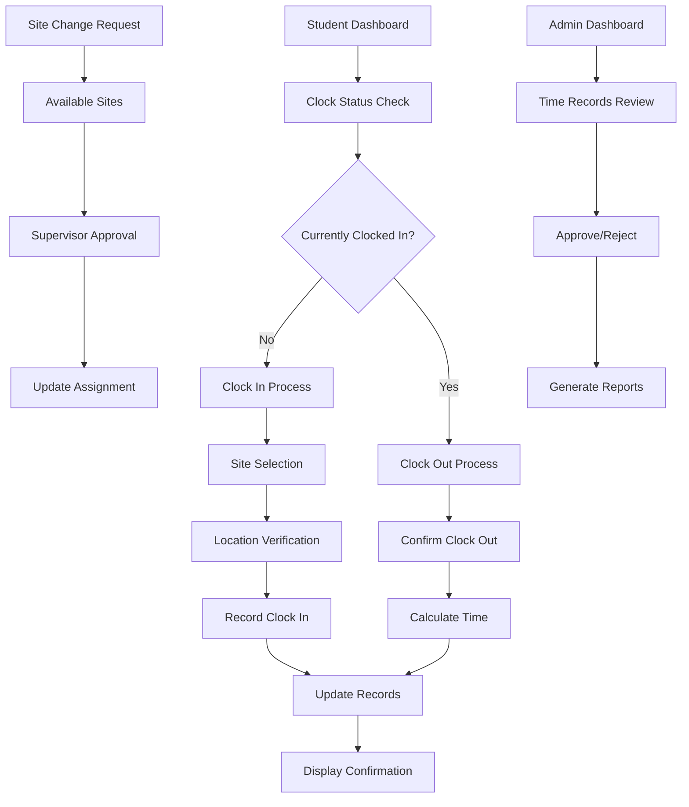

# Student Clock In/Out System - Product Requirements Document

## 1. Product Overview

A comprehensive time tracking system that allows students to clock in and out at their assigned clinical sites with the ability to select and change sites within their school network. The system integrates seamlessly with the existing MedstintClerk application and Neon database to provide accurate time tracking, site validation, and administrative oversight for clinical rotations.

## 2. Core Features

### 2.1 User Roles

| Role                | Registration Method      | Core Permissions                                          |
| ------------------- | ------------------------ | --------------------------------------------------------- |
| Student             | School enrollment system | Can clock in/out, select sites, view time records         |
| Clinical Supervisor | School admin invitation  | Can view student time records, approve/reject entries     |
| School Admin        | System admin setup       | Can manage sites, view all time records, generate reports |
| Super Admin         | System level access      | Full system access, manage all schools and sites          |

### 2.2 Feature Module

Our student clock system requirements consist of the following main pages:

1. **Student Clock Dashboard**: Real-time clock status, quick clock in/out buttons, current site display, time summary.
2. **Site Selection Page**: Available clinical sites list, site details, location verification, site change requests.
3. **Time Records Page**: Personal time history, weekly/monthly summaries, export functionality, dispute resolution.
4. **Clock Management Page** (Admin): Site management, student assignments, time record oversight, approval workflows.

### 2.3 Page Details

| Page Name               | Module Name           | Feature description                                                                       |
| ----------------------- | --------------------- | ----------------------------------------------------------------------------------------- |
| Student Clock Dashboard | Clock Status Display  | Show current clock status (in/out), active site, elapsed time, shift summary              |
| Student Clock Dashboard | Quick Actions         | Large clock in/out buttons, emergency clock out, break tracking                           |
| Student Clock Dashboard | Site Verification     | GPS location check, site confirmation prompt, automatic site detection                    |
| Site Selection Page     | Available Sites List  | Display assigned clinical sites within school network, site details and schedules         |
| Site Selection Page     | Site Change Request   | Request site change with reason, supervisor approval workflow, temporary site assignments |
| Site Selection Page     | Location Services     | GPS integration, geofencing for site boundaries, location-based site suggestions          |
| Time Records Page       | Personal History      | View all clock entries, filter by date/site, search functionality                         |
| Time Records Page       | Time Analytics        | Weekly/monthly summaries, total hours tracking, overtime calculations                     |
| Time Records Page       | Export & Reports      | Generate PDF reports, export to CSV, email summaries to supervisors                       |
| Clock Management Page   | Site Administration   | Create/edit clinical sites, set geofence boundaries, manage site schedules                |
| Clock Management Page   | Student Oversight     | View all student time records, approve disputed entries, generate compliance reports      |
| Clock Management Page   | Assignment Management | Assign students to sites, manage rotation schedules, bulk operations                      |

## 3. Core Process

### Student Clock Workflow

1. Student logs into dashboard and navigates to clock section
2. System verifies student's assigned clinical site and current location
3. Student selects correct site if multiple options available
4. Student clicks clock in/out with automatic timestamp and location capture
5. System validates entry and updates time records
6. Confirmation displayed with current status and elapsed time

### Site Change Workflow

1. Student requests site change from available options
2. System checks if site is within school network and student permissions
3. Supervisor receives notification for approval if required
4. Upon approval, student assignment updated and clock access granted

### Administrative Oversight Workflow

1. Supervisors receive daily/weekly time summaries
2. Disputed or irregular entries flagged for review
3. Administrators can approve, reject, or modify time entries
4. Compliance reports generated for school administration

## 4. User Interface Design

### 4.1 Design Style

* Primary colors: Blue (#2563eb) for clock in, Red (#dc2626) for clock out, Green (#16a34a) for success states

* Secondary colors: Gray (#6b7280) for inactive states, Yellow (#eab308) for warnings

* Button style: Large, rounded buttons with clear icons and status

