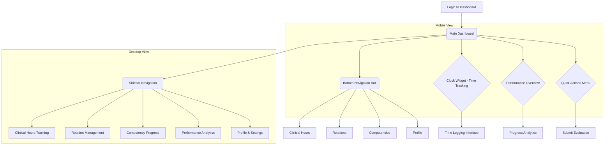

# Student Dashboard Enhancement - Product Requirements Document

## 1. Product Overview

The enhanced MedStint Student Dashboard serves as the central hub for clinical education management, providing students with seamless access to clinical time tracking, competency progress, rotation details, and academic performance metrics across all devices and platforms.

The dashboard addresses the critical need for streamlined clinical education workflows, enabling students to efficiently track their progress, manage rotations, and access essential academic information through a unified, mobile-first interface. This enhancement targets improved user experience, performance optimization, responsive design excellence, and modern accessibility standards to support the next generation of medical education in both clinical and mobile environments.

The solution prioritizes mobile usability while maintaining desktop functionality, ensuring students can access critical features whether they're at clinical sites, in classrooms, or on-the-go, with consistent visual design and intuitive interactions across all touchpoints.

## 2. Core Features

### 2.1 User Roles

| Role    | Registration Method                             | Core Permissions                                                                                                            |
| ------- | ----------------------------------------------- | --------------------------------------------------------------------------------------------------------------------------- |
| Student | School-based enrollment with program assignment | Can track clinical hours, view rotations, access competency progress, submit evaluations, and manage personal academic data |

### 2.2 Feature Module

Our enhanced student dashboard consists of the following main pages, each designed with a mobile-first approach:

1. **Main Dashboard**: Real-time clock widget, performance overview, quick actions, and adaptive navigation hub optimized for both touch and mouse interactions
2. **Clinical Hours Tracking**: Touch-friendly time logging interface, responsive weekly/monthly summaries, and mobile-optimized progress analytics
3. **Rotation Management**: Swipeable rotation cards, collapsible site details, accessible preceptor information, and touch-optimized schedule views
4. **Competency Progress**: Progressive disclosure of skills tracking, streamlined evaluation workflows, and responsive competency completion analytics
5. **Performance Analytics**: Mobile-optimized data visualizations, touch-friendly trend analysis, and accessible goal tracking interfaces
6. **Profile & Settings**: Simplified personal information management, streamlined notification preferences, and device-specific system settings

### 2.3 Page Details

| Page Name               | Module Name              | Feature description                                                                                                                                            |
| ----------------------- | ------------------------ | -------------------------------------------------------------------------------------------------------------------------------------------------------------- |
| Main Dashboard          | Clock Widget             | Real-time clinical time tracking with large, touch-friendly clock-in/out buttons, automatic break detection, and session management with clear visual feedback |
| Main Dashboard          | Performance Overview     | Display clinical hours completed, current rotation status, evaluation scores, and competency progress with responsive, visually intuitive indicators           |
| Main Dashboard          | Quick Actions            | One-click access to log hours, view schedule, submit evaluations, and access rotation details, with adaptive layout for mobile and desktop                     |
| Main Dashboard          | Navigation Hub           | Intuitive, adaptive menu system (bottom navigation for mobile, sidebar for desktop) with role-based access to all dashboard sections and external resources    |
| Clinical Hours Tracking | Time Logging Interface   | Enhanced clock-in/out system with touch-optimized activity categorization, swipeable break tracking, and simplified manual entry forms                         |
| Clinical Hours Tracking | Progress Analytics       | Visual charts showing daily, weekly, and monthly hour accumulation with touch-friendly target comparisons and zoom/pan functionality                           |
| Clinical Hours Tracking | Hour Validation          | Automated validation rules, streamlined supervisor approval workflows with push notifications, and simplified discrepancy resolution forms                     |
| Rotation Management     | Current Rotation Details | Display active rotation information including site, preceptor, schedule, and progress tracking in a collapsible, mobile-friendly format                        |
| Rotation Management     | Rotation History         | Complete rotation timeline with performance summaries and evaluation results, presented in a swipeable, chronological view                                     |
| Rotation Management     | Schedule Management      | Interactive, touch-optimized calendar view with pinch-to-zoom, drag-and-drop shift details, and accessible location information                                |
| Competency Progress     | Skills Tracking          | Real-time competency completion status with detailed progress indicators and requirements, using progressive disclosure to avoid information overload          |
| Competency Progress     | Evaluation Management    | Submit self-evaluations, view supervisor feedback, and track evaluation completion with mobile-friendly forms and clear calls-to-action                        |
| Competency Progress     | Achievement Analytics    | Visual representation of competency mastery with touch-friendly trend analysis and accessible goal-setting features                                            |
| Performance Analytics   | Academic Dashboard       | Comprehensive view of academic performance including GPA, rotation scores, and competency completion rates, with responsive layouts for all screen sizes       |
| Performance Analytics   | Progress Visualization   | Interactive, mobile-first charts and graphs showing performance trends, goal achievement, and comparative analytics with touch-friendly controls               |
| Performance Analytics   | Goal Management          | Set and track personal academic goals with milestone tracking and achievement notifications, optimized for quick updates on mobile devices                     |
| Profile & Settings      | Personal Information     | Manage student profile, contact information, and academic program details with simplified, accessible forms                                                    |
| Profile & Settings      | Notification Preferences | Configure alerts for evaluations, schedule changes, and important deadlines with touch-friendly toggles and controls                                           |
| Profile & Settings      | System Settings          | Customize dashboard layout, theme preferences (including dark mode), and accessibility options with device-specific settings                                   |

## 3. Core Process

**Student Daily Workflow (Mobile-First):**
Students begin their clinical day by accessing the dashboard on their mobile device to clock in using the prominent, touch-friendly time tracking widget. They can quickly view their daily schedule, check rotation details, and access quick actions for common tasks via a bottom navigation bar. Throughout the day, the system automatically tracks their clinical hours while allowing for easy manual activity logging. At the end of their shift, students clock out with a single tap and can immediately view their progress toward rotation requirements in a mobile-optimized view.

**Academic Progress Management (Mobile-First):**
Students regularly access their competency progress to review completed skills and upcoming evaluations through a touch-friendly interface. They can submit self-evaluations, view supervisor feedback, and track their overall academic performance through responsive, mobile-first visual analytics. The system provides push notifications for pending evaluations and approaching deadlines, ensuring timely completion.

**Rotation Transition Process (Mobile-First):**
When transitioning between rotations, students can view their rotation history, access new rotation details, and update their schedules through a swipeable, mobile-friendly interface. The dashboard provides seamless access to site information, preceptor contacts, and rotation-specific requirements, all optimized for on-the-go access.

## 4. User Interface Design

### 4.1 Design Style

* **Primary Colors**: Professional medical blue (#2563eb) for primary actions and headers, with supporting healthcare green (#059669) for success states and medical alert red (#dc2626) for warnings, ensuring consistency with the existing design system.

* **Secondary Colors**: Neutral grays (#f8fafc, #e2e8f0, #64748b) for backgrounds and text, with accent colors for data visualization, maintaining a clean and professional aesthetic.

* **Button Style**: Modern rounded buttons with subtle shadows, solid backgrounds for primary actions, and outline styles for secondary actions, with a minimum tap target of 44px for mobile accessibility.

* **Typography**: Clean sans-serif fonts (Inter/System UI) with a responsive, hierarchical sizing system: headings (24px-32px), body text (14px-16px), and captions (12px-14px), ensuring readability across all devices.

* **Layout Style**: Card-based design with consistent spacing, a responsive grid system, and adaptive navigation (bottom navigation for mobile, sidebar for desktop) with clear breadcrumbs.

* **Icons & Visual Elements**: Lucide React icons for consistency, subtle animations for interactions, and professional medical-themed iconography, all optimized for performance and scalability.

### 4.2 Page Design Overview

| Page Name               | Module Name          | UI Elements                                                                                                                                                                                  |
| ----------------------- | -------------------- | -------------------------------------------------------------------------------------------------------------------------------------------------------------------------------------------- |
| Main Dashboard          | Clock Widget         | Prominent medical blue card with large time display, animated clock-in/out buttons with haptic feedback, and status indicators with subtle shadows and rounded corners, optimized for touch. |
| Main Dashboard          | Performance Overview | Grid layout of metric cards with responsive progress bars, trend indicators using color-coded icons, and touch-friendly tooltips for detailed information.                                   |
| Main Dashboard          | Quick Actions        | Horizontal button row with icon-text combinations, consistent spacing, and responsive stacking for mobile devices, with a minimum tap target of 44px.                                        |
| Clinical Hours Tracking | Time Interface       | Large central clock display with intuitive start/stop controls, touch-friendly activity selection dropdowns, and real-time hour counters, designed for one-handed use.                       |
| Clinical Hours Tracking | Analytics Charts     | Interactive line and bar charts using Chart.js with a medical color scheme, responsive design, and touch-friendly data point hover details with pinch-to-zoom.                               |
| Rotation Management     | Rotation Cards       | Swipeable information cards with site images, progress indicators, contact details, and action buttons with consistent card shadows and touch-friendly targets.                              |
| Competency Progress     | Skills Grid          | Masonry layout of competency cards with completion checkmarks, progress bars, and color-coded status indicators, with progressive disclosure on tap.                                         |
| Performance Analytics   | Dashboard Charts     | Full-width responsive charts with touch-friendly filtering options, legend controls, and export functionality, using a professional and accessible color palette.                            |

### 4.3 Mobile-First Responsive Design

The dashboard follows a mobile-first responsive design approach with breakpoints at 768px (tablet) and 1024px (desktop). The responsive implementation includes:

#### 4.3.1 Mobile Experience (< 768px)

* Bottom navigation bar with icon-only representation for primary navigation

* Single-column layout with full-width cards and components

* Touch-optimized controls with minimum 44px tap targets

* Swipe gestures for common actions (rotation cards, competency lists)

* Collapsible sections to reduce cognitive load

* Floating action button for primary actions

* Simplified data visualizations optimized for smaller screens

#### 4.3.2 Tablet Experience (768px - 1024px)

* Hybrid navigation with collapsible sidebar and contextual bottom navigation

* Two-column grid layout for dashboard components

* Touch-friendly controls with enhanced tooltips

* Expanded data visualizations with more detail

* Side-by-side forms and information panels

#### 4.3.3 Desktop Experience (> 1024px)

* Persistent sidebar navigation with text and icon labels

* Multi-column grid layout with flexible component sizing

* Hover states and keyboard shortcuts for power users

* Advanced data visualization options with filtering and export capabilities

* Split-view interfaces for complex workflows

#### 4.3.4 Cross-Device Optimizations

* Responsive images and assets with appropriate resolution for device type

* Skeleton screens during loading for improved perceived performance

* Lazy loading of off-screen content to improve initial load time

* Offline capabilities for critical features like time tracking

* Synchronized state across devices for seamless multi-device usage

* Adaptive typography that scales based on device size and orientation

* Dark mode support with automatic detection of system preferences

## 5. Mobile UX Patterns & Interactions

### 5.1 Touch-First Interaction Design

* **Gesture Navigation**: Swipe left/right for navigation between sections, pull-to-refresh for data updates, and long-press for contextual actions

* **Haptic Feedback**: Subtle vibrations for successful actions (clock-in/out, form submissions) and error states

* **Progressive Disclosure**: Expandable cards and accordion-style information presentation to prevent information overload

* **One-Handed Usage**: Critical actions positioned within thumb reach, with alternative access methods for users with different hand sizes

### 5.2 Mobile-Specific Features

* **Quick Actions Widget**: iOS/Android home screen widgets for rapid clock-in/out without opening the app

* **Push Notifications**: Smart notifications for evaluation deadlines, schedule changes, and rotation updates with actionable buttons

* **Voice Input**: Voice-to-text for activity logging and evaluation comments

* **Camera Integration**: QR code scanning for location verification and document capture for evaluations

### 5.3 Accessibility & Inclusive Design

* **Screen Reader Optimization**: Semantic HTML structure with proper ARIA labels and focus management

* **High Contrast Mode**: Enhanced color contrast ratios meeting WCAG 2.1 AA standards

* **Font Scaling**: Support for system font size preferences up to 200% scaling

* **Motor Accessibility**: Alternative input methods and customizable gesture sensitivity

## 6. Performance & Technical Considerations

### 6.1 Mobile Performance Optimization

* **Bundle Splitting**: Code splitting by route and feature to reduce initial load time

* **Image Optimization**: WebP format with fallbacks, responsive images, and lazy loading

* **Caching Strategy**: Service worker implementation for offline functionality and faster subsequent loads

* **Network Resilience**: Graceful degradation for poor network conditions with retry mechanisms

### 6.2 Data Management

* **Optimistic Updates**: Immediate UI feedback for user actions with background synchronization

* **Efficient Data Fetching**: GraphQL or optimized REST APIs with pagination and selective field loading

* **Local Storage**: Critical data cached locally for offline access and faster app startup

* **Background Sync**: Automatic data synchronization when network connectivity is restored

### 6.3 Battery & Resource Efficiency

* **Efficient Animations**: CSS transforms and GPU-accelerated animations to minimize battery drain

* **Smart Polling**: Intelligent background data refresh based on user activity and app state

* **Memory Management**: Proper cleanup of event listeners and component unmounting to prevent memory leaks

* **Network Optimization**: Request batching and compression to minimize data usage

