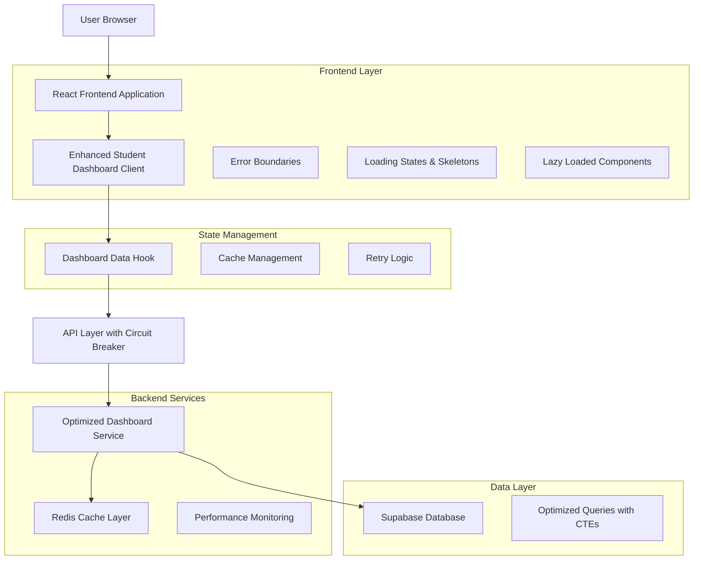

# Student Dashboard Refactoring - Technical Architecture Document

## 1. Architecture Design



## 2. Technology Description

- **Frontend**: React@18 + TypeScript + Tailwind CSS + Vite
- **State Management**: Custom hooks with built-in caching and retry logic
- **Backend**: Supabase (PostgreSQL) with optimized query layer
- **Caching**: Redis for performance optimization
- **Error Handling**: Unified error boundaries with fallback strategies
- **Performance**: Lazy loading, code splitting, and memoization

## 3. Route Definitions

| Route | Purpose |
|-------|---------|
| /dashboard/student | Main student dashboard with comprehensive overview |
| /dashboard/student/rotations | Detailed rotation management and scheduling |
| /dashboard/student/competencies | Competency tracking and progress monitoring |
| /dashboard/student/time-tracking | Clinical hours logging and management |
| /dashboard/student/evaluations | Performance evaluations and feedback |

## 4. Current Issues Analysis

### 4.1 Loading State Management Problems

**Issues Identified:**
- Inconsistent loading states across components
- Missing skeleton screens for better UX
- Race conditions in data fetching
- No proper loading state coordination between parent and child components

**Current Implementation Problems:**
```typescript
// Problem: Basic error handling without retry logic
try {
  dashboardData = await getStudentDashboardData(userId)
} catch (error) {
  console.error("Error fetching dashboard data:", error)
}
```

### 4.2 Error Handling Inconsistencies

**Issues Identified:**
- Inconsistent error boundary implementation
- Missing fallback UI for different error types
- No retry mechanisms for transient failures
- Poor error messaging for users

### 4.3 Performance Bottlenecks

**Issues Identified:**
- Duplicate API calls for similar data
- No caching strategy implementation
- Heavy components not lazy-loaded
- Missing memoization for expensive calculations
- Inefficient re-renders due to poor state management

### 4.4 Code Duplication and Maintainability

**Issues Identified:**
- Duplicate dashboard logic across components
- Inconsistent data fetching patterns
- Mixed server and client-side rendering concerns
- Poor separation of concerns

## 5. Production-Ready Architecture Solutions

### 5.1 Robust Error Boundaries and Fallback Strategies

**Implementation:**
```typescript
// Enhanced Error Boundary Configuration
export const ErrorBoundaryConfigs = {
  student: {
    fallbackType: 'dashboard' as const,
    maxRetries: 3,
    showDetails: process.env.NODE_ENV === "development",
    onError: (error: Error, errorInfo: ErrorInfo) => {
      // Log to monitoring service
      console.error('Student Dashboard Error:', error, errorInfo)
    }
  }
}
```

### 5.2 Optimized Loading States and Skeleton Screens

**Components:**
- `ClockWidgetFallback`: Animated skeleton for clock widget
- `CompetencyDashboardFallback`: Skeleton for competency section
- `TaskListSkeleton`: Loading state for task lists
- `RotationCardSkeleton`: Skeleton for rotation cards

### 5.3 Efficient Data Fetching Patterns

**Custom Hook Implementation:**
```typescript
export function useDashboardData(options: UseDashboardDataOptions) {
  // Features:
  // - Built-in caching with TTL
  // - Automatic retry with exponential backoff
  // - Request deduplication
  // - Stale-while-revalidate strategy
  // - Abort controller for cleanup
}
```

### 5.4 Component Lazy Loading and Code Splitting

**Implementation:**
```typescript
// Lazy load heavy components
const LazyClockWidget = lazy(() => import("../student/clock-widget"))
const LazyCompetencyDashboard = lazy(() => 
  import("../competency/competency-dashboard")
    .then(module => ({ default: module.CompetencyDashboard }))
)
```

### 5.5 Memory Management and Cleanup

**Features:**
- Automatic cleanup of event listeners
- Abort controllers for pending requests
- Cache invalidation strategies
- Component unmount cleanup

## 6. Technical Implementation Plan

### 6.1 Component Restructuring

**New Architecture:**
```
src/components/dashboard/
├── student/
│   ├── enhanced-student-dashboard-client.tsx (Main container)
│   ├── student-dashboard-wrapper.tsx (Data coordination)
│   └── sections/
│       ├── stats-overview.tsx
│       ├── rotation-details.tsx
│       ├── recent-activities.tsx
│       └── competency-progress.tsx
├── shared/
│   ├── dashboard-card.tsx
│   ├── progress-card.tsx
│   └── stat-card.tsx
└── loading/
    ├── dashboard-skeleton.tsx
    └── component-skeletons.tsx
```

### 6.2 State Management Optimization

**Custom Hook Features:**
- Centralized state management for dashboard data
- Built-in caching with configurable TTL
- Automatic retry logic with exponential backoff
- Request deduplication to prevent duplicate API calls
- Optimistic updates for better UX

### 6.3 API Integration Improvements

**Optimized Service Layer:**
```typescript
class OptimizedDashboardService {
  // Features:
  // - CTE-based queries for performance
  // - Redis caching integration
  // - Connection pooling
  // - Query optimization
  // - Batch operations
}
```

### 6.4 Caching Strategies

**Multi-Level Caching:**
1. **Browser Cache**: Component-level memoization
2. **Application Cache**: Custom dashboard cache with TTL
3. **Redis Cache**: Server-side caching for database queries
4. **Database Cache**: Materialized views for complex queries

### 6.5 Testing Strategies

**Comprehensive Testing:**
- Unit tests for custom hooks
- Integration tests for API endpoints
- Component testing with React Testing Library
- E2E tests for critical user flows
- Performance testing for load scenarios

## 7. Best Practices Integration

### 7.1 React Performance Patterns

**Implemented Patterns:**
- `memo()` for expensive components
- `useMemo()` for expensive calculations
- `useCallback()` for stable function references
- Lazy loading for code splitting
- Proper key props for list rendering

### 7.2 TypeScript Strict Typing

**Type Safety:**
```typescript
interface DashboardState {
  tasks: {
    data: Task[]
    loading: LoadingState
  }
  rotations: {
    data: Rotation[]
    loading: LoadingState
  }
  schedule: {
    data: ScheduleDay[]
    loading: LoadingState
  }
}
```

### 7.3 Accessibility Compliance

**Features:**
- Proper ARIA labels for interactive elements
- Keyboard navigation support
- Screen reader compatibility
- High contrast mode support
- Focus management for dynamic content

### 7.4 Security Considerations

**Implementation:**
- JWT token validation for API calls
- Request timeout to prevent hanging
- Input sanitization for user data
- CSRF protection for state-changing operations
- Secure error messages (no sensitive data exposure)

### 7.5 Monitoring and Observability

**Metrics Tracking:**
- Component render performance
- API response times
- Error rates and types
- User interaction patterns
- Cache hit/miss ratios

## 8. Performance Optimization Features

### 8.1 Lazy Loading Implementation

**Components:**
- Clock widget with fallback skeleton
- Competency dashboard with progressive loading
- Heavy chart components loaded on demand

### 8.2 Memoization Strategy

**Optimized Calculations:**
```typescript
// Memoized task filtering
const { urgentTasks, upcomingTasks, completedTasks } = useMemo(() => {
  if (!tasks.data) return { urgentTasks: [], upcomingTasks: [], completedTasks: [] }
  
  const urgent = tasks.data.filter((task: Task) => 
    task.priority === "urgent" || task.priority === "high"
  )
  // ... other filtering logic
  
  return { urgentTasks: urgent, upcomingTasks: upcoming, completedTasks: completed }
}, [tasks.data])
```

### 8.3 Request Optimization

**Features:**
- Request deduplication
- Automatic retry with exponential backoff
- Stale-while-revalidate caching
- Connection pooling for database queries

## 9. Deployment Considerations

### 9.1 Build Optimization

**Configuration:**
- Code splitting by route and component
- Tree shaking for unused code elimination
- Bundle size optimization
- Asset compression and caching

### 9.2 Environment Configuration

**Settings:**
- Development vs production error handling
- Cache TTL configuration by environment
- API timeout settings
- Monitoring service integration

### 9.3 Monitoring Setup

**Production Monitoring:**
- Error tracking and alerting
- Performance metrics collection
- User experience monitoring
- Database query performance tracking

## 10. Migration Strategy

### 10.1 Phase 1: Core Infrastructure
- Implement unified error boundaries
- Add loading skeletons and fallbacks
- Set up caching infrastructure

### 10.2 Phase 2: Component Optimization
- Refactor dashboard components
- Implement lazy loading
- Add memoization optimizations

### 10.3 Phase 3: Performance Enhancement
- Optimize API calls and caching
- Add monitoring and metrics
- Performance testing and tuning

### 10.4 Phase 4: Production Hardening
- Security audit and fixes
- Accessibility compliance
- Final performance optimization