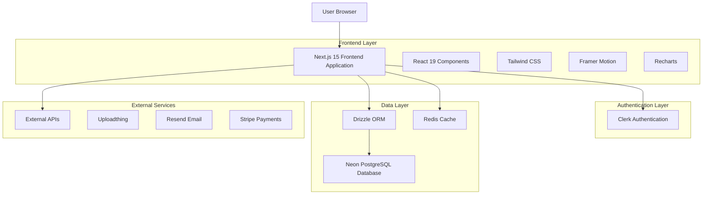
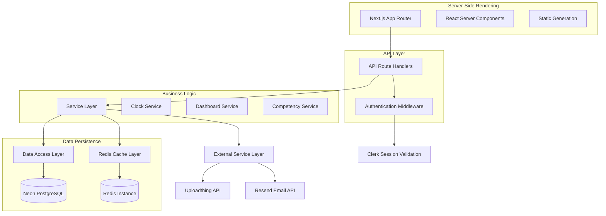
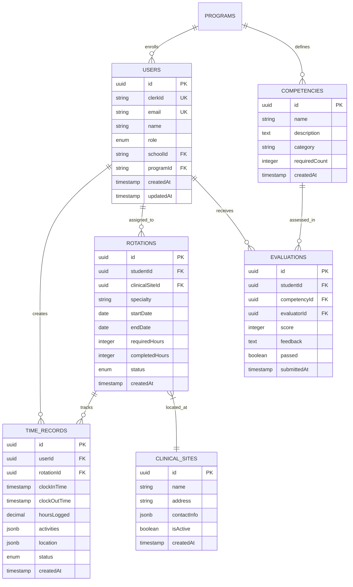

# Student Dashboard Enhancement - Technical Architecture Document

## 1. Architecture Design



## 2. Technology Description

- **Frontend**: Next.js@15.5.3 + React@19.1.0 + TypeScript@5.8.3 + Tailwind CSS@4.1.14
- **Authentication**: Clerk@6.28.1 for user management and session handling
- **Database**: Neon PostgreSQL with Drizzle ORM@0.44.5 for type-safe database operations
- **Caching**: Redis (ioredis@5.7.0) for session management and performance optimization
- **UI Components**: Radix UI primitives with custom styling and Framer Motion@12.23.12 for animations
- **Charts & Analytics**: Recharts@3.1.0 for data visualization and progress tracking
- **State Management**: Zustand@5.0.8 for client-side state management
- **Form Handling**: React Hook Form@7.60.0 with Zod@4.0.5 validation

## 3. Route Definitions

| Route | Purpose |
|-------|---------|
| /dashboard/student | Main student dashboard with clock widget, performance overview, and quick actions |
| /dashboard/student/hours | Detailed clinical hours tracking and time logging interface |
| /dashboard/student/rotations | Current and historical rotation management with schedules |
| /dashboard/student/competencies | Competency progress tracking and evaluation management |
| /dashboard/student/analytics | Performance analytics and goal tracking dashboard |
| /dashboard/student/profile | Personal profile management and system preferences |
| /api/student/clock-status | Real-time clock status and session management |
| /api/student/time-records | Clinical hours CRUD operations and validation |
| /api/student/dashboard-data | Aggregated dashboard data and statistics |
| /api/student/competencies | Competency progress and evaluation data |
| /api/student/rotations | Rotation details and schedule management |

## 4. API Definitions

### 4.1 Core API

**Clock Status Management**
```
GET /api/student/clock-status
```

Response:
| Param Name | Param Type | Description |
|------------|------------|-------------|
| isActive | boolean | Current clock-in status |
| currentSession | object | Active session details including start time and location |
| todayHours | number | Hours completed today |
| weeklyHours | number | Hours completed this week |

**Time Record Operations**
```
POST /api/student/time-records
```

Request:
| Param Name | Param Type | isRequired | Description |
|------------|------------|------------|-------------|
| action | string | true | Clock action: "clock_in" or "clock_out" |
| location | object | true | GPS coordinates and site information |
| activities | array | false | Selected clinical activities |

Response:
| Param Name | Param Type | Description |
|------------|------------|-------------|
| success | boolean | Operation success status |
| sessionId | string | Unique session identifier |
| totalHours | number | Updated total hours |

**Dashboard Data Aggregation**
```
GET /api/student/dashboard-data
```

Response:
| Param Name | Param Type | Description |
|------------|------------|-------------|
| currentRotation | object | Active rotation details and progress |
| totalClinicalHours | string | Cumulative clinical hours completed |
| competencyProgress | array | Competency completion status |
| evaluationsData | object | Evaluation counts and pending items |
| recentTimeRecords | array | Recent clinical activities |

Example Request:
```json
{
  "action": "clock_in",
  "location": {
    "latitude": 40.7128,
    "longitude": -74.0060,
    "siteId": "site_123"
  },
  "activities": ["patient_care", "documentation"]
}
```

## 5. Server Architecture Diagram



## 6. Data Model

### 6.1 Data Model Definition



### 6.2 Data Definition Language

**Users Table (Enhanced for MedStint)**
```sql
-- Create users table with role-based access
CREATE TABLE users (
    id UUID PRIMARY KEY DEFAULT gen_random_uuid(),
    clerk_id VARCHAR(255) UNIQUE NOT NULL,
    email VARCHAR(255) UNIQUE NOT NULL,
    name VARCHAR(255) NOT NULL,
    role VARCHAR(50) DEFAULT 'STUDENT' CHECK (role IN ('STUDENT', 'INSTRUCTOR', 'CLINICAL_SUPERVISOR', 'SCHOOL_ADMIN')),
    school_id UUID REFERENCES schools(id),
    program_id UUID REFERENCES programs(id),
    is_active BOOLEAN DEFAULT true,
    created_at TIMESTAMP WITH TIME ZONE DEFAULT NOW(),
    updated_at TIMESTAMP WITH TIME ZONE DEFAULT NOW()
);

-- Create indexes for performance
CREATE INDEX idx_users_clerk_id ON users(clerk_id);
CREATE INDEX idx_users_school_id ON users(school_id);
CREATE INDEX idx_users_role ON users(role);
```

**Time Records Table (High-Precision Tracking)**
```sql
-- Create time_records table for clinical hour tracking
CREATE TABLE time_records (
    id UUID PRIMARY KEY DEFAULT gen_random_uuid(),
    user_id UUID NOT NULL REFERENCES users(id) ON DELETE CASCADE,
    rotation_id UUID REFERENCES rotations(id),
    clock_in_time TIMESTAMP WITH TIME ZONE NOT NULL,
    clock_out_time TIMESTAMP WITH TIME ZONE,
    hours_logged DECIMAL(5,2) GENERATED ALWAYS AS (
        CASE 
            WHEN clock_out_time IS NOT NULL 
            THEN EXTRACT(EPOCH FROM (clock_out_time - clock_in_time)) / 3600.0
            ELSE 0
        END
    ) STORED,
    activities JSONB DEFAULT '[]',
    location JSONB,
    status VARCHAR(20) DEFAULT 'ACTIVE' CHECK (status IN ('ACTIVE', 'COMPLETED', 'CANCELLED')),
    ip_address INET,
    user_agent TEXT,
    created_at TIMESTAMP WITH TIME ZONE DEFAULT NOW(),
    updated_at TIMESTAMP WITH TIME ZONE DEFAULT NOW()
);

-- Create indexes for efficient querying
CREATE INDEX idx_time_records_user_id ON time_records(user_id);
CREATE INDEX idx_time_records_rotation_id ON time_records(rotation_id);
CREATE INDEX idx_time_records_clock_in_time ON time_records(clock_in_time DESC);
CREATE INDEX idx_time_records_status ON time_records(status);
```

**Rotations Table (Clinical Assignment Management)**
```sql
-- Create rotations table for clinical assignments
CREATE TABLE rotations (
    id UUID PRIMARY KEY DEFAULT gen_random_uuid(),
    student_id UUID NOT NULL REFERENCES users(id) ON DELETE CASCADE,
    clinical_site_id UUID NOT NULL REFERENCES clinical_sites(id),
    specialty VARCHAR(100) NOT NULL,
    start_date DATE NOT NULL,
    end_date DATE NOT NULL,
    required_hours INTEGER DEFAULT 160,
    completed_hours INTEGER DEFAULT 0,
    status VARCHAR(20) DEFAULT 'SCHEDULED' CHECK (status IN ('SCHEDULED', 'ACTIVE', 'COMPLETED', 'CANCELLED')),
    preceptor_id UUID REFERENCES users(id),
    supervisor_id UUID REFERENCES users(id),
    created_at TIMESTAMP WITH TIME ZONE DEFAULT NOW(),
    updated_at TIMESTAMP WITH TIME ZONE DEFAULT NOW()
);

-- Create indexes and constraints
CREATE INDEX idx_rotations_student_id ON rotations(student_id);
CREATE INDEX idx_rotations_clinical_site_id ON rotations(clinical_site_id);
CREATE INDEX idx_rotations_status ON rotations(status);
CREATE INDEX idx_rotations_dates ON rotations(start_date, end_date);
```

**Initial Data Setup**
```sql
-- Insert sample clinical sites
INSERT INTO clinical_sites (name, address, contact_info, is_active) VALUES
('General Hospital', '123 Medical Center Dr, City, State 12345', '{"phone": "555-0123", "email": "contact@generalhospital.com"}', true),
('Community Clinic', '456 Health Ave, City, State 12345', '{"phone": "555-0456", "email": "info@communityclinic.com"}', true);

-- Insert sample competencies
INSERT INTO competencies (name, description, category, required_count) VALUES
('Patient Assessment', 'Comprehensive patient evaluation skills', 'Clinical Skills', 10),
('Documentation', 'Accurate medical record documentation', 'Administrative', 15),
('Communication', 'Effective patient and team communication', 'Interpersonal', 8);
```