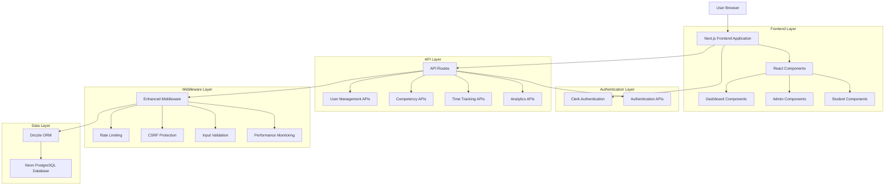
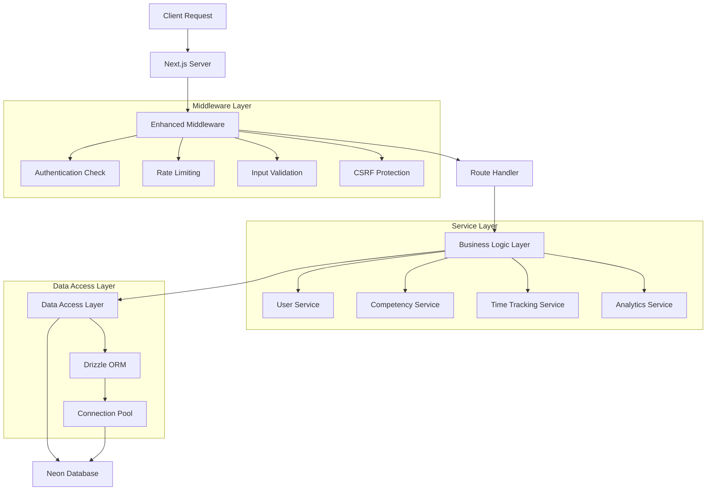
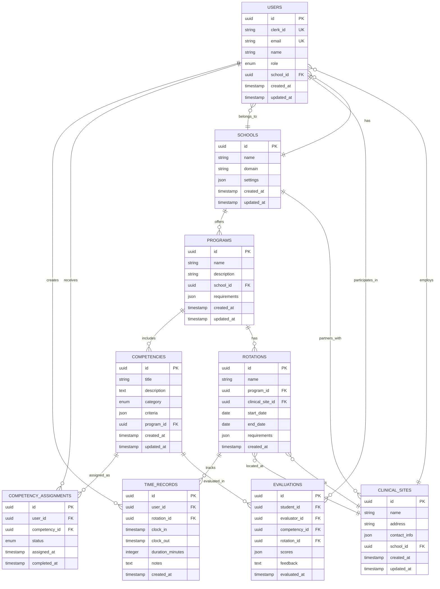

## 1. Architecture Design



## 2. Technology Description

- Frontend: Next.js@14 + React@18 + TypeScript + Tailwind CSS + Shadcn/UI
- Backend: Next.js API Routes + Enhanced Middleware
- Authentication: Clerk Authentication Service
- Database: Neon PostgreSQL + Drizzle ORM
- Deployment: Vercel Platform
- Monitoring: Built-in Performance Monitor + Connection Monitor

## 3. Route Definitions

| Route | Purpose |
|-------|----------|
| / | Landing page with marketing content and authentication |
| /dashboard | Main dashboard with role-based content |
| /dashboard/student | Student-specific dashboard with evaluations and time tracking |
| /dashboard/clinical-supervisor | Clinical supervisor dashboard with competency management |
| /dashboard/school-admin | School administrator dashboard with user and program management |
| /dashboard/admin | System administrator dashboard with full system access |
| /onboarding | Multi-step onboarding flow for new users |
| /auth/sign-in | Clerk-powered sign-in page |
| /auth/sign-up | Clerk-powered sign-up page |
| /privacy | Privacy policy page |
| /terms | Terms of service page |

## 4. API Definitions

### 4.1 Core APIs

**Authentication APIs**
```
GET /api/auth/user
```
Response:
| Param Name | Param Type | Description |
|------------|------------|-------------|
| user | object | Current user information from Clerk |
| role | string | User role (student, clinical_supervisor, school_admin, admin) |
| permissions | array | User permissions based on role |

**User Management APIs**
```
GET /api/users
POST /api/users
PUT /api/users/[id]
DELETE /api/users/[id]
```

Request (POST/PUT):
| Param Name | Param Type | isRequired | Description |
|------------|------------|------------|-------------|
| email | string | true | User email address |
| name | string | true | User full name |
| role | string | true | User role |
| schoolId | string | false | Associated school ID |

Response:
| Param Name | Param Type | Description |
|------------|------------|-------------|
| id | string | User unique identifier |
| email | string | User email address |
| name | string | User full name |
| role | string | User role |
| createdAt | string | User creation timestamp |

**Competency Management APIs**
```
GET /api/competencies
POST /api/competencies
PUT /api/competencies/[id]
DELETE /api/competencies/[id]
```

**Time Tracking APIs**
```
GET /api/time-records
POST /api/time-records
PUT /api/time-records/[id]
POST /api/clock/in
POST /api/clock/out
GET /api/clock/status
```

**Analytics APIs**
```
GET /api/analytics/dashboard
GET /api/analytics/performance
GET /api/analytics/usage
```

### 4.2 Health Check APIs

```
GET /api/health
```
Response:
| Param Name | Param Type | Description |
|------------|------------|-------------|
| status | string | Overall system health status |
| database | object | Database connection status |
| timestamp | string | Health check timestamp |
| version | string | Application version |

## 5. Server Architecture Diagram



## 6. Data Model

### 6.1 Data Model Definition



### 6.2 Data Definition Language

**Users Table**
```sql
-- Create users table
CREATE TABLE users (
    id UUID PRIMARY KEY DEFAULT gen_random_uuid(),
    clerk_id VARCHAR(255) UNIQUE NOT NULL,
    email VARCHAR(255) UNIQUE NOT NULL,
    name VARCHAR(255) NOT NULL,
    role VARCHAR(50) NOT NULL CHECK (role IN ('student', 'clinical_supervisor', 'school_admin', 'admin')),
    school_id UUID REFERENCES schools(id),
    created_at TIMESTAMP WITH TIME ZONE DEFAULT NOW(),
    updated_at TIMESTAMP WITH TIME ZONE DEFAULT NOW()
);

-- Create indexes
CREATE INDEX idx_users_clerk_id ON users(clerk_id);
CREATE INDEX idx_users_email ON users(email);
CREATE INDEX idx_users_role ON users(role);
CREATE INDEX idx_users_school_id ON users(school_id);

-- Row Level Security
ALTER TABLE users ENABLE ROW LEVEL SECURITY;

-- Policies
CREATE POLICY "Users can view own data" ON users
    FOR SELECT USING (clerk_id = auth.jwt() ->> 'sub');

CREATE POLICY "Admins can view all users" ON users
    FOR SELECT USING (EXISTS (
        SELECT 1 FROM users u 
        WHERE u.clerk_id = auth.jwt() ->> 'sub' 
        AND u.role = 'admin'
    ));
```

**Schools Table**
```sql
-- Create schools table
CREATE TABLE schools (
    id UUID PRIMARY KEY DEFAULT gen_random_uuid(),
    name VARCHAR(255) NOT NULL,
    domain VARCHAR(255) UNIQUE,
    settings JSONB DEFAULT '{}',
    created_at TIMESTAMP WITH TIME ZONE DEFAULT NOW(),
    updated_at TIMESTAMP WITH TIME ZONE DEFAULT NOW()
);

-- Create indexes
CREATE INDEX idx_schools_domain ON schools(domain);
CREATE INDEX idx_schools_name ON schools(name);

-- Row Level Security
ALTER TABLE schools ENABLE ROW LEVEL SECURITY;

-- Grant permissions
GRANT SELECT ON schools TO anon;
GRANT ALL PRIVILEGES ON schools TO authenticated;
```

**Time Records Table**
```sql
-- Create time_records table
CREATE TABLE time_records (
    id UUID PRIMARY KEY DEFAULT gen_random_uuid(),
    user_id UUID NOT NULL REFERENCES users(id) ON DELETE CASCADE,
    rotation_id UUID REFERENCES rotations(id),
    clock_in TIMESTAMP WITH TIME ZONE NOT NULL,
    clock_out TIMESTAMP WITH TIME ZONE,
    duration_minutes INTEGER,
    notes TEXT,
    created_at TIMESTAMP WITH TIME ZONE DEFAULT NOW()
);

-- Create indexes
CREATE INDEX idx_time_records_user_id ON time_records(user_id);
CREATE INDEX idx_time_records_clock_in ON time_records(clock_in DESC);
CREATE INDEX idx_time_records_rotation_id ON time_records(rotation_id);

-- Row Level Security
ALTER TABLE time_records ENABLE ROW LEVEL SECURITY;

-- Policies
CREATE POLICY "Users can view own time records" ON time_records
    FOR SELECT USING (user_id IN (
        SELECT id FROM users WHERE clerk_id = auth.jwt() ->> 'sub'
    ));

CREATE POLICY "Users can insert own time records" ON time_records
    FOR INSERT WITH CHECK (user_id IN (
        SELECT id FROM users WHERE clerk_id = auth.jwt() ->> 'sub'
    ));
```

**Competencies Table**
```sql
-- Create competencies table
CREATE TABLE competencies (
    id UUID PRIMARY KEY DEFAULT gen_random_uuid(),
    title VARCHAR(255) NOT NULL,
    description TEXT,
    category VARCHAR(100),
    criteria JSONB DEFAULT '{}',
    program_id UUID REFERENCES programs(id),
    created_at TIMESTAMP WITH TIME ZONE DEFAULT NOW(),
    updated_at TIMESTAMP WITH TIME ZONE DEFAULT NOW()
);

-- Create indexes
CREATE INDEX idx_competencies_program_id ON competencies(program_id);
CREATE INDEX idx_competencies_category ON competencies(category);
CREATE INDEX idx_competencies_title ON competencies(title);

-- Grant permissions
GRANT SELECT ON competencies TO anon;
GRANT ALL PRIVILEGES ON competencies TO authenticated;
```

**Initial Data**
```sql
-- Insert default school
INSERT INTO schools (name, domain, settings) VALUES 
('Demo Medical School', 'demo.medstint.com', '{"timezone": "UTC", "academic_year": "2024-2025"}');

-- Insert default programs
INSERT INTO programs (name, description, school_id, requirements) VALUES 
('Clinical Rotations', 'Core clinical rotation program', 
 (SELECT id FROM schools WHERE domain = 'demo.medstint.com'),
 '{"total_hours": 2000, "required_rotations": ["Internal Medicine", "Surgery", "Pediatrics"]}');

-- Insert sample competencies
INSERT INTO competencies (title, description, category, program_id, criteria) VALUES 
('Patient Communication', 'Effective communication with patients and families', 'Communication',
 (SELECT id FROM programs WHERE name = 'Clinical Rotations'),
 '{"rubric": ["Novice", "Advanced Beginner", "Competent", "Proficient", "Expert"]}'),
('Clinical Reasoning', 'Diagnostic and treatment decision making', 'Clinical Skills',
 (SELECT id FROM programs WHERE name = 'Clinical Rotations'),
 '{"rubric": ["Novice", "Advanced Beginner", "Competent", "Proficient", "Expert"]}');
```