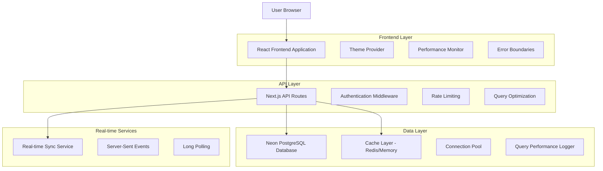

# MedStint Clinical Education Management - Technical Architecture Document
## Real-time Data Integration, UI/UX Enhancement & Performance Optimization

---

## 1. Architecture Design



---

## 2. Technology Description

- **Frontend**: React@18 + Next.js@14 + TypeScript + Tailwind CSS + Framer Motion
- **Backend**: Next.js API Routes + Drizzle ORM
- **Database**: Neon PostgreSQL with connection pooling
- **Caching**: In-memory cache + Redis (production)
- **Real-time**: Server-Sent Events + Long Polling
- **Authentication**: Clerk
- **Monitoring**: Custom performance logger + error tracking

---

## 3. Data Integration Strategy

### 3.1 Database Connection Architecture

**Current State Analysis:**
- Neon PostgreSQL with WebSocket disabled for stability
- Connection pooling implemented with proper lifecycle management
- Row Level Security (RLS) with Clerk authentication integration

**Implementation Plan:**

#### Phase 1: Secure Connection Enhancement
```typescript
// Enhanced connection configuration
export const connectionConfig = {
  pool: {
    min: 2,
    max: 10,
    idleTimeoutMillis: 30000,
    connectionTimeoutMillis: 5000,
  },
  ssl: {
    rejectUnauthorized: true,
    ca: process.env.DATABASE_CA_CERT,
  },
  retry: {
    maxAttempts: 3,
    backoffMultiplier: 2,
    initialDelay: 1000,
  }
}
```

#### Phase 2: Real-time Data Fetching
```typescript
// Real-time data synchronization service
interface RealTimeDataService {
  subscribeToTimeRecords(userId: string): EventSource
  subscribeToRotationUpdates(rotationId: string): EventSource
  invalidateCache(keys: string[]): Promise<void>
}
```

### 3.2 Data Fetching Optimization

**Current Patterns:**
- Drizzle ORM with prepared statements
- Query performance logging implemented
- Basic caching with TTL support

**Enhanced Implementation:**

#### Intelligent Caching Strategy
```typescript
interface CacheStrategy {
  // Multi-level caching
  L1: InMemoryCache    // 1-5 minutes TTL
  L2: RedisCache       // 15-60 minutes TTL
  L3: DatabaseCache    // Materialized views
  
  // Cache invalidation patterns
  invalidationRules: {
    timeRecords: ['user:*', 'rotation:*']
    rotations: ['school:*', 'site:*']
    users: ['profile:*', 'permissions:*']
  }
}
```

#### Optimized Query Patterns
```typescript
// Batch data fetching for dashboard
export async function getDashboardData(userId: string) {
  return await Promise.all([
    getCachedUserProfile(userId),
    getCachedActiveRotation(userId),
    getCachedTimeRecords(userId, { limit: 10 }),
    getCachedStatistics(userId)
  ])
}
```

---

## 4. UI/UX Enhancement Plan

### 4.1 Theme System Architecture

**Current State:**
- Basic dark/light mode with next-themes
- CSS custom properties for theming
- Some components with hardcoded backgrounds

**Enhanced Theme Implementation:**

#### Comprehensive Theme Provider
```typescript
interface ThemeConfig {
  mode: 'light' | 'dark' | 'system'
  colorScheme: 'medical' | 'professional' | 'accessible'
  animations: 'full' | 'reduced' | 'none'
  density: 'compact' | 'comfortable' | 'spacious'
}

// Dynamic theme application
const themeVariables = {
  light: {
    '--background': 'hsl(0 0% 100%)',
    '--foreground': 'hsl(222.2 84% 4.9%)',
    '--medical-primary': 'hsl(221.2 83.2% 53.3%)',
    '--surface-elevated': 'hsl(0 0% 98%)',
  },
  dark: {
    '--background': 'hsl(222.2 84% 4.9%)',
    '--foreground': 'hsl(210 40% 98%)',
    '--medical-primary': 'hsl(217.2 91.2% 59.8%)',
    '--surface-elevated': 'hsl(222.2 84% 8%)',
  }
}
```

### 4.2 Component Theme Compliance

**Components Requiring Theme Updates:**

1. **Clock Widget System**
   - Remove hardcoded `bg-white` classes
   - Implement theme-aware backgrounds
   - Add proper contrast ratios

2. **Dashboard Cards**
   - Dynamic surface colors
   - Theme-aware shadows and borders
   - Consistent spacing and typography

3. **Modal and Dialog Components**
   - Backdrop theming
   - Content area theming
   - Focus management in dark mode

#### Implementation Pattern
```typescript
// Theme-aware component pattern
export function ThemedCard({ children, variant = 'default' }) {
  return (
    <div className={cn(
      'rounded-lg border transition-colors',
      'bg-card text-card-foreground',
      'shadow-sm hover:shadow-md',
      variant === 'elevated' && 'bg-surface-elevated',
      variant === 'medical' && 'border-medical-primary/20'
    )}>
      {children}
    </div>
  )
}
```

### 4.3 Location Display Cleanup

**Current Issues:**
- Redundant location capture displays
- Inconsistent location status indicators
- Multiple location permission requests

**Optimization Plan:**

#### Unified Location Service
```typescript
interface LocationService {
  getCurrentLocation(): Promise<LocationData>
  watchPosition(callback: LocationCallback): WatchId
  getCachedLocation(): LocationData | null
  requestPermission(): Promise<PermissionState>
}

// Single location display component
export function LocationStatus({ 
  showDetails = false,
  variant = 'compact' 
}) {
  // Consolidated location logic
}
```

---

## 5. Performance Optimization Framework

### 5.1 Real-time Data Handling

**Current Performance Bottlenecks:**
- Multiple API calls for dashboard data
- Inefficient re-renders on data updates
- No request deduplication

**Optimization Strategy:**

#### Request Batching and Deduplication
```typescript
class RequestBatcher {
  private pendingRequests = new Map<string, Promise<any>>()
  private batchTimeout: NodeJS.Timeout | null = null
  
  async batchRequest<T>(key: string, fetcher: () => Promise<T>): Promise<T> {
    // Deduplicate identical requests
    if (this.pendingRequests.has(key)) {
      return this.pendingRequests.get(key)!
    }
    
    // Batch multiple requests
    const promise = this.executeBatch(key, fetcher)
    this.pendingRequests.set(key, promise)
    
    return promise
  }
}
```

#### Optimistic Updates Pattern
```typescript
interface OptimisticUpdate<T> {
  optimisticData: T
  rollbackData: T
  mutation: () => Promise<T>
  onSuccess: (data: T) => void
  onError: (error: Error) => void
}

// Usage in clock-in/out operations
export function useOptimisticClockAction() {
  return useMutation({
    mutationFn: clockInAction,
    onMutate: (variables) => {
      // Apply optimistic update
      const optimisticRecord = createOptimisticRecord(variables)
      queryClient.setQueryData(['timeRecords'], optimisticRecord)
      return { optimisticRecord }
    },
    onError: (error, variables, context) => {
      // Rollback on error
      queryClient.setQueryData(['timeRecords'], context?.rollbackData)
    }
  })
}
```

### 5.2 Rendering Optimization

#### Component Memoization Strategy
```typescript
// Memoized dashboard components
export const MemoizedClockWidget = memo(ClockWidget, (prev, next) => {
  return (
    prev.currentTime === next.currentTime &&
    prev.clockStatus === next.clockStatus &&
    prev.location.coordinates === next.location.coordinates
  )
})

// Virtual scrolling for large lists
export function VirtualizedTimeRecords({ records }: { records: TimeRecord[] }) {
  const { virtualItems, totalSize } = useVirtualizer({
    count: records.length,
    getScrollElement: () => parentRef.current,
    estimateSize: () => 80,
    overscan: 5,
  })
  
  return (
    <div ref={parentRef} className="h-400 overflow-auto">
      <div style={{ height: totalSize }}>
        {virtualItems.map((virtualItem) => (
          <TimeRecordItem
            key={virtualItem.key}
            record={records[virtualItem.index]}
            style={{
              position: 'absolute',
              top: 0,
              left: 0,
              width: '100%',
              transform: `translateY(${virtualItem.start}px)`,
            }}
          />
        ))}
      </div>
    </div>
  )
}
```

### 5.3 Caching Architecture

#### Multi-Level Caching Implementation
```typescript
interface CacheLevel {
  name: string
  ttl: number
  maxSize: number
  evictionPolicy: 'LRU' | 'LFU' | 'TTL'
}

const cacheHierarchy: CacheLevel[] = [
  { name: 'memory', ttl: 60000, maxSize: 100, evictionPolicy: 'LRU' },
  { name: 'sessionStorage', ttl: 300000, maxSize: 50, evictionPolicy: 'TTL' },
  { name: 'indexedDB', ttl: 3600000, maxSize: 1000, evictionPolicy: 'LFU' }
]

// Smart cache selection
export class SmartCache {
  async get<T>(key: string): Promise<T | null> {
    for (const level of cacheHierarchy) {
      const data = await this.getFromLevel<T>(key, level)
      if (data) {
        // Promote to higher cache levels
        await this.promoteToHigherLevels(key, data, level)
        return data
      }
    }
    return null
  }
}
```

---

## 6. Code Quality Framework

### 6.1 Error Handling Standards

#### Comprehensive Error Boundary System
```typescript
interface ErrorBoundaryConfig {
  fallbackComponent: ComponentType<ErrorFallbackProps>
  onError: (error: Error, errorInfo: ErrorInfo) => void
  enableRetry: boolean
  maxRetries: number
  retryDelay: number
}

// Hierarchical error boundaries
export function AppErrorBoundary({ children }: { children: ReactNode }) {
  return (
    <ErrorBoundary
      FallbackComponent={GlobalErrorFallback}
      onError={logErrorToService}
    >
      <DashboardErrorBoundary>
        <ComponentErrorBoundary>
          {children}
        </ComponentErrorBoundary>
      </DashboardErrorBoundary>
    </ErrorBoundary>
  )
}
```

#### Standardized Error Types
```typescript
export class MedStintError extends Error {
  constructor(
    message: string,
    public code: string,
    public severity: 'low' | 'medium' | 'high' | 'critical',
    public context?: Record<string, any>
  ) {
    super(message)
    this.name = 'MedStintError'
  }
}

// Specific error types
export class DatabaseError extends MedStintError {
  constructor(message: string, query?: string) {
    super(message, 'DB_ERROR', 'high', { query })
  }
}

export class ValidationError extends MedStintError {
  constructor(field: string, value: any) {
    super(`Invalid ${field}: ${value}`, 'VALIDATION_ERROR', 'medium', { field, value })
  }
}
```

### 6.2 Data Validation Protocols

#### Comprehensive Validation Schema
```typescript
import { z } from 'zod'

// Base schemas
export const TimeRecordSchema = z.object({
  id: z.string().uuid(),
  userId: z.string(),
  rotationId: z.string().uuid(),
  clockIn: z.date(),
  clockOut: z.date().optional(),
  location: z.object({
    latitude: z.number().min(-90).max(90),
    longitude: z.number().min(-180).max(180),
    accuracy: z.number().positive(),
  }).optional(),
  notes: z.string().max(1000).optional(),
})

// API validation middleware
export function validateRequest<T>(schema: z.ZodSchema<T>) {
  return (req: NextRequest, res: NextResponse, next: NextFunction) => {
    try {
      const validatedData = schema.parse(req.body)
      req.validatedData = validatedData
      next()
    } catch (error) {
      if (error instanceof z.ZodError) {
        return NextResponse.json(
          { error: 'Validation failed', details: error.errors },
          { status: 400 }
        )
      }
      throw error
    }
  }
}
```

### 6.3 Coding Standards Enforcement

#### TypeScript Configuration
```json
{
  "compilerOptions": {
    "strict": true,
    "noUncheckedIndexedAccess": true,
    "exactOptionalPropertyTypes": true,
    "noImplicitReturns": true,
    "noFallthroughCasesInSwitch": true,
    "noImplicitOverride": true
  },
  "include": ["src/**/*"],
  "exclude": ["node_modules", ".next"]
}
```

#### ESLint Rules
```javascript
module.exports = {
  extends: [
    'next/core-web-vitals',
    '@typescript-eslint/recommended',
    'plugin:react-hooks/recommended'
  ],
  rules: {
    '@typescript-eslint/no-unused-vars': 'error',
    '@typescript-eslint/explicit-function-return-type': 'warn',
    'react-hooks/exhaustive-deps': 'error',
    'prefer-const': 'error',
    'no-var': 'error'
  }
}
```

---

## 7. Implementation Phases

### Phase 1: Foundation (Week 1-2)
1. **Database Connection Enhancement**
   - Implement secure connection pooling
   - Add comprehensive error handling
   - Set up performance monitoring

2. **Theme System Overhaul**
   - Create comprehensive theme provider
   - Update all components for theme compliance
   - Implement theme persistence

### Phase 2: Performance Optimization (Week 3-4)
1. **Caching Implementation**
   - Multi-level caching system
   - Request deduplication
   - Cache invalidation strategies

2. **Real-time Data Integration**
   - Server-Sent Events implementation
   - Optimistic updates
   - Efficient re-rendering

### Phase 3: UI/UX Enhancement (Week 5-6)
1. **Component Optimization**
   - Location display cleanup
   - Clock system enhancement
   - Responsive design improvements

2. **Performance Monitoring**
   - Real-time performance metrics
   - User experience tracking
   - Error monitoring dashboard

### Phase 4: Code Quality & Testing (Week 7-8)
1. **Refactoring & Standards**
   - Code quality improvements
   - Comprehensive testing suite
   - Documentation updates

2. **Production Optimization**
   - Bundle size optimization
   - CDN integration
   - Performance tuning

---

## 8. Success Metrics

### Performance Metrics
- **Page Load Time**: < 2 seconds (target: < 1.5s)
- **Time to Interactive**: < 3 seconds (target: < 2s)
- **Database Query Time**: < 100ms average (target: < 50ms)
- **Cache Hit Rate**: > 80% (target: > 90%)

### User Experience Metrics
- **Theme Switch Time**: < 200ms
- **Real-time Update Latency**: < 500ms
- **Error Rate**: < 0.1% (target: < 0.05%)
- **Accessibility Score**: > 95%

### Code Quality Metrics
- **TypeScript Coverage**: 100%
- **Test Coverage**: > 90%
- **ESLint Violations**: 0
- **Bundle Size**: < 500KB (target: < 400KB)

---

## 9. Risk Mitigation

### Technical Risks
1. **Database Connection Limits**
   - Mitigation: Connection pooling + monitoring
   - Fallback: Graceful degradation

2. **Real-time Performance**
   - Mitigation: Efficient caching + batching
   - Fallback: Polling with exponential backoff

3. **Theme Compatibility**
   - Mitigation: Comprehensive testing
   - Fallback: System theme detection

### Operational Risks
1. **Migration Complexity**
   - Mitigation: Phased rollout + feature flags
   - Fallback: Quick rollback procedures

2. **Performance Regression**
   - Mitigation: Continuous monitoring
   - Fallback: Performance budgets + alerts

---

This technical architecture document provides a comprehensive roadmap for implementing real-time data integration, UI/UX improvements, performance optimization, and code quality enhancements for the MedStint Clinical Education Management application.