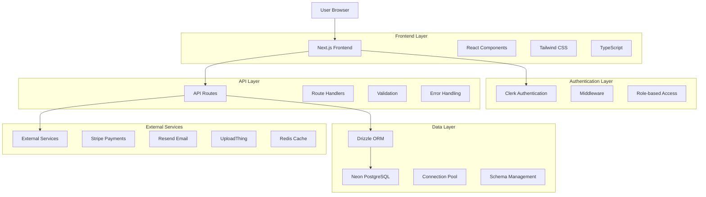
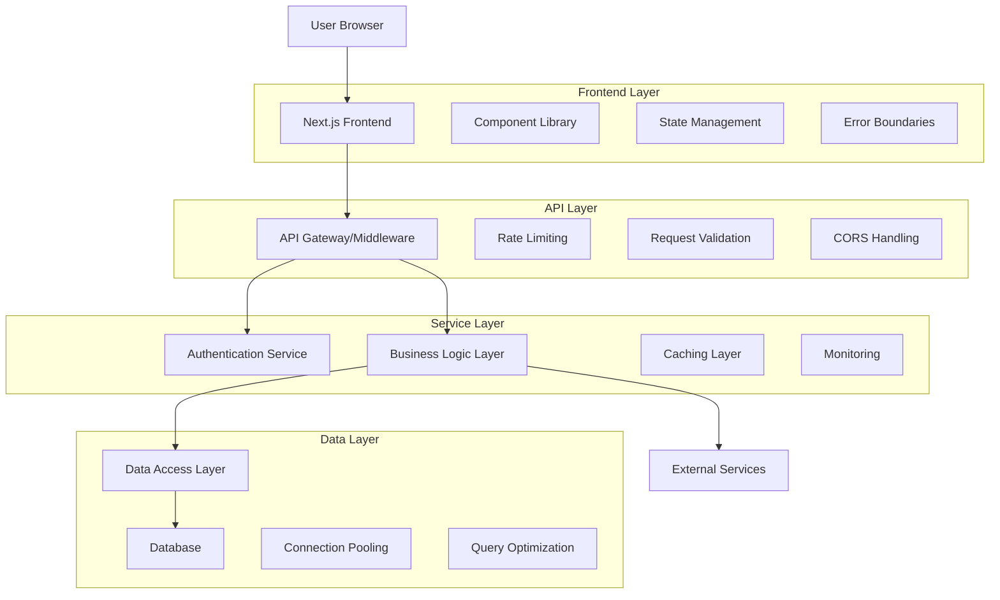
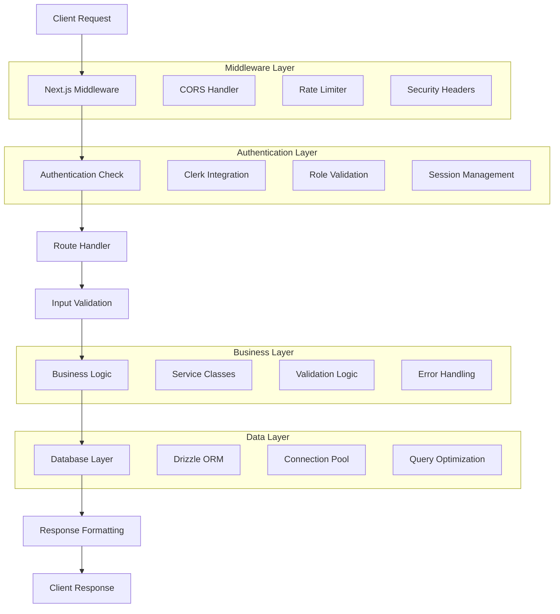
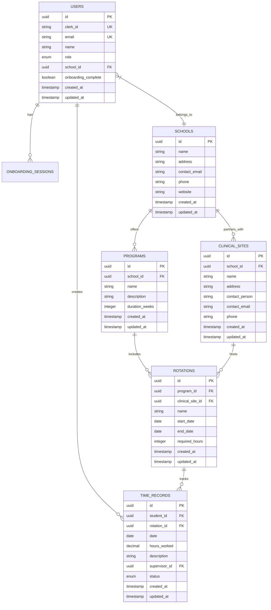

# MedStint Technical Architecture Analysis

## 1. Architecture Design

### Current Architecture


### Recommended Architecture


## 2. Technology Description

### Current Stack
- **Frontend:** Next.js 14 + React 18 + TypeScript + Tailwind CSS
- **Authentication:** Clerk
- **Database:** Neon PostgreSQL + Drizzle ORM
- **Styling:** Tailwind CSS + Radix UI
- **Payments:** Stripe
- **Email:** Resend
- **File Upload:** UploadThing
- **Caching:** Redis (Upstash)
- **Deployment:** Vercel (assumed)

### Recommended Additions
- **Monitoring:** Sentry for error tracking
- **Testing:** Jest + React Testing Library + Playwright
- **Documentation:** Storybook for components
- **API Documentation:** OpenAPI/Swagger
- **Performance:** Next.js Image optimization
- **Security:** Helmet.js for security headers

## 3. Route Definitions

### Frontend Routes
| Route | Purpose | Authentication | Role Required |
|-------|---------|----------------|---------------|
| `/` | Landing page | No | None |
| `/sign-in` | User authentication | No | None |
| `/sign-up` | User registration | No | None |
| `/dashboard` | Main dashboard | Yes | Any |
| `/dashboard/admin/*` | Admin panel | Yes | Admin |
| `/dashboard/school-admin/*` | School administration | Yes | School Admin |
| `/dashboard/student/*` | Student portal | Yes | Student |
| `/onboarding` | User onboarding | Yes | Any |
| `/profile` | User profile management | Yes | Any |

### API Route Structure
| Route Pattern | Purpose | Methods | Authentication |
|---------------|---------|---------|----------------|
| `/api/health` | System health check | GET | Admin only |
| `/api/auth/*` | Authentication endpoints | GET, POST | Varies |
| `/api/user/*` | User management | GET, POST, PUT, DELETE | Yes |
| `/api/admin/*` | Admin operations | GET, POST, PUT, DELETE | Admin only |
| `/api/schools/*` | School management | GET, POST, PUT, DELETE | School Admin+ |
| `/api/students/*` | Student operations | GET, POST, PUT, DELETE | Varies |
| `/api/rotations/*` | Rotation management | GET, POST, PUT, DELETE | School Admin+ |
| `/api/time-records/*` | Time tracking | GET, POST, PUT, DELETE | Student+ |
| `/api/billing/*` | Payment processing | GET, POST | Yes |
| `/api/webhooks/*` | External service webhooks | POST | Service-specific |

## 4. API Definitions

### 4.1 Core API Endpoints

#### Authentication
```typescript
// GET /api/auth/me
interface AuthMeResponse {
  user: {
    id: string;
    email: string;
    name: string;
    role: 'student' | 'school_admin' | 'admin';
    onboardingComplete: boolean;
  };
}

// POST /api/auth/onboard
interface OnboardRequest {
  role: 'student' | 'school_admin';
  schoolId?: string;
  additionalInfo?: Record<string, any>;
}
```

#### User Management
```typescript
// PUT /api/user/update
interface UserUpdateRequest {
  name?: string;
  email?: string;
  profile?: {
    phone?: string;
    address?: string;
    emergencyContact?: string;
  };
}

interface UserUpdateResponse {
  success: boolean;
  user: User;
  message?: string;
}
```

#### School Management
```typescript
// POST /api/schools
interface CreateSchoolRequest {
  name: string;
  address: string;
  contactEmail: string;
  phone?: string;
  website?: string;
}

// GET /api/schools/{id}/students
interface SchoolStudentsResponse {
  students: Array<{
    id: string;
    name: string;
    email: string;
    program: string;
    status: 'active' | 'inactive' | 'graduated';
  }>;
  pagination: {
    page: number;
    limit: number;
    total: number;
  };
}
```

#### Time Records
```typescript
// POST /api/time-records
interface TimeRecordRequest {
  studentId: string;
  rotationId: string;
  date: string;
  hoursWorked: number;
  description?: string;
  supervisorId?: string;
}

// GET /api/time-records/summary
interface TimeRecordSummaryResponse {
  totalHours: number;
  weeklyHours: number;
  monthlyHours: number;
  rotationHours: Record<string, number>;
}
```

### 4.2 Error Response Format
```typescript
interface APIError {
  error: {
    code: string;
    message: string;
    details?: Record<string, any>;
    timestamp: string;
    requestId: string;
  };
}
```

## 5. Server Architecture Diagram



## 6. Data Model

### 6.1 Core Entities


### 6.2 Data Definition Language

#### Users Table
```sql
-- Create users table
CREATE TABLE users (
    id UUID PRIMARY KEY DEFAULT gen_random_uuid(),
    clerk_id VARCHAR(255) UNIQUE NOT NULL,
    email VARCHAR(255) UNIQUE NOT NULL,
    name VARCHAR(255) NOT NULL,
    role VARCHAR(50) NOT NULL CHECK (role IN ('student', 'school_admin', 'admin')),
    school_id UUID REFERENCES schools(id),
    onboarding_complete BOOLEAN DEFAULT FALSE,
    profile JSONB DEFAULT '{}',
    created_at TIMESTAMP WITH TIME ZONE DEFAULT NOW(),
    updated_at TIMESTAMP WITH TIME ZONE DEFAULT NOW()
);

-- Create indexes
CREATE INDEX idx_users_clerk_id ON users(clerk_id);
CREATE INDEX idx_users_email ON users(email);
CREATE INDEX idx_users_school_id ON users(school_id);
CREATE INDEX idx_users_role ON users(role);
```

#### Schools Table
```sql
-- Create schools table
CREATE TABLE schools (
    id UUID PRIMARY KEY DEFAULT gen_random_uuid(),
    name VARCHAR(255) NOT NULL,
    address TEXT NOT NULL,
    contact_email VARCHAR(255) NOT NULL,
    phone VARCHAR(50),
    website VARCHAR(255),
    settings JSONB DEFAULT '{}',
    created_at TIMESTAMP WITH TIME ZONE DEFAULT NOW(),
    updated_at TIMESTAMP WITH TIME ZONE DEFAULT NOW()
);

-- Create indexes
CREATE INDEX idx_schools_name ON schools(name);
CREATE INDEX idx_schools_contact_email ON schools(contact_email);
```

#### Time Records Table
```sql
-- Create time_records table
CREATE TABLE time_records (
    id UUID PRIMARY KEY DEFAULT gen_random_uuid(),
    student_id UUID NOT NULL REFERENCES users(id),
    rotation_id UUID NOT NULL REFERENCES rotations(id),
    date DATE NOT NULL,
    hours_worked DECIMAL(4,2) NOT NULL CHECK (hours_worked >= 0 AND hours_worked <= 24),
    description TEXT,
    supervisor_id UUID REFERENCES users(id),
    status VARCHAR(50) DEFAULT 'pending' CHECK (status IN ('pending', 'approved', 'rejected')),
    metadata JSONB DEFAULT '{}',
    created_at TIMESTAMP WITH TIME ZONE DEFAULT NOW(),
    updated_at TIMESTAMP WITH TIME ZONE DEFAULT NOW(),
    
    -- Ensure no duplicate records for same student/rotation/date
    UNIQUE(student_id, rotation_id, date)
);

-- Create indexes for performance
CREATE INDEX idx_time_records_student_id ON time_records(student_id);
CREATE INDEX idx_time_records_rotation_id ON time_records(rotation_id);
CREATE INDEX idx_time_records_date ON time_records(date);
CREATE INDEX idx_time_records_status ON time_records(status);
CREATE INDEX idx_time_records_student_date ON time_records(student_id, date);
```

#### Row Level Security (RLS)
```sql
-- Enable RLS on sensitive tables
ALTER TABLE users ENABLE ROW LEVEL SECURITY;
ALTER TABLE time_records ENABLE ROW LEVEL SECURITY;
ALTER TABLE schools ENABLE ROW LEVEL SECURITY;

-- Users can only see their own data
CREATE POLICY "Users can view own data" ON users
    FOR SELECT USING (clerk_id = auth.jwt() ->> 'sub');

-- Students can only see their own time records
CREATE POLICY "Students can view own time records" ON time_records
    FOR SELECT USING (
        student_id IN (
            SELECT id FROM users WHERE clerk_id = auth.jwt() ->> 'sub'
        )
    );

-- School admins can see their school's data
CREATE POLICY "School admins can view school data" ON users
    FOR SELECT USING (
        school_id IN (
            SELECT school_id FROM users 
            WHERE clerk_id = auth.jwt() ->> 'sub' 
            AND role = 'school_admin'
        )
    );
```

## 7. Performance Optimization Recommendations

### Database Optimizations
1. **Connection Pooling:** Implement proper connection pool sizing
2. **Query Optimization:** Add missing indexes and optimize N+1 queries
3. **Caching Strategy:** Implement Redis caching for frequently accessed data
4. **Database Monitoring:** Add query performance monitoring

### Frontend Optimizations
1. **Code Splitting:** Implement route-based code splitting
2. **Image Optimization:** Use Next.js Image component
3. **Bundle Analysis:** Regular bundle size monitoring
4. **Service Worker:** Implement caching strategies

### API Optimizations
1. **Response Caching:** Implement appropriate cache headers
2. **Compression:** Enable gzip/brotli compression
3. **Rate Limiting:** Implement per-endpoint rate limiting
4. **Pagination:** Implement cursor-based pagination for large datasets

This technical architecture analysis provides a comprehensive view of the current system and recommendations for improvement to achieve production-ready standards.