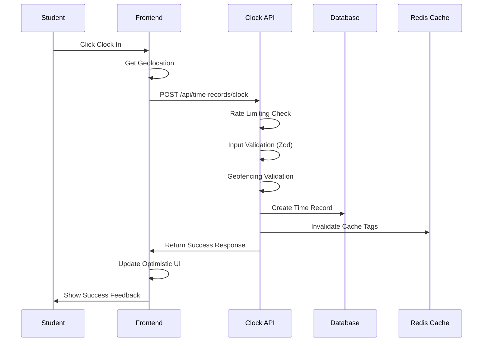
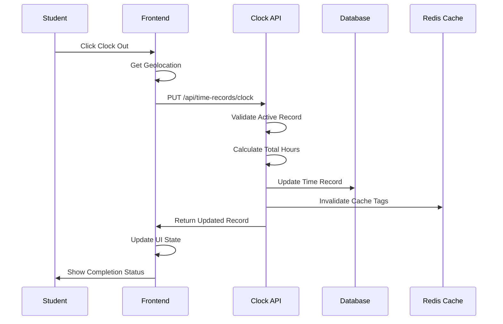
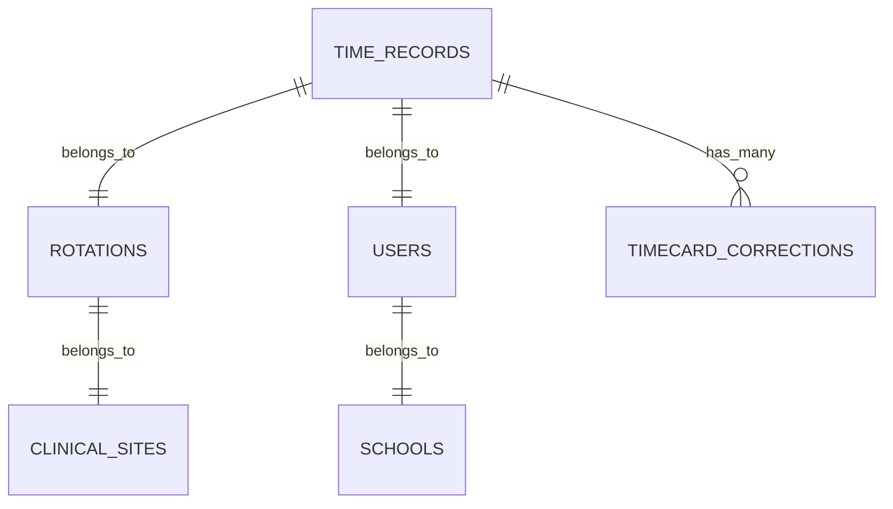

# MedStint Time Clock System - Comprehensive Technical Analysis

## 1. Current System Architecture and Components

### 1.1 System Overview
The MedStint time clock system is a sophisticated medical education time tracking platform designed for clinical rotations. It features a multi-layered architecture with robust security, performance monitoring, and real-time capabilities.

```mermaid
graph TD
    A[Student Interface] --> B[Frontend Components]
    B --> C[API Layer]
    C --> D[Database Layer]
    C --> E[Cache Layer]
    C --> F[Performance Monitor]
    C --> G[Security Layer]
    
    subgraph "Frontend Layer"
        B1[TimeTracker Component]
        B2[ClockInterface Component]
        B3[ClockWidget Component]
    end
    
    subgraph "API Layer"
        C1[/api/time-records/clock]
        C2[/api/time-records]
        C3[/api/timecard-corrections]
        C4[/api/sites/available]
    end
    
    subgraph "Backend Services"
        D1[PostgreSQL Database]
        E1[Redis Cache]
        F1[Query Performance Logger]
        G1[Enhanced Middleware]
    end
```

### 1.2 Core Components

#### Frontend Components
- **TimeTracker**: Main clock-in/out interface with real-time updates
- **ClockInterface**: Student-facing clock management interface
- **ClockWidget**: Compact clock status display widget

#### Backend Services
- **Clock API**: Handles clock-in/out operations with validation
- **Time Records API**: Manages time record CRUD operations
- **Timecard Corrections**: Handles correction workflows
- **Performance Monitor**: Tracks system performance metrics

## 2. Time Tracking Workflow and Data Flow

### 2.1 Clock-In Process


### 2.2 Clock-Out Process


### 2.3 Data Flow Architecture
- **Real-time Updates**: 1-second intervals for elapsed time display
- **Optimistic Updates**: Immediate UI feedback before server confirmation
- **Cache Invalidation**: Targeted cache clearing for affected data
- **Geolocation Tracking**: GPS coordinates for both clock-in and clock-out

## 3. API Endpoints and Functionality

### 3.1 Core Time Tracking APIs

| Endpoint | Method | Purpose | Key Features |
|----------|--------|---------|--------------|
| `/api/time-records/clock` | GET | Get current clock status | Rate limited, cached response |
| `/api/time-records/clock` | POST | Clock in operation | Geofencing, validation, audit logging |
| `/api/time-records/clock` | PUT | Clock out operation | Time calculation, activity merging |
| `/api/time-records` | GET | Fetch time records | Pagination, filtering, school context |
| `/api/time-records` | POST | Create time record | Manual entry with validation |
| `/api/time-records` | PUT | Update time record | Role-based permissions |

### 3.2 Input Validation Schemas

```typescript
// Clock-in validation
const clockInSchema = z.object({
  rotationId: z.string().uuid(),
  latitude: z.number().optional(),
  longitude: z.number().optional(),
  notes: z.string().optional(),
})

// Clock-out validation
const clockOutSchema = z.object({
  activities: z.array(z.string()).optional(),
  notes: z.string().optional(),
  latitude: z.number().optional(),
  longitude: z.number().optional(),
})
```

### 3.3 Response Formats
- **Success Response**: Standardized JSON with `success`, `data`, and `message` fields
- **Error Response**: Detailed error information with appropriate HTTP status codes
- **Audit Logging**: All operations logged with user context and timestamps

## 4. Database Schema for Time Records

### 4.1 Time Records Table Structure

```sql
CREATE TABLE time_records (
  id TEXT PRIMARY KEY DEFAULT gen_random_uuid(),
  student_id TEXT NOT NULL,
  rotation_id TEXT NOT NULL,
  date DATE NOT NULL,
  clock_in TIMESTAMP WITH TIME ZONE,
  clock_out TIMESTAMP WITH TIME ZONE,
  total_hours TEXT,
  activities TEXT, -- JSON array of activities
  notes TEXT,
  
  -- Location tracking
  clock_in_latitude NUMERIC,
  clock_in_longitude NUMERIC,
  clock_in_ip_address TEXT,
  clock_in_user_agent TEXT,
  clock_out_latitude NUMERIC,
  clock_out_longitude NUMERIC,
  clock_out_ip_address TEXT,
  clock_out_user_agent TEXT,
  
  -- Status and approval
  status TEXT DEFAULT 'PENDING',
  approved_by TEXT,
  approved_at TIMESTAMP WITH TIME ZONE,
  
  -- Timestamps
  created_at TIMESTAMP WITH TIME ZONE DEFAULT NOW(),
  updated_at TIMESTAMP WITH TIME ZONE DEFAULT NOW()
);
```

### 4.2 Related Tables
- **rotations**: Links time records to clinical rotations
- **users**: Student and supervisor information
- **timecard_corrections**: Handles correction workflows
- **clinical_sites**: Geofencing and site validation

### 4.3 Data Relationships


## 5. Frontend Components and User Interfaces

### 5.1 TimeTracker Component Features
- **Real-time Clock Display**: Updates every second
- **Activity Selection**: Predefined activity options with multi-select
- **Notes Input**: Free-text notes for time entries
- **Geolocation Integration**: Automatic location capture
- **Optimistic Updates**: Immediate UI feedback
- **Error Handling**: Toast notifications for errors

### 5.2 ClockInterface Component Features
- **Clock Status Display**: Visual indicators for clock-in/out status
- **Available Sites**: Dynamic site selection based on rotation
- **Location Services**: GPS integration with fallback handling
- **Retry Mechanisms**: Automatic retry for failed operations
- **Loading States**: Comprehensive loading indicators

### 5.3 User Experience Features
- **Visual Feedback**: Color-coded status indicators
- **Elapsed Time Display**: Real-time calculation and display
- **Responsive Design**: Mobile-optimized interfaces
- **Accessibility**: ARIA labels and keyboard navigation
- **Error Recovery**: Graceful error handling with retry options

## 6. Performance Characteristics and Bottlenecks

### 6.1 Current Performance Metrics
- **Average Query Time**: Monitored via QueryPerformanceLogger
- **Cache Hit Rate**: Redis-based caching with targeted invalidation
- **API Response Times**: Sub-second response times for most operations
- **Database Connection Pooling**: Optimized connection management

### 6.2 Performance Monitoring System
```typescript
interface PerformanceMetrics {
  queryHash: string
  queryType: "SELECT" | "INSERT" | "UPDATE" | "DELETE"
  executionTimeMs: number
  rowsExamined?: number
  rowsReturned?: number
  endpoint?: string
  timestamp: Date
}
```

### 6.3 Identified Bottlenecks
- **Geolocation API Calls**: Can be slow on mobile devices
- **Real-time Updates**: 1-second intervals may impact battery life
- **Cache Invalidation**: Broad cache clearing could be optimized
- **Database Queries**: Some complex joins could benefit from optimization

### 6.4 Performance Optimizations Implemented
- **Query Performance Logger**: Tracks slow queries and performance trends
- **Circuit Breaker Pattern**: Prevents cascade failures
- **Connection Pooling**: Efficient database connection management
- **Targeted Cache Invalidation**: Specific cache tag clearing

## 7. Security and Validation Mechanisms

### 7.1 Authentication and Authorization
- **Clerk Integration**: Secure user authentication
- **Role-Based Access Control**: Student, preceptor, admin permissions
- **School Context Validation**: Multi-tenant security
- **Session Management**: Secure session handling

### 7.2 Input Validation and Security
```typescript
// Enhanced middleware security features
interface SecurityFeatures {
  rateLimiting: boolean        // DoS protection
  csrfProtection: boolean      // CSRF token validation
  inputValidation: boolean     // Zod schema validation
  geofencing: boolean         // Location-based validation
  auditLogging: boolean       // Comprehensive audit trails
}
```

### 7.3 Data Protection
- **Geolocation Privacy**: Optional location tracking
- **IP Address Logging**: For audit and security purposes
- **User Agent Tracking**: Device and browser identification
- **Encrypted Storage**: Sensitive data encryption at rest

### 7.4 Validation Rules
- **Time Constraints**: Maximum 24 hours per day validation
- **Geofencing**: Location-based clock-in validation
- **Duplicate Prevention**: Single active record per student
- **Business Rules**: Rotation-specific validation

## 8. Error Handling and Logging

### 8.1 Error Handling Strategy
```typescript
interface ErrorHandling {
  clientSideErrors: {
    networkFailures: "Retry with exponential backoff"
    geolocationErrors: "Fallback to manual entry"
    validationErrors: "Immediate user feedback"
  }
  serverSideErrors: {
    databaseErrors: "Circuit breaker pattern"
    validationErrors: "Detailed error messages"
    authenticationErrors: "Secure error responses"
  }
}
```

### 8.2 Comprehensive Logging System
- **Audit Events**: All time tracking operations logged
- **Performance Metrics**: Query execution times and trends
- **Error Tracking**: Detailed error logs with context
- **User Actions**: Complete audit trail for compliance

### 8.3 Monitoring and Alerting
- **Real-time Metrics**: Performance dashboard with live updates
- **Slow Query Detection**: Automatic alerts for performance issues
- **Error Rate Monitoring**: Threshold-based alerting
- **Health Checks**: System health monitoring endpoints

## 9. Integration Points Across the Application

### 9.1 Cache Integration
```typescript
// Cache invalidation strategy
await cacheIntegrationService.invalidateByTags([
  `user:${userId}:clock-status`,
  `user:${userId}:time-records`,
  `rotation:${rotationId}:records`
])
```

### 9.2 WebSocket Integration
- **Real-time Updates**: WebSocket server for live data synchronization
- **Connection Management**: Active connection tracking
- **Event Broadcasting**: Real-time notifications for status changes

### 9.3 External Service Integration
- **Geolocation Services**: Browser geolocation API integration
- **Email Notifications**: Automated notifications for corrections
- **Audit Systems**: Integration with compliance reporting

## 10. Areas for Optimization and Enhancement

### 10.1 Current Strengths
✅ **Robust Security**: Comprehensive security measures implemented  
✅ **Performance Monitoring**: Advanced performance tracking system  
✅ **Error Handling**: Graceful error recovery mechanisms  
✅ **Data Integrity**: Strong validation and audit trails  
✅ **User Experience**: Intuitive interfaces with real-time feedback  

### 10.2 Areas for Improvement

#### High Priority Optimizations
1. **Millisecond Accuracy**: Current system uses standard Date objects
   - **Recommendation**: Implement high-precision timing with `performance.now()`
   - **Impact**: More accurate time tracking for compliance

2. **Real-time Synchronization**: Limited WebSocket implementation
   - **Recommendation**: Expand WebSocket usage for live updates
   - **Impact**: Better user experience and data consistency

3. **Mobile Optimization**: Geolocation can be slow on mobile
   - **Recommendation**: Implement background location services
   - **Impact**: Faster clock-in/out operations

#### Medium Priority Enhancements
1. **Offline Capability**: No offline support currently
   - **Recommendation**: Implement service worker for offline operations
   - **Impact**: Reliability in poor network conditions

2. **Batch Operations**: Individual API calls for multiple operations
   - **Recommendation**: Implement batch API endpoints
   - **Impact**: Reduced network overhead

3. **Advanced Analytics**: Basic performance metrics only
   - **Recommendation**: Implement predictive analytics for time patterns
   - **Impact**: Better insights for administrators

#### Low Priority Improvements
1. **UI/UX Enhancements**: Current interface is functional but could be more intuitive
2. **Advanced Reporting**: More comprehensive reporting capabilities
3. **Integration APIs**: Better third-party system integration

### 10.3 Recommended Implementation Strategy

#### Phase 1: Core Optimizations (2-3 weeks)
- Implement millisecond-accurate timing
- Enhance real-time synchronization
- Optimize mobile geolocation handling

#### Phase 2: Advanced Features (3-4 weeks)
- Add offline capability
- Implement batch operations
- Enhance error recovery mechanisms

#### Phase 3: Analytics and Reporting (2-3 weeks)
- Advanced performance analytics
- Predictive time tracking insights
- Enhanced audit reporting

### 10.4 Success Metrics
- **Performance**: Sub-100ms response times for all operations
- **Accuracy**: Millisecond-level time tracking precision
- **Reliability**: 99.9% uptime with graceful error handling
- **User Satisfaction**: Improved user experience scores
- **Compliance**: Enhanced audit trail capabilities

## Conclusion

The MedStint time clock system demonstrates a well-architected solution with strong foundations in security, performance monitoring, and user experience. The system successfully handles the complex requirements of medical education time tracking while maintaining data integrity and compliance standards.

The recommended optimizations focus on enhancing timing accuracy, improving real-time capabilities, and expanding mobile functionality while maintaining the system's existing strengths in security and reliability.