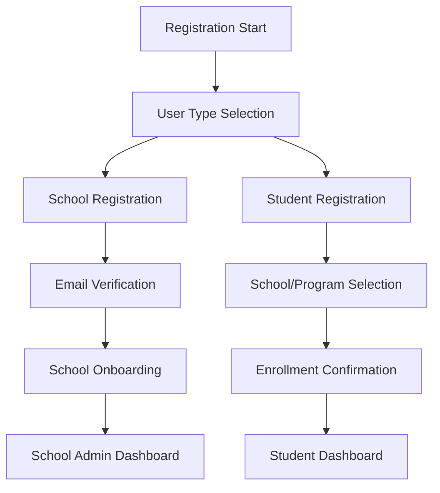

# User Onboarding Flow Requirements

## 1. Product Overview
Implement a comprehensive user onboarding system that identifies user types (school vs student) during registration and provides appropriate setup flows for each user type.
- Schools receive guided setup to create admin accounts, configure programs, and manage clinical students
- Students get streamlined enrollment process with school/program selection
- The system ensures proper role assignment and organizational structure from the first login

## 2. Core Features

### 2.1 User Roles
| Role | Registration Method | Core Permissions |
|------|---------------------|------------------|
| School Admin | School registration flow with verification | Can manage school settings, programs, students, and clinical sites |
| Student | Student registration flow with school selection | Can access assigned rotations, time tracking, and evaluations |

### 2.2 Feature Module
Our user onboarding requirements consist of the following main pages:
1. **User Type Selection Page**: Role selection interface, registration path routing
2. **School Registration Page**: School information form, admin account setup, verification process
3. **School Onboarding Page**: Program creation wizard, clinical site setup, initial student invitation
4. **Student Registration Page**: Personal information form, school/program selection, enrollment confirmation
5. **Onboarding Completion Page**: Welcome message, next steps guidance, dashboard redirect

### 2.3 Page Details

| Page Name | Module Name | Feature description |
|-----------|-------------|---------------------|
| User Type Selection | Role Selection Interface | Display clear options for "I represent a school" vs "I am a student". Include role descriptions and visual indicators. Route users to appropriate registration flows. |
| User Type Selection | Registration Path Routing | Redirect to school or student registration based on selection. Maintain user choice in session for form pre-filling. |
| School Registration | School Information Form | Collect school name, address, phone, email, website, accreditation details. Validate required fields and format. |
| School Registration | Admin Account Setup | Create school administrator user account with contact details. Set role as SCHOOL_ADMIN and link to school record. |
| School Registration | Verification Process | Send email verification to school admin. Require verification before accessing onboarding flow. |
| School Onboarding | Program Creation Wizard | Guide through creating initial academic programs. Collect program name, description, duration, requirements. Allow multiple program creation. |
| School Onboarding | Clinical Site Setup | Optional clinical site registration. Collect site details, contact information, specialties, capacity. |
| School Onboarding | Initial Student Invitation | Provide bulk student invitation system. Generate invitation codes or email invites. Set up initial student roster. |
| Student Registration | Personal Information Form | Collect student name, email, phone, address, student ID. Validate email uniqueness and format. |
| Student Registration | School/Program Selection | Display available schools and their programs. Filter and search functionality. Show program details and requirements. |
| Student Registration | Enrollment Confirmation | Confirm selected school and program. Set enrollment date and expected graduation. Create student account with STUDENT role. |
| Onboarding Completion | Welcome Message | Display personalized welcome based on user type. Show account setup confirmation and next steps. |
| Onboarding Completion | Next Steps Guidance | Provide role-specific guidance for first actions. Link to relevant dashboard sections and help resources. |
| Onboarding Completion | Dashboard Redirect | Automatic redirect to appropriate dashboard after brief delay. Ensure proper role-based routing. |

## 3. Core Process

**New User Registration Flow:**
1. User visits registration page and selects user type (school or student)
2. School path: Complete school registration → Email verification → School onboarding wizard → Dashboard
3. Student path: Complete student registration → School/program selection → Enrollment confirmation → Dashboard
4. Both paths end with role-appropriate dashboard access and guided next steps

**School Admin Setup Flow:**
1. School information collection and admin account creation
2. Email verification and account activation
3. Guided onboarding: program setup → clinical sites → student invitations
4. Dashboard access with full school management capabilities

## 4. User Interface Design

### 4.1 Design Style
- Primary colors: Blue (#3B82F6) for schools, Green (#10B981) for students
- Secondary colors: Gray (#6B7280) for neutral elements
- Button style: Rounded corners with subtle shadows
- Font: Inter or system fonts, 16px base size
- Layout style: Card-based design with clear visual hierarchy
- Icons: Lucide icons for consistency, school and graduation cap themes

### 4.2 Page Design Overview

| Page Name | Module Name | UI Elements |
|-----------|-------------|-------------|
| User Type Selection | Role Selection Interface | Large card-based selection with icons (🏫 for school, 🎓 for student). Blue and green color coding. Clear descriptions and call-to-action buttons. |
| School Registration | School Information Form | Multi-step form with progress indicator. Clean input fields with validation states. Professional styling with school branding elements. |
| School Onboarding | Program Creation Wizard | Step-by-step wizard interface with progress bar. Expandable sections for multiple programs. Add/remove functionality with smooth animations. |
| Student Registration | School/Program Selection | Searchable dropdown or card grid for schools. Program details in expandable cards. Filter options and clear selection indicators. |
| Onboarding Completion | Welcome Message | Celebration-style design with success indicators. Role-specific imagery and personalized content. Clear next steps with prominent buttons. |

### 4.3 Responsiveness
Desktop-first design with mobile-adaptive layouts. Touch-friendly interface elements for mobile users. Responsive form layouts and navigation patterns.